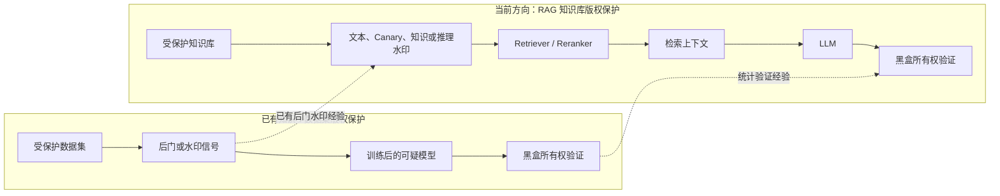
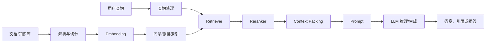
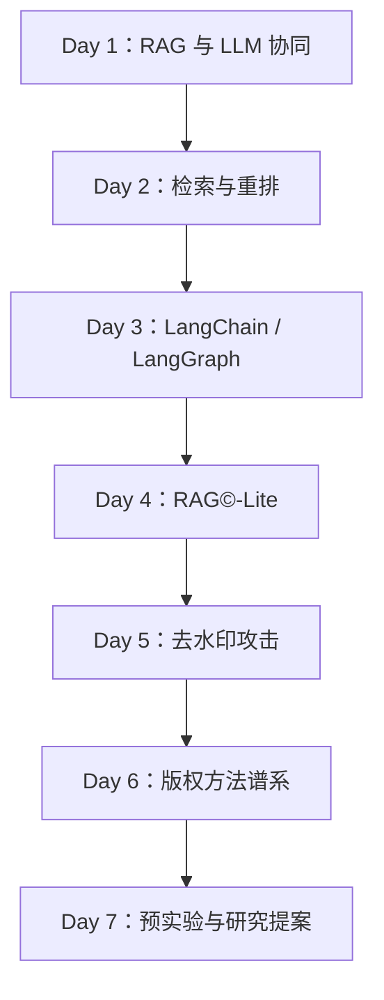

# RAG 知识地图

## 1. 与已有知识的关系

现有研究基础是“数据集 → 水印 → 可疑模型 → 所有权验证”。RAG 知识库版权保护保留了这一目标，但水印不再通过训练进入模型参数，而是在推理时沿检索链路进入 LLM 上下文。

核心变化：版权信号需要同时满足“能够被检索”和“能够通过生成或其他可观察行为被验证”。

## 2. RAG 技术链路

版权研究需要追踪信号在每个节点的变化：

| 节点                 | 需要学习的问题                     | 版权保护问题        |
| ------------------ | --------------------------- | ------------- |
| 切分                 | chunk size、overlap、结构保留     | 水印会不会被切断？     |
| Embedding          | 语义空间和相似度                    | 触发查询能否靠近水印文档？ |
| Retriever          | BM25、Dense、Hybrid           | 水印是否进入 Top-k？ |
| Reranker           | Cross-Encoder/LLM 排序        | 水印会被过滤还是提升？   |
| Query Processing   | Rewrite、Multi-query、HyDE    | 触发词是否被自然删除？   |
| Context Processing | 压缩、摘要、去重                    | 水印语义能否存活？     |
| LLM                | 参数知识、上下文知识、对齐               | 模型是否采用水印知识？   |
| Detector           | 规则、Embedding、LLM Judge、统计检验 | 是否能低 FPR 验证？  |

## 3. 一周路线

## 4. 导航

- [详细学习计划](../plan.md)
- [RAG 数据流与 LLM 协同](./01-rag-data-flow.md)
- [RAG© 论文笔记](./02-ragc-paper.md)

## 5. 当前状态

- 当前阶段：Day 1 进行中；
- 当前任务：完成 Day 1 精选资源导读并形成自由总结；
- 已完成正式学习任务：无；
- 下一步：根据资源导读总结，提炼 RAG 数据流、组件边界和水印传播机制。
