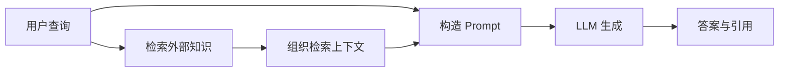
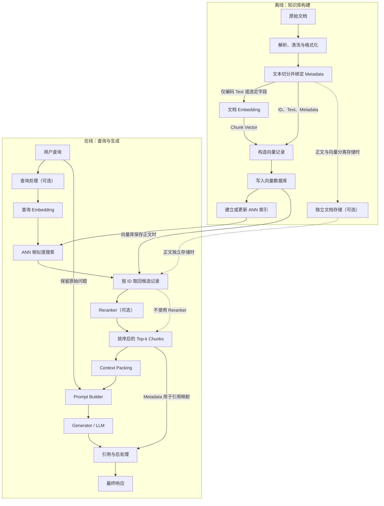
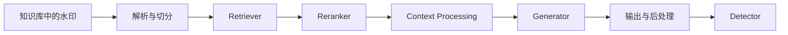

# RAG 数据流与 LLM 协同

本篇按“RAG 的作用与边界 -> 离线数据管线 -> 在线应用管线 -> 原始 RAG 概率模型 -> 上下文组织 -> Trace 与故障归因 -> 知识库水印传播 -> 常见误解 -> 小结”的顺序组织。阅读时可以先建立外部知识从文档进入模型输出的完整数据流，再理解 Retriever 与 Generator 如何联合决定结果，最后从版权保护角度分析信号在哪些环节被保留或破坏。

速查目录：

- `RAG 的作用与边界`：说明 RAG 解决什么问题，以及它与模型参数知识、微调和 Prompt Engineering 的关系。
- `RAG 的两条数据流`：区分离线数据管线与在线应用管线，明确每个组件的输入和输出。
- `原始 RAG 模型`：解释 Query Encoder、Document Index、MIPS、Retriever 概率、Generator 和边缘化。
- `上下文预算与引用`：说明 Top-k 为什么不等于最终上下文，以及 Context Packing 需要处理什么约束。
- `Trace 与故障归因`：根据中间结果定位解析、检索、重排、上下文和生成错误。
- `知识库水印传播`：分析水印从知识库到可观察输出必须通过的环节。
- `常见误解`：整理 RAG 学习中容易混淆的概念边界。

## RAG 的作用与边界

RAG，Retrieval-Augmented Generation，检索增强生成，是在模型生成答案之前，先从外部知识源中检索相关信息，再把这些信息作为上下文提供给生成模型的方法。

纯 LLM 主要依赖训练过程中写入参数的知识。这类参数知识存在三个典型限制：

- 训练完成后不容易及时更新。
- 无法天然访问企业私有数据或某个特定知识库。
- 模型可能生成流畅但缺少事实依据的内容。

RAG 增加了一条外部知识通道：



RAG 的核心价值是让知识可更新、可追溯、可替换，但它不能自动保证答案正确。最终结果仍然取决于：

- 知识库内容是否正确；
- Retriever 是否召回相关内容；
- Reranker 是否保留并提升关键内容；
- Context Packing 是否把关键证据完整放入 Prompt；
- LLM 是否正确使用上下文；
- 引用和后处理是否准确。

### RAG 与微调

RAG 和微调解决的问题有重叠，但侧重点不同。

| 维度 | RAG | 微调 |
| --- | --- | --- |
| 知识位置 | 外部文档、索引或数据库 | 模型参数或附加适配器 |
| 更新方式 | 更新文档并重新索引 | 准备训练数据并再次训练 |
| 事实追溯 | 可以保留文档来源和引用 | 很难直接定位参数知识来源 |
| 典型用途 | 私有知识、时效知识、事实问答 | 行为、格式、风格、领域能力适配 |
| 主要风险 | 检索错误、上下文污染、生成不忠实 | 灾难性遗忘、数据偏差、知识难更新 |

“RAG 只负责知识、微调只负责能力”是一种便于入门的近似说法，不是严格边界。实际系统可以同时使用两者：微调负责模型行为或领域适配，RAG 负责提供当前查询所需的外部证据。

## RAG 的两条数据流

完整 RAG 系统通常包含两条不同的数据流：

- 离线数据管线：把原始文档加工成可检索的知识库。
- 在线应用管线：根据用户查询检索证据并生成答案。

下面以使用向量检索的 Dense RAG 为例；BM25 与 Hybrid Retrieval 的索引分支将在后文单独讨论。



### 离线数据管线

离线阶段不是直接把整份 PDF 交给 Embedding 模型，而是逐步把原始文档加工成可检索的记录。下面用一份虚构的售后政策文档贯穿整个过程。

**原始输入**

假设知识库中有文件 `售后政策.pdf`，第 3 页包含：

```text
退款时限
用户可在商品签收后 7 天内申请无理由退款。定制商品除外。
```

**第一步：解析与清洗**

解析器从 PDF 中提取文字和页码；清洗程序去掉页眉、页脚、乱码和多余换行。此时数据仍然是人能阅读的文本：

```python
document = {
    "document_id": "after-sales-policy",
    "text": "退款时限\n用户可在商品签收后 7 天内申请无理由退款。定制商品除外。",
    "source": "售后政策.pdf",
    "page": 3,
}
```

**第二步：切分并绑定 Metadata**

长文档会被拆成多个 Chunk。每个 Chunk 都要保留来源信息，否则检索后无法引用原文或定位错误：

```python
chunk = {
    "chunk_id": "after-sales-policy#chunk-008",
    "text": "用户可在商品签收后 7 天内申请无理由退款。定制商品除外。",
    "metadata": {
        "document_id": "after-sales-policy",
        "title": "售后政策",
        "section": "退款时限",
        "page": 3,
        "source": "售后政策.pdf",
    },
}
```

这里的 `text` 是知识本身，`metadata` 说明知识来自哪里。`Chunk + Metadata` 表示两者绑定成一条记录，不是进行数学加法。

**第三步：生成向量**

Embedding 模型通常读取 `chunk["text"]`，输出固定维度的浮点数数组。下面只展示前几个数：

```text
输入："用户可在商品签收后 7 天内申请无理由退款。定制商品除外。"

输出：[0.021, -0.184, 0.093, 0.317, ...]
       └────────────── 例如共 768 维 ──────────────┘
```

向量是文本的检索表示，不能代替原文供人阅读，也通常不能可靠地还原为原文。

**第四步：写入向量数据库并建立索引**

系统把前面的信息合并为一条向量记录：

```python
vector_record = {
    "id": "after-sales-policy#chunk-008",
    "vector": [0.021, -0.184, 0.093, 0.317, ...],
    "text": "用户可在商品签收后 7 天内申请无理由退款。定制商品除外。",
    "metadata": {
        "document_id": "after-sales-policy",
        "section": "退款时限",
        "page": 3,
        "source": "售后政策.pdf",
    },
}
```

向量数据库保存这些记录，并建立 HNSW、IVF 等 ANN 索引，以便在大量向量中快速寻找近邻。因此需要区分：

- **向量记录**保存 `ID + Vector + Text/文本引用 + Metadata`；
- **向量索引**是加速相似度搜索的数据结构；
- **向量数据库**负责记录存储、索引、过滤和查询等完整能力。

至此，一份原始文档才真正变成了可供在线检索的知识库内容：

```text
原始 PDF
→ 干净文本
→ Chunk + Metadata
→ Chunk Vector
→ 向量记录
→ 向量数据库及 ANN 索引
```

向量数据库不是 RAG 的必选组件：

- BM25 等稀疏检索主要依赖倒排索引。
- Dense Retrieval 主要依赖向量索引。
- Hybrid Retrieval 会同时使用倒排索引和向量索引。
- 小型实验可以直接使用内存数组和 FAISS，不需要完整数据库服务。

切分后的基本数据对象可以理解为：

```python
chunk = {
    "chunk_id": "doc-001#chunk-003",
    "document_id": "doc-001",
    "text": "需要参与检索和生成的正文片段",
    "metadata": {
        "title": "文档标题",
        "section": "章节名称",
        "source": "来源路径",
    },
}
```

Embedding 向量和 `chunk_id` 必须保持稳定映射。Retriever 返回向量索引中的结果后，系统需要根据 ID 找回原始文本和元数据，而不是只把向量交给 LLM。

### 在线应用管线

在线阶段从用户查询开始，以答案、引用或拒答结束。继续使用前面的售后政策知识库，观察一个问题在每一步变成什么形式。

**第一步：接收并处理用户问题**

```text
用户问题：商品签收以后，多久可以申请无理由退款？
```

简单问题可以直接用于检索。复杂问题则可能先去除无意义字符、提取过滤条件，或者改写为更适合检索的表达：

```text
Retrieval Query：商品签收后无理由退款期限
```

**第二步：将查询编码成向量**

查询也必须经过与文档兼容的 Embedding 模型：

```text
"商品签收后无理由退款期限"
→ [0.018, -0.171, 0.087, 0.301, ...]
```

这个 `Query Vector` 与离线阶段保存的 `Chunk Vector` 位于同一个向量空间，因此可以计算内积或余弦相似度。

**第三步：Retriever 召回候选 Chunk**

向量索引搜索与 Query Vector 最相近的记录。例如先返回 Top-3：

```text
1. score=0.91  退款期限：签收后 7 天内……
2. score=0.78  退款到账：审核通过后 3—5 个工作日……
3. score=0.63  换货期限：签收后 15 天内……
```

这些是候选证据，不是最终答案。Retriever 的任务是尽量不要漏掉相关内容，因此候选集合中允许存在一些噪声。

**第四步：Reranker 重新排序**

Reranker 同时读取查询和候选文本，进行更精细的相关性判断。它可能保留前两条，并将真正回答“申请期限”的 Chunk 排在首位：

```text
Top-1：用户可在商品签收后 7 天内申请无理由退款。定制商品除外。
Top-2：退款审核通过后，款项将在 3—5 个工作日内原路退回。
```

**第五步：组织上下文并构造 Prompt**

系统根据 Token 预算对 Chunk 去重、截断、排序，并保留引用标识，最终形成 LLM 能读取的自然语言输入：

```text
系统要求：仅根据给定资料回答；资料不足时说明无法确定。

参考资料：
[售后政策，第 3 页]
用户可在商品签收后 7 天内申请无理由退款。定制商品除外。

用户问题：商品签收以后，多久可以申请无理由退款？
```

注意，LLM 接收的是原始 Chunk 文本，而不是 `[0.021, -0.184, ...]` 这样的检索向量。

**第六步：生成并返回结果**

```text
用户可在商品签收后 7 天内申请无理由退款，但定制商品除外。
来源：《售后政策》第 3 页。
```

因此在线数据的完整变化是：

```text
用户问题
→ Retrieval Query
→ Query Vector
→ Retriever 候选 Chunks
→ Reranker 排序后的 Chunks
→ Packed Context
→ Final Prompt
→ 答案与引用
```

Top-k 只是 Retriever 或 Reranker 的中间输出，不是完整在线阶段的最终输出。

这里需要区分三个容易混淆的对象：

- 用户问题：用户真正希望系统回答的内容。
- Retrieval Query：交给 Retriever 的查询，可能经过改写或分解。
- Final Prompt：交给 LLM 的完整输入，通常包含 System 指令、检索上下文和用户问题。

## 原始 RAG 模型

Lewis 等人在 2020 年的 RAG 论文中，把预训练 Retriever 与预训练 Seq2Seq Generator 组合起来，并通过概率模型联合训练。论文 Figure 1 的主线可以概括为：

```text
查询 x
-> Query Encoder 得到 q_eta(x)
-> MIPS 检索 Top-k 文档 z
-> Generator 分别计算基于每篇文档生成 y 的概率
-> 对不同文档对应的生成概率加权求和
```

### 符号与组件

| 符号 | 含义 |
| --- | --- |
| $x$ | 输入查询或任务输入 |
| $z$ | 一篇检索文档，论文中将它视为潜变量 |
| $y$ | 最终目标输出 |
| $q_\eta(x)$ | 带参数 $\eta$ 的查询编码器输出 |
| $d(z)$ | 文档 $z$ 的向量表示 |
| $p_\eta(z \mid x)$ | Retriever 认为文档 $z$ 与查询 $x$ 相关的概率 |
| $p_\theta(y \mid x,z)$ | Generator 在查询和文档条件下生成 $y$ 的概率 |

### MIPS 与 Retriever 概率

MIPS，Maximum Inner Product Search，最大内积搜索，使用查询向量和文档向量的内积衡量匹配程度：

$$
s(x,z)=q_\eta(x)^\top d(z)
$$

内积越大，文档越接近当前查询。对候选文档的分数进行归一化后，可以得到 Retriever 概率：

$$
p_\eta(z \mid x)
=
\frac{\exp(q_\eta(x)^\top d(z))}
{\sum_{z'}\exp(q_\eta(x)^\top d(z'))}
$$

实际文档集合很大，因此系统先通过 MIPS 找到 Top-k，再在有限候选集合中近似后续计算。

### 将文档视为潜变量

训练数据通常只给出输入 $x$ 和目标输出 $y$，但不会明确告诉模型应该使用哪篇文档 $z$。因此论文把文档视为潜变量：模型需要同时学习“哪篇文档有用”和“如何利用该文档生成答案”。

对 RAG-Sequence，可以把最终序列概率理解为：

$$
p(y \mid x)
\approx
\sum_{z \in \operatorname{TopK}(x)}
p_\eta(z \mid x)
p_\theta(y \mid x,z)
$$

它不是简单选择唯一文档，而是把不同文档支持同一输出的概率加权汇总。

例如：

| 文档 | $p_\eta(z \mid x)$ | $p_\theta(y \mid x,z)$ | 对最终输出的贡献 |
| --- | ---: | ---: | ---: |
| $z_1$ | 0.6 | 0.9 | 0.54 |
| $z_2$ | 0.3 | 0.2 | 0.06 |
| $z_3$ | 0.1 | 0.5 | 0.05 |

在这个简化例子中，三篇文档对目标输出的总贡献为 $0.65$。因此，一篇文档即使进入 Top-k，如果 Retriever 给它的权重很低，它对最终输出的影响仍然可能很弱。

### 参数化记忆与非参数化记忆

- Parametric Memory：生成模型参数 $\theta$ 中隐含的知识。
- Non-Parametric Memory：外部 Document Index 中保存的显式文档知识。

“Non-Parametric Retriever”不表示整个 Retriever 完全没有参数。Query Encoder 仍然有参数 $\eta$；这个名称主要强调知识存储在可访问和可替换的外部文档中，而不是全部写入 Generator 参数。

### 端到端训练

论文训练时，损失可以同时更新 Query Encoder 和 Generator：

- 如果某篇文档有助于生成正确输出，它的 Retriever 概率会得到正向训练信号。
- Generator 学习在给定查询和文档时生成正确输出。
- 原论文中的文档编码器与文档索引通常保持固定，主要更新 Query Encoder 和 Generator。
- 没有进入当前 Top-k 的文档无法直接参与这次近似计算，因此召回仍然是训练信号能够到达文档的前提。

### 与现代工程 RAG 的区别

| 原始 RAG 论文 | 常见工程 RAG |
| --- | --- |
| Retriever 与 Generator 可以联合微调 | Embedding、Retriever 和 LLM 经常分别冻结 |
| 对不同文档条件下的生成概率进行边缘化 | 常把多个 Top-k Chunk 拼入一次 Prompt |
| 以 Dense Retriever 和文档潜变量为核心 | 可加入 BM25、Hybrid、Reranker、Query Rewrite 等组件 |
| 目标是一个可训练的概率生成模型 | 目标通常是可替换、可观测的应用管线 |

因此，论文 Figure 1 用于理解 RAG 的理论来源，但不能直接等同于今天常见的“向量数据库 + Prompt + API LLM”实现。

## 上下文预算与引用

Retriever 返回 Top-k 后，系统仍然不能无条件把全部文本放入 Prompt。总上下文窗口需要同时容纳 System 指令、用户问题、检索上下文、对话历史和模型输出空间。

可以用下面的预算关系理解：

$$
B_{context}
=
B_{total}
-B_{system}
-B_{query}
-B_{history}
-B_{output}
$$

其中：

- $B_{total}$：模型的总上下文窗口；
- $B_{system}$：System 指令占用的 Token；
- $B_{query}$：用户查询占用的 Token；
- $B_{history}$：对话历史占用的 Token；
- $B_{output}$：为生成答案预留的 Token；
- $B_{context}$：真正可以分配给检索文档的预算。

Context Packing 需要在有限预算内决定：

- 保留哪些 Chunk；
- 每个 Chunk 截取多少内容；
- 是否去重或压缩；
- 按相关性、文档顺序还是来源多样性排列；
- 如何插入来源标识，支持后续引用。

引用不是 LLM 凭空生成一个编号。可靠实现需要保留下面的映射：

```text
answer claim
-> context label
-> chunk_id
-> document_id
-> source path / URL / page
```

如果只把纯文本放入 Prompt，不保留 `chunk_id` 和来源元数据，即使回答内容正确，也很难生成可靠、可核查的引用。

## Trace 与故障归因

RAG 是多组件系统。只观察最终答案，无法判断错误来自检索、上下文组织还是生成。每次查询应保存完整 Trace，例如：

```json
{
  "query": "",
  "retrieval_query": "",
  "retrieved_ids": [],
  "retrieval_scores": [],
  "reranked_ids": [],
  "packed_context": "",
  "prompt": "",
  "answer": "",
  "citations": [],
  "latency": {}
}
```

故障归因的基本方法是：沿 Trace 从上游向下游检查，找到预期信息第一次消失或发生错误的位置。

| 现象 | 优先检查的组件 |
| --- | --- |
| 原始文档有目标信息，Chunk 中没有 | Parser、Cleaner、Chunker |
| 索引中的 Chunk 正确，但候选集没有 | Query Processing、Index、Retriever |
| 候选集有正确 Chunk，重排结果没有 | Reranker |
| 重排结果有，`packed_context` 没有 | Compressor、Deduplicator、Context Packer |
| `packed_context` 有，最终 Prompt 没有 | Prompt Builder |
| Prompt 有正确证据，答案没有采用 | Prompt、Generator、参数知识冲突、解码设置 |
| 答案正确但引用错误 | Citation Mapper、Metadata Mapping |
| 答案包含目标信号但检测失败 | Output Processor、Detector |

这里有一个重要边界：如果目标信息已经完整存在于最终 Prompt 中，就应暂时排除解析、切分、检索、重排和 Context Packing，优先检查 Generator 及其之后的组件。

## 知识库水印传播

传统数据集水印通常通过训练过程影响模型参数。RAG 知识库水印则需要在推理时沿检索链路进入上下文，再影响可观察输出。



从机制上可以把验证成功拆成四个连续条件：

1. 水印文档能够被检索；
2. 水印信号能够保留在最终上下文；
3. Generator 会采用该信号；
4. Detector 能从可观察结果中识别该信号。

可以使用下面的启发式分解理解整体成功概率：

$$
P_{verify}
\approx
P_{retrieve}
\times P_{preserve}
\times P_{use}
\times P_{detect}
$$

这个乘积分解不是在声明四个事件严格独立，而是用于定位系统瓶颈：任意一项接近 0，最终验证成功率都会很低。

| 组件 | 水印可能被破坏的方式 |
| --- | --- |
| 解析与清洗 | 特殊字符、格式或隐藏结构被删除 |
| Chunking | 触发信息与目标知识被切到不同 Chunk |
| Query Rewrite | 触发词或特定表达被改写掉 |
| Retriever | 水印文档无法进入候选集 |
| Reranker | 水印文档因表面相关性不足被降权或过滤 |
| Context Compression | 精确短语被摘要、改写或删除 |
| Context Packing | 水印 Chunk 因预算、排序或去重被截断 |
| Generator | 模型忽略上下文、优先采用参数知识或拒绝回答 |
| Output Processing | 过滤、清洗或格式化删除目标信号 |
| Detector | 阈值不合适或验证规则泛化能力不足 |

不同水印信号对组件变换的敏感性不同：

| 信号类型 | 优点 | 主要风险 |
| --- | --- | --- |
| 精确字符串 | 易于确定性检测 | 容易被改写、压缩和后处理删除 |
| 语义信息 | 对同义改写更鲁棒 | 检测边界模糊，可能提高误报率 |
| 推理路径 | 可以设计更复杂的所有权行为 | 依赖模型是否暴露推理，容易受隐藏 CoT 影响 |

原始 RAG 论文中的两个概率也可以解释水印强度：

$$
\text{Watermark Influence}
\propto
p_\eta(z_w \mid x)
\times
p_\theta(y_w \mid x,z_w)
$$

其中 $z_w$ 是水印文档，$y_w$ 是目标可验证输出。第一项描述水印文档能否获得足够检索权重，第二项描述 Generator 是否会基于该文档产生目标行为。

## 常见误解

1. **RAG 可以消除幻觉**

   RAG 只能提供外部证据。错误文档、错误召回、上下文曲解和越界推断仍然会产生不可靠答案。

2. **RAG 必须使用向量数据库**

   RAG 也可以使用 BM25、SQL、知识图谱、Web Search 或混合检索。向量数据库只是常见实现之一。

3. **Top-k 就是在线查询阶段的输出**

   Top-k 是 Retriever 或 Reranker 的中间结果。完整管线还包括上下文组织、Prompt、生成、引用和后处理。

4. **正确文档进入 Top-k，最终答案就一定正确**

   正确证据仍可能被重排、截断、压缩、忽略或误解。

5. **Non-Parametric Retriever 完全没有参数**

   外部文档索引属于非参数化记忆，但 Query Encoder 本身仍然包含可训练参数。

6. **最终答案错误就是 LLM 幻觉**

   最终错误可能来自知识库、解析、检索、重排、上下文组织、生成或引用映射。必须结合 Trace 定位责任组件。

7. **某种 RAG 方法能稳定提升固定百分比**

   Chunking、Reranking、Hybrid Retrieval 和防幻觉方法的收益依赖数据、模型、查询分布与评测方法。没有原始来源或复现实验时，不应把经验性百分比当作通用结论。

## 小结

理解 RAG 时应抓住四条主线：

- RAG 包含离线数据管线和在线应用管线。离线阶段把原始文档变成 Chunks、Metadata 和索引；在线阶段完成查询处理、召回、重排、上下文组织和生成。
- 原始 RAG 模型把外部文档视为潜变量，用 Retriever 概率和 Generator 概率共同决定最终输出；现代工程 RAG 通常将组件拆开，并增加 Hybrid Retrieval、Reranker 和 Context Processing。
- Top-k 不是最终答案，也不保证正确证据会被模型采用。上下文预算、Prompt 约束、参数知识冲突和引用映射都会影响输出。
- 知识库水印必须同时通过检索、上下文保留、模型采用和检测四个环节。研究时应保存完整 Trace，分别评估 Retriever、Generator 和 Detector。

一句话记忆：

```text
RAG 的结果不只由“找到了什么”决定，还由“保留了什么、模型采用了什么、最后能检测到什么”共同决定。
```

## 参考资料

- [Lewis et al., 2020：Retrieval-Augmented Generation for Knowledge-Intensive NLP Tasks](https://papers.neurips.cc/paper_files/paper/2020/file/6b493230205f780e1bc26945df7481e5-Paper.pdf)
- [DeepLearning.AI：Retrieval Augmented Generation](https://learn.deeplearning.ai/courses/retrieval-augmented-generation/information)
- [Microsoft：Design and develop a RAG solution](https://learn.microsoft.com/en-us/azure/architecture/ai-ml/guide/rag/rag-solution-design-and-evaluation-guide)
- [小林coding：RAG 技术全景导读](https://mp.weixin.qq.com/s/BqOdWsCjtXoUllUuFVb29w)
- [RAG 知识地图](./00-RAG知识地图.md)
- [详细学习计划](../plan.md)
