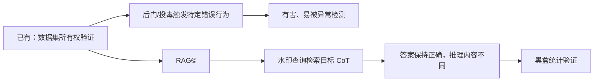
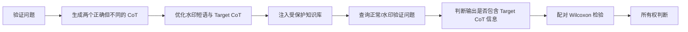

# RAG©：基于推理的 RAG 知识库所有权验证

## 在已有知识中的定位

RAG© 延续数据集所有权验证的基本框架，但将验证信号从“错误预测标签”移动到“正确答案背后的目标推理内容”。其主要目的，是减少传统投毒或后门水印对系统正确性的破坏。

## 问题定义

- 资产：RAG 使用的专有知识库；
- 攻击者：未经授权复制或使用知识库，并部署可查询的 RAG 服务；
- 防御者能力：只能通过 API 输入文本并观察文本输出；
- 目标：判断可疑 RAG 是否使用了受保护知识库；
- 限制：不访问可疑模型参数、Retriever 配置或 Token 概率。

## 方法流程

## 关键直觉

水印必须同时满足两个条件：

1. **检索条件**：带水印的验证问题应把目标 CoT 文档检索进 Top-k；
2. **生成/观察条件**：LLM 输出应包含目标 CoT 的信息，同时最终答案仍然正确。

正常问题不应激活目标 CoT，否则会产生较高的误报率。

## 方法组成

### RAG©-O

- 使用替代 Retriever；
- 通过优化让水印查询远离普通相关文本，同时接近目标文本；
- 效果较高，但优化成本较大。

### RAG©-L

- 使用 LLM 生成罕见但语义无害的短语；
- 使用 LLM 改写 Target CoT；
- 成本更低，更适合作为本周的小规模复现起点。

## 实验设置摘要

- 数据集：Natural Questions、HotpotQA、MS-MARCO；
- Retriever：Contriever、Contriever-MS、ANCE；
- Generator：GPT-3.5、GPT-4、LLaMA2、LLaMA3；
- 默认 Top-k：5；
- 每个数据集随机选择 100 个验证问题；
- 每个验证问题注入 2 条目标文本；
- 注入比例不高于约 0.008%；
- 检验：配对 Wilcoxon，显著性水平示例为 0.01。

## 主要指标

| 指标 | 含义 |
|---|---|
| VSR | 可疑 RAG 按预期生成目标 CoT 信息的比例 |
| Harmfulness | 水印验证导致最终答案错误的比例 |
| FPR | 正常或独立 RAG 被错误判定为侵权的风险 |
| p-value | 观察到的水印行为是否显著偏离无侵权假设 |

## 论文中已测试的自适应攻击

- Perplexity Filter；
- Query Rephrasing。

论文结果显示这些攻击会明显降低 VSR，但没有把水印信号完全降到无水印水平。

## 值得继续研究的局限

1. Retriever 主要是较早期 Dense 模型，缺少现代 Embedding、BM25、Hybrid 与 Reranker；
2. 未系统研究 Query Rewrite、Multi-query、HyDE、Context Compression 和 Adaptive RAG；
3. 依赖输出中可观察的 CoT 信息；现代推理模型可能隐藏或只返回推理摘要；
4. 依赖 LLM Judge，需研究 Judge 偏差、提示敏感性和伪造；
5. 缺少局部盗用、重切分、去重、扩充、知识迁移和响应清洗实验；
6. 方法属于事后验证，不能主动阻止盗用；
7. 主要研究文本知识库，缺少多模态场景；
8. 单比特所有权证据难以支持多用户追踪、串谋分析和责任归属。

## 与本项目的直接连接

本周优先研究：

- RAG©-L 在 Qwen3/BGE-M3 中的激活效果；
- Hybrid Retrieval 与 Reranker 对水印的作用；
- Query Rewrite 和 Context Compression 是否成为天然去水印器；
- 不可观察 CoT 条件下的替代验证信号；
- 局部知识库盗用比例与统计功效之间的关系。

## 研究问题

- 复现 RAG©-L 的最小版本；
- 比较规则、Embedding 与 LLM Judge；
- 检查水印在 BM25、Dense、Hybrid 和 Reranker 间的迁移；
- 检查仅返回短答案时 VSR 如何变化；
- 检查重新切分和释义改写后的水印存活率。

## 参考资料

- 本地论文：`../../LLM/paper/2502.10440v1.pdf`（仓库外本地路径）
- [arXiv:2502.10440](https://arxiv.org/abs/2502.10440)
- [RAG 知识地图](./00-RAG知识地图.md)
- [详细学习计划](../plan.md)
