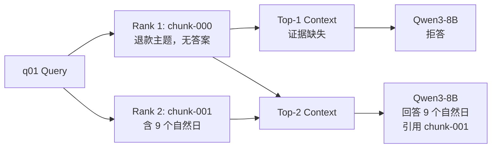
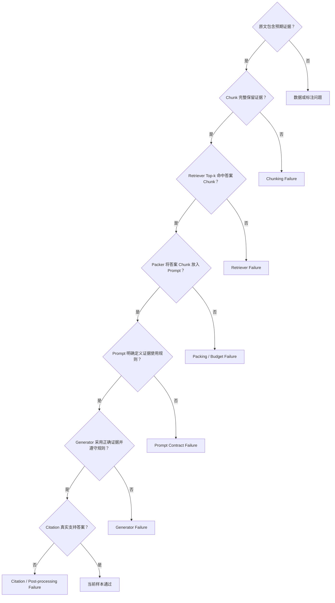
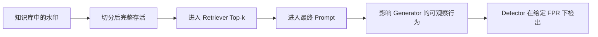

# 透明 Dense RAG：沿证据传播链定位系统故障

本章不是按 API 调用顺序罗列组件，而是围绕一个核心问题展开：

> 当 RAG 最终没有给出正确答案时，预期证据究竟在哪个环节消失，或者在哪个环节虽然存在却没有被正确使用？

为回答这个问题，本章先建立一条可观察的 Dense RAG 证据传播链，再用一个贯穿全章的 q01 案例定位 Chunk 级检索故障，最后通过 5 个问题、6 种证据条件和 30 条完整 Trace，区分三类本质不同的失败：

1. Retriever 没有把答案证据送入 Prompt；
2. 送入 Prompt 的证据本身已经错误；
3. Generator 看到了冲突证据，却没有执行既定规则。

## 知识点速查

| 想解决的问题 | 本章结论 | 对应章节 |
|---|---|---|
| 为什么最终答案不足以定位错误？ | 多个上游故障会产生相同的最终现象，必须保存中间对象 | [1. 研究问题与实验思路](#1-研究问题与实验思路) |
| Dense RAG 中的证据如何流动？ | `Document → Chunk → Rank → Context → Prompt → Output` | [2. 建立透明的证据传播链](#2-建立透明的证据传播链) |
| 找对文档是否等于找对证据？ | 不等于；本实验 Document Recall@1 为 1.0，Answer Chunk Recall@1 仅为 0.8 | [3. q01：一次完整的故障定位](#3-q01一次完整的故障定位) |
| 如何区分事实正确与忠于证据？ | 两者必须分开评测；模型可以忠实传播错误证据 | [4. 条件矩阵：分离三类故障](#4-条件矩阵分离三类故障) |
| 如何形成可复用的诊断方法？ | 找到预期证据第一次缺失或第一次被错误处理的位置 | [5. 可复用的评测与归因框架](#5-可复用的评测与归因框架) |
| 这与知识库版权保护有什么关系？ | 水印只有通过每一层传播门，才可能被输出侧 Detector 观察到 | [6. 对知识库版权保护的启示](#6-对知识库版权保护的启示) |

本章对应的核心代码不是一个单体脚本，而是按数据边界拆成以下几步。建议阅读正文时同时打开这些文件：

| 步骤 | 代码 | 输入 → 输出 |
|---|---|---|
| 文档切分 | [`scripts/build_chunks.py`](../scripts/build_chunks.py) | 原始文档 → 带 Offset 的 Chunk |
| Dense 检索器 | [`scripts/dense_retriever.py`](../scripts/dense_retriever.py) | Chunk / Query → 向量、FAISS 排名与 Trace |
| 检索评测 | [`scripts/run_dense_retrieval.py`](../scripts/run_dense_retrieval.py) | 检索 Trace + Gold → Recall、MRR |
| 上下文与 Prompt | [`scripts/context_pipeline.py`](../scripts/context_pipeline.py) | 排名结果 → Packed Context → Messages |
| Generator | [`scripts/qwen_generator.py`](../scripts/qwen_generator.py) | Messages → JSON 答案与生成 Trace |
| 条件矩阵 | [`scripts/run_rag_condition_matrix.py`](../scripts/run_rag_condition_matrix.py) | 受控证据条件 → 30 条诊断 Trace |

---

## 1. 研究问题与实验思路

### 1.1 为什么需要“透明 RAG”

RAG 最终只返回一段文字，但错误可能来自完全不同的位置：

- 原文中没有答案，或标注本身错误；
- 切分破坏了答案或水印短语；
- Retriever 找到了正确文档，却把不含答案的 Chunk 排在前面；
- Context Packing 因预算丢弃了答案证据；
- Prompt 没有明确证据使用和冲突处理规则；
- Generator 看到了证据，却没有采用它；
- Generator 给出了正确答案，但引用不支持该答案。

如果只保存最终答案，这些原因无法区分。本实验因此不使用 LangChain 封装核心流程，而是显式保存每个阶段的输入和输出：

```json
{
  "query": "...",
  "retrieved_ids": ["..."],
  "retrieval_scores": [0.0],
  "selected_ids": ["..."],
  "packed_context": "...",
  "prompt": "...",
  "raw_output": "...",
  "answer": "...",
  "citations": ["..."],
  "latency": {}
}
```

这里的“透明”不是指组件必须简单，而是指组件边界必须可观察：任何一条答案证据都能够从原文追踪到最终输出。

### 1.2 为什么使用虚构知识

Generator 同时受到两类知识影响：

- **参数知识**：训练期间写入模型参数的知识；
- **外部证据**：本次 Prompt 临时提供的 Retrieved Context。

前置实验曾用“澳大利亚首都”问题改变证据和 System 指令：

| 条件 | 上下文 | 输出 | 说明 |
|---|---|---|---|
| 无上下文、强约束 | 无 | 堪培拉 | 使用参数知识 |
| 正确上下文、强约束 | 堪培拉 | 堪培拉 | 两类知识一致，无法判断主要来源 |
| 错误上下文、强约束 | 悉尼 | 悉尼 | 外部证据覆盖参数知识 |
| 正误证据冲突、强约束 | 两者都有 | 拒答 | 模型识别到冲突 |
| 错误上下文、弱约束 | 悉尼 | 堪培拉 | 参数知识覆盖外部证据 |

这说明“模型答对”不能证明它使用了知识库，“模型引用某段文本”也不能单独证明答案由该文本导致。

为了减少参数知识混杂，后续实验改用虚构的“青岚商城”政策，并要求模型只依据证据回答。这样，实验关注点可以从“模型是否记得事实”转向“证据如何穿过 RAG 管线”。

前置结果见 [参数知识与 Retrieved Context 冲突最小实验](../results/day1_context_conflict.md)。

### 1.3 受控知识库与问题

知识库包含 5 份虚构政策文档。每个问题同时标注正确文档和期望答案：

| 问题 | 主题 | 期望答案 |
|---|---|---|
| q01 | 退款政策 | 9 个自然日 |
| q02 | 发票政策 | 17 个自然日 |
| q03 | 会员政策 | 1360 点成长值 |
| q04 | 保修政策 | 22 个月 |
| q05 | 物流政策 | 连续 48 小时 |

一条标注的核心结构如下：

```json
{
  "question_id": "q01",
  "query": "青岚商城普通商品签收后多久可以申请无理由退款？",
  "gold_document_id": "qinglan-refund-v1",
  "expected_answer": "9 个自然日",
  "answer_aliases": ["9个自然日", "9 天", "9天"]
}
```

这里必须保留两个不同层级的 Gold：

- `gold_document_id`：判断 Retriever 是否找对主题；
- `expected_answer` 与别名：判断 Retriever 是否找到真正能够回答问题的 Chunk。

这个区别会直接决定后续故障归因。

---

## 2. 建立透明的证据传播链

整个系统可分为离线建库、在线问答和评测追踪三条链路：


其中最重要的数据对应关系是：

```text
Chunk 第 i 行
↔ Embedding 第 i 行
↔ FAISS 整数 ID i
↔ Manifest 第 i 行
```

FAISS 只认识向量和整数位置，不认识 `chunk_id`、标题或正文。Manifest 负责把整数 ID 映射回可读、可引用、可验证的证据。

### 2.1 Chunking：先保证证据没有在建库时丢失

每个 Chunk 除正文外，还保存稳定 ID、所属文档和字符位置：

```python
@dataclass(frozen=True)
class Chunk:
    chunk_id: str
    document_id: str
    text: str
    start_char: int
    end_char: int
    metadata: dict[str, Any]
```

字符位置支持一个强校验：

```python
source_text = documents_by_id[chunk.document_id]["text"]
assert source_text[chunk.start_char:chunk.end_char] == chunk.text
```

只要断言成立，就能证明 Chunk 正文来自指定原文区间，而不是在清洗或序列化时被意外修改。

本实验使用：

```text
max_chars = 140
min_chars = 70
overlap_chars = 30
preferred_breaks = 换行、。！？；
```

切分的核心代码如下：

```python
def choose_chunk_end(text, start, max_chars, min_chars):
    hard_end = min(start + max_chars, len(text))
    if hard_end == len(text):
        return hard_end

    earliest_boundary = min(start + min_chars, hard_end)
    for position in range(hard_end - 1, earliest_boundary - 1, -1):
        if text[position] in BREAK_CHARACTERS:
            return position + 1
    return hard_end


def split_document(document, *, max_chars, overlap_chars, min_chars):
    text = document["text"]
    chunks = []
    start = 0

    while start < len(text):
        end = choose_chunk_end(text, start, max_chars, min_chars)

        chunk_start, chunk_end = start, end
        while chunk_start < chunk_end and text[chunk_start].isspace():
            chunk_start += 1
        while chunk_end > chunk_start and text[chunk_end - 1].isspace():
            chunk_end -= 1

        if chunk_start < chunk_end:
            chunks.append(Chunk(
                chunk_id=(
                    f"{document['document_id']}"
                    f"#chunk-{len(chunks):03d}"
                ),
                document_id=document["document_id"],
                text=text[chunk_start:chunk_end],
                start_char=chunk_start,
                end_char=chunk_end,
                metadata={"source": document["source"]},
            ))

        if end >= len(text):
            break
        next_start = end - overlap_chars
        if next_start <= start:
            raise RuntimeError("Splitter did not advance")
        start = next_start
```

这段代码要分四步理解：

1. `hard_end` 保证 Chunk 不超过 `max_chars`；
2. 从 `hard_end` 向前搜索句末，使边界尽量落在完整句子后；
3. 找不到合适句末时退化为固定字符切分，因此不会因追求语义边界而无限延长；
4. 下一段从 `end - overlap_chars` 开始，使边界附近的内容在相邻 Chunk 中重复出现。

去除首尾空白时必须同步移动 `chunk_start` 和 `chunk_end`。不能直接对 `text[start:end]` 调用 `strip()` 后仍保存旧 Offset，否则正文将无法由原文切片精确还原。

运行：

```bash
python scripts/build_chunks.py
```

得到：

| 项目 | 结果 |
|---|---:|
| 文档数 | 5 |
| Chunk 数 | 12 |
| 最短 / 最长 Chunk | 65 / 138 字符 |
| 平均长度 | 114.75 字符 |
| Chunk ID 唯一 | 通过 |
| Offset 可还原原文 | 通过 |
| 非空白字符无丢失 | 通过 |
| 5 个期望答案均被保留 | 通过 |

q01 的答案只存在于 `qinglan-refund-v1#chunk-001`。这条事实为后面判断检索成败提供了明确依据。

固定字符 Overlap 仍有结构性局限：新 Chunk 可能从半个语义单元开始。Offset 校验只能证明文本没有丢失，不能证明边界在语义上合理。

结果分析：

- 12 个 Chunk 全部可以按 Offset 回到原文，说明后续检索错误不能归因于序列化或文本篡改；
- 5 个答案均至少出现在一个 Chunk 中，说明后续 Answer Recall 的分母有效；
- q01 答案只位于 `chunk-001`，因此 `chunk-000` 即使来自退款文档，也不能算答案命中；
- Overlap 保障了字符覆盖，却没有保障 q01 的规则段在语义向量上排名第一，这正是下一阶段要测量的问题。

相关产物：

- [Chunk 记录](../results/day1_chunks.jsonl)
- [切分汇总与自动校验](../results/day1_chunking_summary.json)

### 2.2 Dense Retrieval：从语义相似变成可核对的排名

Qwen3-Embedding-0.6B 将 12 个 Chunk 编码为 1024 维向量：

```text
document_embeddings.shape == (12, 1024)
query_embedding.shape == (1, 1024)
```

Cosine 相似度比较向量方向：

$$
\cos(\mathbf q,\mathbf d)
=
\frac{\mathbf q^\top \mathbf d}
{\|\mathbf q\|_2\|\mathbf d\|_2}
$$

查询和文档向量均做 L2 归一化后，

$$
\|\mathbf q\|_2=\|\mathbf d\|_2=1
\quad\Longrightarrow\quad
\cos(\mathbf q,\mathbf d)=\mathbf q^\top\mathbf d
$$

因此可以使用 FAISS `IndexFlatIP` 做精确余弦检索：

```python
document_embeddings = model.encode(
    chunk_texts,
    normalize_embeddings=True,
    convert_to_numpy=True,
).astype("float32")

query_embedding = model.encode(
    [query],
    prompt_name="query",
    normalize_embeddings=True,
    convert_to_numpy=True,
).astype("float32")

index = faiss.IndexFlatIP(document_embeddings.shape[1])
index.add(np.ascontiguousarray(document_embeddings))
scores, indices = index.search(
    np.ascontiguousarray(query_embedding),
    top_k,
)
```

代码中的关键点是：

- 文档侧直接编码 `chunk["text"]`，查询侧使用 Qwen3 Embedding 的 `prompt_name="query"`；两侧角色不同，但必须使用同一个模型版本；
- `normalize_embeddings=True` 让 Inner Product 可以解释为 Cosine；
- `.astype("float32")` 与 `np.ascontiguousarray(...)` 确保数据类型和内存布局满足 FAISS 接口要求；
- `embeddings.shape[1]` 是单个向量的维度 `1024`，不是 Chunk 数；
- `IndexFlatIP` 返回的是整数行号，必须再映射回相同行的 Chunk。

映射与 Trace 的核心逻辑如下：

```python
results = []
for rank, (faiss_id, score) in enumerate(
    zip(indices[0], scores[0]),
    start=1,
):
    chunk = self.chunks[int(faiss_id)]
    results.append({
        "rank": rank,
        "faiss_id": int(faiss_id),
        "chunk_id": chunk["chunk_id"],
        "document_id": chunk["document_id"],
        "score": round(float(score), 6),
        "text": chunk["text"],
        "start_char": chunk["start_char"],
        "end_char": chunk["end_char"],
    })
```

这里不能只保存 `retrieved_ids`。正文和 Offset 使我们能够检查“这条结果是否真的包含答案”，分数使我们能够分析 Rank 翻转所需的 Margin。

`IndexFlatIP` 会比较所有向量，是精确检索，不会引入 ANN 近似误差。当前只有 12 个 Chunk，它适合作为后续 HNSW、IVF 等近似索引的无损基线。

模型固定为：

```text
Qwen/Qwen3-Embedding-0.6B
revision: 97b0c614be4d77ee51c0cef4e5f07c00f9eb65b3
```

实验确认 12 个向量的范数均为 `1.0`，FAISS 索引行数、Embedding 行数和 Manifest 行数完全一致。

本次运行的建库结果为：

| 项目 | 结果 |
|---|---:|
| 模型加载 | 9.953 秒 |
| 12 个文档向量编码并建索引 | 0.319 秒 |
| Embedding Shape | `(12, 1024)` |
| 向量范数最小 / 最大值 | `1.0 / 1.0` |
| FAISS `ntotal` | 12 |

这些时间只反映当前硬件和冷启动状态；本节真正需要验证的是 Shape、范数和三类行号是否一致。

### 2.3 检索评测：必须区分文档 Rank 与答案 Chunk Rank

对每个问题定义两个首次命中位置：

- **Document Rank**：正确文档的任意 Chunk 第一次出现的位置；
- **Answer Chunk Rank**：正确文档中、真正包含期望答案的 Chunk 第一次出现的位置。

对应代码为：

```python
document_rank = first_matching_rank(
    results,
    lambda r: r["document_id"] == gold_document_id,
)

answer_rank = first_matching_rank(
    results,
    lambda r: (
        r["document_id"] == gold_document_id
        and any(
            alias in normalized_text(r["text"])
            for alias in normalized_aliases
        )
    ),
)
```

第一段只检查来源，第二段同时检查来源与答案别名。要求来源匹配可以避免其他文档偶然出现相同数字时被误判为正确答案证据。

查询级 Recall@k 为：

$$
\mathrm{Recall@k}
=
\frac{1}{N}
\sum_{i=1}^{N}
\mathbb{I}(r_i\le k)
$$

MRR 关注首次命中是否足够靠前：

$$
\mathrm{MRR}
=
\frac{1}{N}
\sum_{i=1}^{N}
\frac{1}{r_i}
$$

未命中时该项记为 0。本实验的答案 Chunk Rank 为 `[2, 1, 1, 1, 1]`，所以：

$$
\mathrm{Answer\ MRR}
=
\frac{1/2+1+1+1+1}{5}
=0.9
$$

完整结果为：

| 指标 | 结果 | 含义 |
|---|---:|---|
| Document Recall@1 | 1.0 | 5 个问题的 Rank 1 都来自正确文档 |
| Answer Chunk Recall@1 | 0.8 | 只有 4/5 的 Rank 1 真正含答案 |
| Document Recall@3 | 1.0 | Top-3 均含正确文档 |
| Answer Chunk Recall@3 | 1.0 | Top-3 均含答案 Chunk |
| Document MRR | 1.0 | 正确文档首次出现位置均为 1 |
| Answer Chunk MRR | 0.9 | q01 的答案证据位于 Rank 2 |

相关产物：

- [逐问题 Top-5 Trace](../results/day1_dense_retrieval.jsonl)
- [检索指标汇总](../results/day1_dense_retrieval_summary.json)
- [FAISS ID 与 Chunk 映射](../results/day1_dense_manifest.jsonl)

### 2.4 Context Packing：把“检索到”与“真正进入 Prompt”分开

Retriever 的 Top-k 不是 Generator 最终看到的上下文。Context Packer 还必须处理排序、预算和证据完整性。

本实验规定：

1. 保持 Retriever 排名；
2. 只放入完整 Chunk，不静默截断正文；
3. 明确记录 `selected_ids` 与 `dropped_ids`；
4. Retrieval Score 保留在 Trace 中，但不暴露给 Generator。

每个证据块的格式为：

```text
[证据 1]
chunk_id: qinglan-refund-v1#chunk-000
source: ...
text: ...
```

如果后续证据块超出预算，Packer 会停止加入并记录被丢弃的 ID；如果第一条证据都无法放入，则直接报错。这样，“答案没有进入 Prompt”可以进一步区分为：

- Retriever 根本没有命中答案 Chunk；
- Retriever 已命中，但 Packer 因预算丢弃了它。

当前使用字符预算只是为了便于观察。生产实验应使用目标 LLM 的 Tokenizer 计算 Token 预算。

核心实现如下：

```python
for position, result in enumerate(ranked_results):
    block = format_evidence_block(result, len(blocks) + 1)
    candidate = separator.join([*blocks, block])

    if len(candidate) > max_context_chars:
        if not blocks:
            raise ValueError("The first evidence block cannot fit")
        dropped_ids = [
            item["chunk_id"]
            for item in ranked_results[position:]
        ]
        break

    blocks.append(block)
    selected_results.append(result)
```

这里使用“完整前缀”策略：从 Rank 1 开始依次加入，一旦下一块超过预算便停止。它不会跳过一个较长的高排名 Chunk，再塞入后面的短 Chunk，因此 Selected IDs 始终是 Retriever 排名的一个前缀。

Top-1/Top-2 的实际运行结果为：

| 条件 | 记录数 | 答案证据覆盖率 | 平均 Context 字符数 | 平均 Prompt 字符数 | 丢弃 Chunk |
|---|---:|---:|---:|---:|---:|
| Top-1 | 5 | 0.8 | 213.4 | 530.6 | 0 |
| Top-2 | 5 | 1.0 | 423.0 | 740.2 | 0 |

结果说明：Top-2 在当前小语料上补回了唯一缺失的 q01 答案证据；由于没有任何 Chunk 因预算被丢弃，证据覆盖率提升完全来自扩大 Retriever 截止位置，而不是 Packer 行为改变。

### 2.5 Prompt 与 Generator：把证据使用规则变成可评测协议

q01 Top-1/Top-2 基线 Prompt 的核心规则是：

```text
只能使用提供的证据，不得使用参数知识补充事实；
证据不足时必须拒答；
citations 只能填写实际支持答案的 chunk_id；
只输出合法 JSON。
```

第 4 节的条件矩阵在此基础上额外加入：

```text
如果不同证据对问题所问的同一事实给出互相矛盾的值，
必须将 insufficient_evidence 设为 true，
并将 citations 设为空列表。
```

必须区分这两个版本：q01 探针只验证“证据缺失与证据存在”，条件矩阵才显式定义“正误证据冲突时拒答”。因此，后文把冲突条件不拒答归因于 Generator 规则服从失败是有前提的——对应 Prompt 已明确给出冲突处理规则。

输出协议为：

```json
{
  "answer": "答案或证据不足",
  "citations": ["chunk_id"],
  "insufficient_evidence": false
}
```

Generator 使用 Qwen3-8B，关闭 Thinking 与采样：

```text
Qwen/Qwen3-8B
revision: b968826d9c46dd6066d109eabc6255188de91218
dtype: BF16
do_sample: false
enable_thinking: false
seed: 42
```

核心生成代码如下：

```python
rendered_prompt = tokenizer.apply_chat_template(
    messages,
    tokenize=False,
    add_generation_prompt=True,
    enable_thinking=False,
)
model_inputs = tokenizer(
    [rendered_prompt],
    return_tensors="pt",
).to(model.device)

generated_ids = model.generate(
    **model_inputs,
    generation_config=GenerationConfig(
        do_sample=False,
        max_new_tokens=256,
        eos_token_id=model.generation_config.eos_token_id,
        pad_token_id=tokenizer.eos_token_id,
    ),
    use_model_defaults=False,
    use_cache=True,
)

output_ids = generated_ids[0, model_inputs.input_ids.shape[1]:]
raw_output = tokenizer.decode(
    output_ids,
    skip_special_tokens=True,
).strip()
```

逐步解释：

1. `apply_chat_template` 把 System/User Messages 转成模型实际接收的字符串；Trace 必须保存这个 Rendered Prompt；
2. `enable_thinking=False` 关闭 Qwen3 的显式 Thinking 输出，使实验只评测最终 JSON；
3. `do_sample=False` 使用确定性贪心解码，避免采样噪声干扰组件归因；
4. `use_model_defaults=False` 防止模型仓库的默认 Generation Config 覆盖显式设置；
5. 切片 `generated_ids[..., input_token_count:]` 只保留新生成部分，否则解码结果会混入输入 Prompt。

结构化输出便于自动评测，但 Citation 不能只做格式检查。程序还要验证：

- 引用 ID 是否属于 `selected_ids`；
- 被引用 Chunk 是否真的支持答案；
- 答案是否匹配期望答案或受控反事实；
- 拒答标记与答案、引用是否一致。

---

## 3. q01：一次完整的故障定位

q01 询问普通商品的无理由退款期限，正确答案是“9 个自然日”。Retriever 的前两名为：

| Rank | Chunk | Score | 正确文档 | 含答案 |
|---:|---|---:|---:|---:|
| 1 | `qinglan-refund-v1#chunk-000` | 0.772848 | 是 | 否 |
| 2 | `qinglan-refund-v1#chunk-001` | 0.696101 | 是 | 是 |

分数间隔为：

$$
0.772848-0.696101=0.076747
$$

Retriever 已理解“退款政策”这一主题，但把背景段排在具体规则段之前。这是 **Chunk 级排名失败**，不是文档主题检索失败。

单条样本的 Trace 可以画成：



### 3.1 Top-1 与 Top-2 的证据传播

| 条件 | Selected IDs | 答案证据进入 Prompt | Generator 行为 |
|---|---|---:|---|
| Top-1 | `chunk-000` | 否 | 正确拒答 |
| Top-2 | `chunk-000`, `chunk-001` | 是 | 回答 9 个自然日并引用 `chunk-001` |

Top-1 输出为：

```json
{
  "answer": "证据不足",
  "citations": [],
  "insufficient_evidence": true
}
```

Top-2 输出为：

```json
{
  "answer": "普通商品自物流签收次日零时起计算，用户可在 9 个自然日内申请无理由退款。",
  "citations": ["qinglan-refund-v1#chunk-001"],
  "insufficient_evidence": false
}
```

对应运行数据为：

| 条件 | 输入 Token | 输出 Token | 生成时间 | 峰值显存 |
|---|---:|---:|---:|---:|
| Top-1 | 242 | 21 | 1.031 秒 | 15.324 GiB |
| Top-2 | 360 | 58 | 1.560 秒 | 15.352 GiB |

Top-2 的输入 Token 和生成时间更高，是加入第二个 Chunk 的直接成本。这里只运行一次，不能把约 `0.5` 秒差异解释成稳定性能结论；它主要用于确认 Trace 中的输入规模与输出行为一致。

当前 1000 字符预算没有丢弃任何请求的 Chunk，且 Selected Chunk 在 Prompt 中均保持完整。因此 Top-1 的证据缺失不能归因于 Context Packer。

### 3.2 沿传播链定位“第一次缺失”

| 阶段 | Top-1 | Top-2 | 归因 |
|---|---|---|---|
| 原始文档 | 含“9 个自然日” | 相同 | 数据正确 |
| Chunking | 答案保存在 `chunk-001` | 相同 | 切分未丢失 |
| Retrieval | 只取 `chunk-000` | 取 `chunk-000/001` | Top-1 的证据在此首次缺失 |
| Context Packing | 完整保留 Rank 1 | 完整保留前两名 | Packer 正常 |
| Prompt | 无答案证据 | 有答案证据 | Prompt Builder 正常 |
| Generator | 正确拒答 | 正确回答并引用 | Generator 正常 |

因此，q01 的结论不是笼统的“RAG 回答失败”，而是：

> Dense Retriever 找对了文档主题，但没有把答案 Chunk 排到 Rank 1；在 Top-1 设置下，后续组件均按预期工作。

这也说明拒答不一定是生成失败。证据确实不在 Prompt 时，拒答是正确行为。

相关产物：

- [10 条 Context/Prompt 记录](../results/day1_context_packing.jsonl)
- [Packing 对照汇总](../results/day1_context_packing_summary.json)
- [q01 Generator 完整 Trace](../results/project_cache_q01_generator_verify.jsonl)
- [q01 Generator 汇总](../results/project_cache_q01_generator_verify_summary.json)

---

## 4. 条件矩阵：分离三类故障

q01 Top-1/Top-2 只能证明一个案例。为了检验行为是否稳定，实验对 5 个问题构造 6 种证据条件，共运行 30 条完整 Trace。

### 4.1 六种条件分别控制什么

| 条件 | 提供的证据 | 要隔离的问题 | 期望行为 |
|---|---|---|---|
| `no_rag` | 无 | 模型会不会使用参数知识猜测 | 拒答 |
| `gold_context` | 仅 Gold 答案 Chunk | 理想证据下能否正确回答 | 回答 Gold |
| `wrong_context` | 仅同主题反事实 Chunk | 模型会不会传播错误证据 | 回答反事实 |
| `conflict_gold_first` | Gold 在前，反事实在后 | 能否识别冲突 | 拒答 |
| `conflict_wrong_first` | 反事实在前，Gold 在后 | 冲突决策是否受顺序影响 | 拒答 |
| `retrieved_top1` | 真实 Dense Rank 1 | 端到端结果是否受答案召回约束 | 有答案则回答，否则拒答 |

反事实证据不是随便取一段无关文本，而是在 Gold Chunk 中只替换问题所问的关键值：

| 问题 | Gold | 反事实 |
|---|---:|---:|
| q01 | 9 个自然日 | 14 个自然日 |
| q02 | 17 个自然日 | 30 个自然日 |
| q03 | 1360 点成长值 | 2000 点成长值 |
| q04 | 22 个月 | 12 个月 |
| q05 | 连续 48 小时 | 连续 24 小时 |

这样可以保持主题、句式和其余上下文不变，把主要实验变量限制为一个事实值。

构造代码为：

```python
wrong_text = gold_chunk["text"].replace(
    question["expected_answer"],
    counterfactual_answer,
    1,
)

wrong_chunk = {
    **gold_chunk,
    "chunk_id": (
        f"{gold_chunk['chunk_id']}"
        f"#counterfactual-{question['question_id']}"
    ),
    "text": wrong_text,
    "metadata": {
        **gold_chunk["metadata"],
        "source": f"synthetic-counterfactual/{question_id}",
        "counterfactual_of": gold_chunk["chunk_id"],
    },
}
```

`replace(..., 1)` 只替换第一个目标事实，新的 `chunk_id` 和 `counterfactual_of` 则避免它与真实 Chunk 混淆。实验 Trace 因而能够同时回答“模型用了哪条证据”和“这条证据由哪条 Gold Chunk 变造而来”。

### 4.2 为什么必须分开评测“事实正确”与“证据忠实”

反事实条件下有两个不同维度：

- **Gold correctness**：答案是否符合原始知识库；
- **Evidence faithfulness**：答案是否忠于本次 Prompt 中的证据。

例如模型根据反事实 Chunk 回答“14 个自然日”，并正确引用该 Chunk。此时它对 Prompt 内证据是忠实的，但对原始知识库是错误的。

因此，本实验不把所有输出压缩成一个 Accuracy，而是分别检查：

```text
答案是否匹配 Gold
答案是否匹配受控反事实
是否按规则拒答
Citation ID 是否属于 Selected IDs
Citation 内容是否真正支持答案
整体行为是否符合当前条件的预期
```

30 条 Trace 均通过输入输出完整性检查：

```text
30/30 条件组合唯一
30/30 JSON 解析成功
30/30 输出 Schema 合法
30/30 Citation ID 是 Selected IDs 的子集
30/30 Evidence ID 与正文完整存在于 Prompt
30/30 Prompt 消息完整存在于 Rendered Chat Prompt
```

核心评测逻辑如下：

```python
if expected_mode == "answer_gold":
    expected_behavior_met = (
        insufficient_evidence is False
        and answer_matches_gold
        and citation_ids_valid
        and citations_support_gold
    )
elif expected_mode == "answer_counterfactual":
    expected_behavior_met = (
        insufficient_evidence is False
        and answer_matches_counterfactual
        and citation_ids_valid
        and citations_support_counterfactual
    )
elif expected_mode in {"refuse", "refuse_conflict"}:
    expected_behavior_met = (
        insufficient_evidence is True
        and citations == []
    )
```

这段逻辑没有把 `wrong_context` 期待为 Gold 答案。因为该条件的目的不是测量知识库真值，而是测量 Generator 是否服从当前证据。原始事实正确性由 `answer_matches_gold` 单独保留，避免“忠于错误证据”被误记成系统事实正确。

### 4.3 总体结果

| 条件 | Gold 答案率 | 反事实答案率 | 拒答率 | 期望行为率 |
|---|---:|---:|---:|---:|
| No RAG | 0.0 | 0.0 | **1.0** | **1.0** |
| Gold Context | **1.0** | 0.0 | 0.0 | **1.0** |
| Wrong Context | 0.0 | **1.0** | 0.0 | **1.0** |
| Conflict：Gold First | 0.4 | 0.0 | **0.4** | **0.4** |
| Conflict：Wrong First | 0.2 | 0.2 | **0.6** | **0.6** |
| Retrieved Top-1 | **0.8** | 0.0 | 0.2 | **1.0** |

三个单证据条件非常稳定：

- **No RAG：5/5 拒答。** 虚构事实与证据约束抑制了参数知识猜测。
- **Gold Context：5/5 正确回答并引用。** 当前 Prompt 与 Generator 能在理想证据下完成任务。
- **Wrong Context：5/5 传播反事实。** 模型会忠实地放大上游证据错误。

例如 q01 Wrong Context 的实际输出是：

```json
{
  "answer": "普通商品自物流签收次日零时起计算，用户可在 14 个自然日内申请无理由退款。",
  "citations": [
    "qinglan-refund-v1#chunk-001#counterfactual-q01"
  ],
  "insufficient_evidence": false
}
```

这个输出在 JSON 格式、Citation ID 和证据支持性上都通过验证，但与原始知识库的“9 个自然日”冲突。这正是为什么 Citation 合法性不能替代证据来源与完整性检查。

基础 20 条条件矩阵中有 17 条符合预期，期望行为率为：

$$
\frac{17}{20}=0.85
$$

加入反序冲突和真实 Top-1 后，30 条中共有 5 条不符合预期，全部来自冲突处理。

### 4.4 冲突处理具有内容依赖和顺序效应

两种顺序共 10 条冲突 Trace，只有 5 条按指令拒答：

$$
\mathrm{Conflict\ Refusal\ Rate}
=
\frac{5}{10}
=0.5
$$

| 问题 | Gold First | Wrong First | 顺序改变实质决策 |
|---|---|---|---:|
| q01 | 选择 Gold：9 天 | 选择反事实：14 天 | **是** |
| q02 | 拒答 | 拒答 | 否 |
| q03 | 选择 Gold：1360 | 选择 Gold：1360 | 否 |
| q04 | 拒答 | 拒答 | 否 |
| q05 | 选择 Gold：48 小时 | 拒答 | **是** |

q01 的两个 Prompt 包含完全相同的两条证据，只交换顺序，模型就从 Gold 切换到反事实答案。这是明确的证据顺序效应。

但不能据此概括为“模型总选择第一条”：

- q03 两种顺序都选择 Gold；
- q02、q04 两种顺序都拒答；
- q05 在 Gold First 时选择 Gold，反序后拒答。

更准确的结论是：

> 冲突处理同时依赖证据内容和排列顺序；即使 System Prompt 明确要求冲突时拒答，也不能假定 Generator 会稳定执行。

### 4.5 真实 Top-1 暴露出三类故障的边界

真实 Dense Rank-1 条件得到：

| 问题 | Rank-1 含答案 | Generator 行为 | 判断 |
|---|---:|---|---|
| q01 | 否 | 拒答 | Generator 行为正确，Retriever 排名失败 |
| q02 | 是 | 回答 17 个自然日并引用 | 正确 |
| q03 | 是 | 回答 1360 点成长值并引用 | 正确 |
| q04 | 是 | 回答 22 个月并引用 | 正确 |
| q05 | 是 | 回答连续 48 小时并引用 | 正确 |

端到端可回答率 `0.8` 与 Answer Chunk Recall@1 `0.8` 完全一致：

```text
Answer Chunk Recall@1 = 0.8
→ Prompt 的答案证据覆盖率 = 0.8
→ Generator 可回答率 = 0.8
```

结合反事实和冲突条件，可以分离出三类故障：

| 故障类型 | 证据状态 | 典型现象 | 本实验案例 |
|---|---|---|---|
| Retriever Failure | 答案证据未进入 Prompt | Generator 正确拒答，但系统无法回答 | q01 Retrieved Top-1 |
| Evidence Integrity Failure | Prompt 中只有错误证据 | Generator 忠实传播错误答案 | 5 个 Wrong Context |
| Generator Failure | 正误证据都已进入 Prompt | 未按显式冲突规则拒答 | q01、q03、q05 的部分冲突条件 |

相关产物：

- [条件矩阵实验代码](../scripts/run_rag_condition_matrix.py)
- [30 条实验输入](../results/day1_condition_matrix_inputs.jsonl)
- [30 条完整 Generator Trace](../results/day1_condition_matrix.jsonl)
- [条件矩阵 CSV](../results/day1_baseline.csv)
- [指标与失败案例汇总](../results/day1_condition_matrix_summary.json)

---

## 5. 可复用的评测与归因框架

### 5.1 核心原则：寻找第一次缺失或第一次错误处理

诊断时按下面的顺序检查：



这套方法比“最终答案对不对”更有用，因为它把修复责任映射到具体组件。

### 5.2 各阶段至少保存和测量什么

| 阶段 | 必须保存 | 关键指标或检查 |
|---|---|---|
| Chunking | `chunk_id`、正文、Offset、Metadata | 文本覆盖、答案保留、边界完整性 |
| Retrieval | 排名、分数、FAISS ID、Chunk ID | Answer Rank、Recall@k、MRR、Margin |
| Packing | `selected_ids`、`dropped_ids`、完整 Context | 答案证据覆盖率、预算丢弃率 |
| Prompt | 消息对象、Rendered Prompt | 证据是否完整、规则是否明确 |
| Generator | Raw Output、解析结果、Token、耗时 | Gold/反事实匹配、拒答、Schema |
| Citation | 引用 ID 与对应文本 | ID 合法性、内容支持性 |

### 5.3 常见误解

**Document Recall@1 = 1.0 不表示系统一定能回答。**
它只表示 Rank 1 来自正确文档，不保证该 Chunk 含答案。

**Top-k 越大不一定越好。**
本实验从 Top-1 增加到 Top-2 恰好补回答案证据，但更大的 k 会增加噪声、Token 成本和证据冲突。

**Citation 正确不等于完成因果证明。**
程序可以验证引用文本支持答案，却不能仅凭模型自报引用证明其内部生成过程确实依赖该文本。

**Citation ID 合法不表示知识真实。**
反事实实验中所有 Citation ID 都合法，引用文本也支持模型答案，但答案仍与原始知识库冲突。

**显式要求冲突时拒答，不保证模型一定拒答。**
本实验 10 条冲突输入只有 5 条拒答。规则服从必须实测。

**`IndexFlatIP` 不是近似索引。**
它精确扫描全部向量。HNSW、IVF 等才引入速度与召回率之间的近似权衡。

**字符预算不等于 Token 预算。**
字符数适合透明演示，正式实验必须使用 Generator 的 Tokenizer。

---

## 6. 对知识库版权保护的启示

透明 RAG 把知识库水印从“文档中存在某个信号”转化为一条可测量的传播链：



每一段都对应独立的实验问题：

1. **Chunking 存活率**：水印短语是否被边界切断、被 Overlap 复制或被去重？
2. **Retrieval 命中率**：触发查询能否召回目标水印 Chunk，而不只是同主题文档？
3. **Context 存活率**：水印 Chunk 是否被预算、压缩或 Reranker 丢弃？
4. **Generator 采用率**：水印进入 Prompt 后是否真正改变答案、引用或其他可观察行为？
5. **Detector 检出率**：最终信号能否在受控 FPR 下稳定完成所有权验证？

q01 展示了一个直接风险：即使 Retriever 找到了包含目标证据的文档，目标 Chunk 仍可能只排在 Rank 2。若系统只取 Top-1，输出侧 Detector 不可能观察到该信号。

Overlap 也有双重作用：

- 它可能复制水印，使多个 Chunk 都能触发；
- 它也可能切断或改写水印周围的语义边界，影响 Embedding、隐蔽性和误触发率。

因此，水印实验不应只报告“正确文档 Recall”，至少还应报告：

```text
目标水印 Chunk Rank
Hit@k
与相邻正常 Chunk 的分数 Margin
进入最终 Prompt 的概率
Generator 采用率
Detector TPR / FPR
```

条件矩阵还揭示了两个安全问题：

- **Spoofing / Knowledge-base Poisoning**：5/5 反事实证据都被模型采纳并引用。攻击者不必修改模型参数，只要让伪造证据进入 Prompt，就可能稳定改变答案。
- **Ownership Ambiguity**：正常知识与水印知识冲突时，模型可能选择任意一侧或拒答，且结果受顺序影响。仅依赖输出短语的所有权判断会因此产生歧义。

另外，Citation ID 合法只能证明“该 ID 出现在 Prompt 中”，不能证明其内容来自可信知识库。版权验证仍需要来源认证、统计检验和独立 Detector。

---

## 7. 复现信息与实验边界

### 7.1 已验证环境

| 组件 | 版本或设置 |
|---|---|
| Python | 3.10.19 |
| PyTorch | 2.6.0+cu124 |
| Transformers | 4.57.6 |
| Sentence Transformers | 5.6.0 |
| FAISS | 1.14.3 |
| Accelerate | 1.14.0 |
| GPU | NVIDIA L20，单卡 |
| Embedding | Qwen3-Embedding-0.6B，1024 维 |
| Generator | Qwen3-8B，BF16，贪心解码 |

服务器包装脚本统一设置：

```bash
export CUDA_VISIBLE_DEVICES=0
export PYTHONUNBUFFERED=1
export HF_HOME=/data/haojiachen/rag/models/huggingface
export HF_HUB_CACHE=/data/haojiachen/rag/models/huggingface/hub
export HF_XET_CACHE=/data/haojiachen/rag/models/huggingface/xet
export HF_HUB_DISABLE_XET=1
export HF_HUB_DOWNLOAD_TIMEOUT=120
export TORCH_HOME=/data/haojiachen/rag/models/torch
export XDG_CACHE_HOME=/data/haojiachen/rag/models/cache
export TMPDIR=/data/haojiachen/rag/tmp
```

两个模型的固定 Revision 已通过 `HF_HUB_OFFLINE=1` 离线加载验证。模型、缓存、结果和临时文件均位于 `/data/haojiachen/rag` 下。

### 7.2 最小复现顺序

本地生成并校验受控 Chunk：

```bash
python scripts/build_chunks.py
```

将本地 `scripts/` 同步到服务器后，在 `/data/haojiachen/rag` 中依次运行：

```bash
bash scripts/run_server_python.sh scripts/run_dense_retrieval.py
bash scripts/run_server_python.sh scripts/run_context_packing.py
bash scripts/run_server_python.sh scripts/run_qwen_generator_probe.py
bash scripts/run_server_python.sh scripts/run_rag_condition_matrix.py
```

可复现性不只依赖命令，还依赖同时保存：

- 数据文件 SHA-256；
- 模型 ID 与 Revision；
- Embedding、FAISS Index 和 Manifest；
- Prompt 消息与模型侧 Rendered Prompt；
- 原始输出和解析结果；
- 依赖版本、GPU、耗时与显存。

模型下载和缓存记录见 [服务器模型记录](../results/server_model_downloads.json)。

### 7.3 当前实验不能证明什么

- 语料只有 5 份虚构文档和 5 个问题；
- 每个生成条件只运行一次，尚不能估计行为方差；
- 使用贪心解码，没有覆盖采样对结果稳定性的影响；
- 反事实只替换一个数值，没有覆盖语义改写、多跳冲突和来源伪造；
- 本章基线只使用 Dense Retrieval，没有比较 BM25、Hybrid 和 Reranker；
- `IndexFlatIP` 没有 ANN 近似误差，不能代表 HNSW、IVF 的速度—召回权衡；
- 答案评测依赖字符串别名，可能漏掉语义等价表达；
- 当前结果是机制验证，不是统计显著的模型质量或水印安全结论。

---

## 8. 小结

本章建立了一条不依赖编排框架的透明 Dense RAG 证据传播链，并得到四个核心结论：

1. **文档命中不等于证据命中。** Document Recall@1 为 1.0，但 Answer Chunk Recall@1 只有 0.8；q01 的正确文档排在第一，答案 Chunk 却排在第二。
2. **端到端上限受答案证据覆盖约束。** 真实 Top-1 的答案证据覆盖率和 Generator 可回答率均为 0.8。
3. **忠于证据不等于事实正确。** 5 个反事实 Context 全部被模型采纳并引用，说明 Generator 会稳定传播上游证据错误。
4. **冲突规则不能只靠 Prompt 保证。** 10 条冲突输入只有 5 条拒答，且部分结果受证据顺序影响。

最重要的方法论不是某个模型或某个分数，而是：

> 分别测量 Retriever 找到了什么、Packer 保留了什么、证据本身是否可信、Generator 看到了什么以及最终采用了什么；再把故障归因到预期证据第一次缺失或第一次被错误处理的位置。

这套方法既适用于普通 RAG 调试，也为知识库水印研究提供了可复用的实验骨架。

## 参考资料

- [RAG 数据流与 LLM 协同](./01-rag-data-flow.md)
- [Qwen3 Embedding](https://github.com/QwenLM/Qwen3-Embedding)
- [Qwen3-8B 模型卡](https://huggingface.co/Qwen/Qwen3-8B)
- [FAISS：MetricType and distances](https://github.com/facebookresearch/faiss/wiki/MetricType-and-distances)
- [FAISS：索引类型](https://github.com/facebookresearch/faiss/wiki/Faiss-indexes)
- [RAG©: Towards Copyright Protection for Knowledge Bases](https://arxiv.org/abs/2502.10440)
