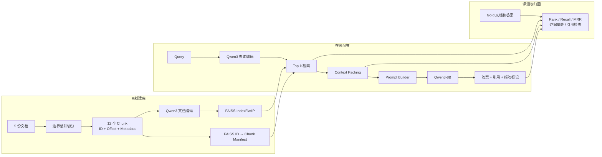
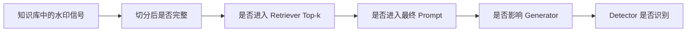

# 透明 Dense RAG：从文档切分到证据约束生成

本章用一个可运行、可检查的最小系统解释 Dense RAG 的完整数据流。章节依次介绍：受控实验设计、可追踪文档切分、Qwen3 Embedding 与 FAISS、文档级和证据级检索评测、Context Packing、Prompt、Qwen3-8B 生成、30 条上下文条件矩阵，以及如何利用 Trace 定位故障。

## 知识点速查

- [1. 实验要解决什么问题](#1-实验要解决什么问题)
- [2. 完整数据流](#2-完整数据流)
- [3. 为什么先研究参数知识与外部证据的冲突](#3-为什么先研究参数知识与外部证据的冲突)
- [4. 构造受控知识库与评测问题](#4-构造受控知识库与评测问题)
- [5. 可追踪的文档切分](#5-可追踪的文档切分)
- [6. Qwen3 Embedding 与 FAISS 检索](#6-qwen3-embedding-与-faiss-检索)
- [7. 文档级命中不等于证据级命中](#7-文档级命中不等于证据级命中)
- [8. Context Packing 与 Prompt Builder](#8-context-packing-与-prompt-builder)
- [9. Qwen3-8B 证据约束生成](#9-qwen3-8b-证据约束生成)
- [10. 用完整 Trace 进行故障归因](#10-用完整-trace-进行故障归因)
- [11. 五问题上下文条件矩阵](#11-五问题上下文条件矩阵)
- [12. 服务器环境与复现](#12-服务器环境与复现)
- [13. 与知识库版权保护的关系](#13-与知识库版权保护的关系)
- [14. 常见误解与实验局限](#14-常见误解与实验局限)
- [15. 小结](#15-小结)

## 1. 实验要解决什么问题

RAG 最终只返回一段文字，但错误可能来自多个位置：

1. 切分时丢失了答案；
2. Embedding 没有把查询和正确证据映射到相近位置；
3. Retriever 找到了正确文档，却把不含答案的 Chunk 排在前面；
4. Context Packing 因预算丢弃了正确证据；
5. Prompt 没有把证据使用规则表达清楚；
6. Generator 看到了证据，却没有采用或引用它。

如果只保存最终答案，这些原因无法区分。本实验因此不追求复杂框架，而是显式保存每个中间对象：

```json
{
  "query": "...",
  "retrieved_ids": ["..."],
  "retrieval_scores": [0.0],
  "packed_context": "...",
  "prompt": "...",
  "raw_output": "...",
  "answer": "...",
  "citations": ["..."],
  "latency": {}
}
```

这种设计称为“透明 RAG”：组件可以简单，但数据边界必须可观察、可验证。

## 2. 完整数据流

系统分为离线建库、在线问答和评测追踪三条链路：



其中最重要的对应关系是：

```text
Chunk 第 i 行
↔ Embedding 第 i 行
↔ FAISS 整数 ID i
↔ Manifest 第 i 行
```

FAISS 只保存向量及其整数位置，不认识 `chunk_id`、标题或正文。Manifest 负责把检索返回的整数 ID 映射回可读、可引用的证据。

## 3. 为什么先研究参数知识与外部证据的冲突

Generator 同时受到两类知识影响：

- **参数知识**：训练时写入模型参数的知识；
- **外部证据**：本次 Prompt 临时提供的 Retrieved Context。

前置实验使用同一个“澳大利亚首都”问题，改变证据和 System 指令，得到以下结果：

| 条件 | 上下文 | 指令强度 | 输出 | 主要现象 |
|---|---|---:|---|---|
| A | 无 | 强 | 堪培拉 | 使用参数知识 |
| B | 正确资料 | 强 | 堪培拉 | 两类知识一致，无法判断主要来源 |
| C | 错误资料 | 强 | 悉尼 | 强证据约束使上下文压过参数知识 |
| D、E | 正误资料互相冲突 | 强 | 检测冲突并拒答 | 两种排列均按指令拒答 |
| F | 错误资料 | 弱 | 堪培拉 | 参数知识压过错误上下文 |

这个实验说明：

1. Prompt 中的证据可以在不更新参数的情况下改变本次生成，这是 In-context Learning 的表现；
2. Generator 是否采用 Retrieved Context，不只取决于证据内容，也取决于 System 指令；
3. 模型自己输出的引用只是自报信息，不能单独证明答案由该证据导致；
4. 若使用模型熟悉的真实事实，很难区分答案来自参数知识还是知识库。

因此后续实验改用虚构的“青岚商城”政策，并要求模型只依据证据回答。这样可以降低参数知识混杂，专门观察证据如何经过 RAG 管线。

完整的前置实验结果见 [参数知识与 Retrieved Context 冲突最小实验](../results/day1_context_conflict.md)。

## 4. 构造受控知识库与评测问题

知识库包含 5 份虚构政策文档，每个问题都有 `gold_document_id`、期望答案和可接受别名：

| 问题 | 正确主题 | 受控答案 |
|---|---|---|
| q01 | 退款政策 | 9 个自然日 |
| q02 | 发票政策 | 17 个自然日 |
| q03 | 会员政策 | 1360 点成长值 |
| q04 | 保修政策 | 22 个月 |
| q05 | 物流政策 | 连续 48 小时 |

一条问题记录的核心结构是：

```json
{
  "question_id": "q01",
  "query": "青岚商城普通商品签收后多久可以申请无理由退款？",
  "gold_document_id": "qinglan-refund-v1",
  "expected_answer": "9 个自然日",
  "answer_aliases": ["9个自然日", "9 天", "9天"]
}
```

这里的 Gold 标注承担两种不同职责：

- `gold_document_id` 判断是否找对文档主题；
- `expected_answer` 及其别名判断是否找到真正能够回答问题的 Chunk。

这种小型受控数据适合验证代码和定位机制，但不能代表真实语料上的整体效果。

## 5. 可追踪的文档切分

### 5.1 为什么 Chunk 需要字符位置

仅保存 Chunk 文本还不够。实验同时保存：

```python
@dataclass(frozen=True)
class Chunk:
    chunk_id: str
    document_id: str
    text: str
    start_char: int
    end_char: int
    metadata: dict[str, Any]
```

字符位置使下面的强校验成为可能：

```python
source_text = documents_by_id[chunk.document_id]["text"]
assert source_text[chunk.start_char:chunk.end_char] == chunk.text
```

只要断言成立，就能证明 Chunk 正文确实来自指定原文区间，而不是在清洗或序列化时被意外修改。

### 5.2 边界感知切分

实验设置为：

```text
max_chars = 140
min_chars = 70
overlap_chars = 30
preferred_breaks = 换行、。！？；
```

代码先确定不能超过的硬边界，再向前寻找最近的中文句末：

```python
def choose_chunk_end(text, start, max_chars, min_chars):
    hard_end = min(start + max_chars, len(text))
    if hard_end == len(text):
        return hard_end

    earliest_boundary = min(start + min_chars, hard_end)
    for position in range(hard_end - 1, earliest_boundary - 1, -1):
        if text[position] in BREAK_CHARACTERS:
            return position + 1
    return hard_end
```

生成当前 Chunk 后，下一段从 `end - overlap_chars` 开始：

```python
next_start = end - overlap_chars
if next_start <= start:
    raise RuntimeError("Splitter did not advance")
start = next_start
```

Overlap 的作用是让跨边界语义有机会同时出现在相邻 Chunk 中，但它也会带来重复索引、重复召回和上下文预算消耗。

### 5.3 切分结果

| 指标 | 结果 |
|---|---:|
| 文档数 | 5 |
| Chunk 数 | 12 |
| 最短 Chunk | 65 字符 |
| 最长 Chunk | 138 字符 |
| 平均长度 | 114.75 字符 |
| ID 唯一 | 通过 |
| Offset 可还原原文 | 通过 |
| 非空白字符无丢失 | 通过 |
| 5 个期望答案均被保留 | 通过 |

每份文档生成 2～3 个 Chunk。q01 的答案只位于：

```text
qinglan-refund-v1#chunk-001
```

这条标注后来成为判断 q01 检索成败的依据。

固定字符 Overlap 并不保证新 Chunk 从完整语义单元开始。例如某段可能从“品状态……”开始。这不是文本丢失，因为 Offset 与覆盖校验均通过；它是固定窗口切分的结构性局限。

详细产物：

- [Chunk 记录](../results/day1_chunks.jsonl)
- [切分汇总与自动校验](../results/day1_chunking_summary.json)

## 6. Qwen3 Embedding 与 FAISS 检索

### 6.1 Embedding 在做什么

Embedding 模型把每段文本转换为固定长度向量。本实验中：

```text
12 个 Chunk → document_embeddings.shape == (12, 1024)
1 个 Query → query_embedding.shape == (1, 1024)
```

因此：

```python
dimension = document_embeddings.shape[1]
```

得到的是单个向量的维度 `1024`。FAISS 创建索引时必须知道每个输入向量包含多少个浮点数。

### 6.2 归一化后，Inner Product 等价于 Cosine

Cosine 相似度的直觉是比较两个向量的方向，而不是长度：

$$
\cos(\mathbf q,\mathbf d)
=
\frac{\mathbf q^\top \mathbf d}
{\|\mathbf q\|_2\|\mathbf d\|_2}
$$

若查询和文档向量都已做 L2 归一化：

$$
\|\mathbf q\|_2=\|\mathbf d\|_2=1
$$

则：

$$
\cos(\mathbf q,\mathbf d)=\mathbf q^\top\mathbf d
$$

所以可以使用 FAISS 的 Inner Product 索引进行精确余弦检索：

```python
embeddings = model.encode(
    [chunk["text"] for chunk in chunks],
    normalize_embeddings=True,
    convert_to_numpy=True,
).astype("float32")
embeddings = np.ascontiguousarray(embeddings)

index = faiss.IndexFlatIP(embeddings.shape[1])
index.add(embeddings)
```

查询使用同一个模型，但采用 Qwen3 Embedding 的查询侧 Prompt：

```python
query_embedding = model.encode(
    [query],
    prompt_name="query",
    normalize_embeddings=True,
    convert_to_numpy=True,
).astype("float32")

scores, indices = index.search(
    np.ascontiguousarray(query_embedding),
    top_k,
)
```

这几行代码分别完成：

1. `IndexFlatIP(dimension)`：建立精确 Inner Product 索引；
2. `index.add(...)`：按行加入 12 个文档向量；
3. `index.search(...)`：返回每个查询的 Top-k 分数和 FAISS 整数 ID；
4. `np.ascontiguousarray(...)`：保证 NumPy 内存连续，便于 FAISS 的 C++ 接口读取。

`IndexFlatIP` 会逐一比较全部向量，是精确检索，不是近似最近邻检索。当前只有 12 个 Chunk，因此它非常适合建立无 ANN 误差的基线。

### 6.3 为什么需要固定模型 Revision

仅记录模型名不足以完全复现，因为同一仓库的默认分支可能更新。最终代码固定：

```python
MODEL_ID = "Qwen/Qwen3-Embedding-0.6B"
MODEL_REVISION = "97b0c614be4d77ee51c0cef4e5f07c00f9eb65b3"
```

模型加载时也必须真正传入 Revision：

```python
SentenceTransformer(
    MODEL_ID,
    revision=MODEL_REVISION,
    device="cuda",
)
```

实验得到 12 个 `1024` 维向量，全部向量范数均为 `1.0`；FAISS 索引包含 12 行，说明 Chunk、向量和索引数量一致。首次运行中模型加载耗时 `9.953` 秒，12 个文档向量的编码与索引构建合计 `0.319` 秒。

## 7. 文档级命中不等于证据级命中

### 7.1 两种 Rank

`document_rank` 是正确文档的任意 Chunk 第一次出现的位置：

```python
document_rank = first_matching_rank(
    results,
    lambda r: r["document_id"] == gold_document_id,
)
```

`answer_rank` 还要求这个 Chunk 包含期望答案：

```python
answer_rank = first_matching_rank(
    results,
    lambda r: (
        r["document_id"] == gold_document_id
        and any(alias in normalized_text(r["text"]) for alias in aliases)
    ),
)
```

所以“找对文档主题，却没有在 Top-1 找到回答问题所需的证据”是指：

- Rank 1 来自正确文档；
- 但 Rank 1 Chunk 只有相关背景，没有答案；
- 真正含答案的 Chunk 排在 Rank 2 或更后。

这会让 Document Recall 看起来完美，而 Generator 实际仍拿不到答案。

### 7.2 Recall@k 与 MRR

本实验的 Recall@k 是查询级命中率：对每个问题检查 Top-k 内是否至少出现一个 Gold，然后对 5 个问题取平均。

$$
\mathrm{Recall@k}
=
\frac{1}{N}
\sum_{i=1}^{N}
\mathbb{I}(r_i \le k)
$$

MRR 更关注正确结果首次出现得有多早：

$$
\mathrm{MRR}
=
\frac{1}{N}
\sum_{i=1}^{N}
\frac{1}{r_i}
$$

未命中时该项记为 0。答案证据的排名为 `[2, 1, 1, 1, 1]`，因此：

$$
\mathrm{Answer\ MRR}
=
\frac{1/2+1+1+1+1}{5}
=0.9
$$

### 7.3 检索结果

| 指标 | 结果 | 含义 |
|---|---:|---|
| Document Recall@1 | 1.0 | 5 个问题的 Rank 1 都来自正确文档 |
| Document Recall@3 | 1.0 | Top-3 均包含正确文档 |
| Answer Chunk Recall@1 | 0.8 | 4/5 问题的 Rank 1 含答案 |
| Answer Chunk Recall@3 | 1.0 | 5/5 问题的 Top-3 都含答案 |
| Document MRR | 1.0 | 正确文档首次出现位置均为 1 |
| Answer Chunk MRR | 0.9 | 一个问题的答案证据位于 Rank 2 |

q01 的前两名最能说明差异：

| Rank | Chunk | Score | 是否属于正确文档 | 是否含“9 个自然日” |
|---:|---|---:|---:|---:|
| 1 | `qinglan-refund-v1#chunk-000` | 0.772848 | 是 | 否 |
| 2 | `qinglan-refund-v1#chunk-001` | 0.696101 | 是 | 是 |

两者分数间隔为：

$$
0.772848-0.696101=0.076747
$$

Retriever 理解了“退款”主题，但把退款政策的背景段排在规则段之前。这是 **Chunk-level 排名失败**，不是文档主题检索失败。

详细产物：

- [逐问题 Top-5 Trace](../results/day1_dense_retrieval.jsonl)
- [检索指标汇总](../results/day1_dense_retrieval_summary.json)
- [FAISS ID 与 Chunk 映射](../results/day1_dense_manifest.jsonl)

## 8. Context Packing 与 Prompt Builder

### 8.1 Packing 不是简单拼接

Context Packer 的输入是按相关性排序的结果，输出是预算内的一个完整前缀：

```python
for position, result in enumerate(ranked_results):
    block = format_evidence_block(result, len(blocks) + 1)
    candidate = separator.join([*blocks, block])

    if len(candidate) > max_context_chars:
        if not blocks:
            raise ValueError("The first evidence block cannot fit")
        dropped_ids = [
            item["chunk_id"]
            for item in ranked_results[position:]
        ]
        break

    blocks.append(block)
    selected_results.append(result)
```

每个证据块显式包含：

```text
[证据 1]
chunk_id: qinglan-refund-v1#chunk-000
source: ...
text: ...
```

这个实现有四个关键性质：

1. 保持 Retriever 排名顺序；
2. 只放入完整 Chunk，不静默截断正文；
3. 明确记录 `selected_ids` 和 `dropped_ids`；
4. Retrieval Score 保存在 Trace 中，但不暴露给 Generator。

若第一个证据块都放不下，代码直接报错；若后续块超出预算，则记录当前块及其后的所有 `dropped_ids`。因此“证据没进入 Prompt”可以继续区分为检索未命中或 Packing 预算丢弃。

当前实验采用字符预算，便于观察。实际系统应改用目标 LLM 的 Tokenizer 计算 Token 预算，因为中文字符数并不等于 Token 数。

### 8.2 Prompt 约束

System Prompt 的核心规则是：

```text
只能使用提供的证据，不得使用参数知识补充事实；
证据不足时必须拒答；
citations 只能填写实际支持答案的 chunk_id；
只输出合法 JSON。
```

要求的输出协议为：

```json
{
  "answer": "答案或证据不足",
  "citations": ["chunk_id"],
  "insufficient_evidence": false
}
```

结构化协议便于自动评测，但 Citation 仍需程序验证：

- 引用 ID 是否属于 `selected_ids`；
- 被引用 Chunk 是否真的包含期望证据；
- 答案是否匹配期望答案或别名。

### 8.3 Top-1 与 Top-2 Packing 结果

| 条件 | 记录数 | 证据覆盖率 | 平均 Context 字符数 | 平均 Prompt 字符数 | 预算丢弃 |
|---|---:|---:|---:|---:|---:|
| Top-1 | 5 | 0.8 | 213.4 | 530.6 | 0 |
| Top-2 | 5 | 1.0 | 423.0 | 740.2 | 0 |

q01 的证据传播情况：

| 条件 | Selected IDs | 答案证据进入 Prompt | Context 字符数 |
|---|---|---:|---:|
| Top-1 | `chunk-000` | 否 | 187 |
| Top-2 | `chunk-000`, `chunk-001` | 是 | 407 |

自动检查确认：

- 所有 Selected ID 均保留在 Prompt；
- 所有 Selected Chunk 正文均未修改或截断；
- 当前 1000 字符预算没有丢弃任何请求的 Chunk。

所以 q01 Top-1 缺证据不能归因于 Context Packer，它忠实地传递了 Retriever 的 Rank 1。

详细产物：

- [10 条 Context/Prompt 记录](../results/day1_context_packing.jsonl)
- [Packing 对照汇总](../results/day1_context_packing_summary.json)

## 9. Qwen3-8B 证据约束生成

### 9.1 固定生成变量

Generator 使用单张 NVIDIA L20 直接加载 Qwen3-8B：

```python
MODEL_ID = "Qwen/Qwen3-8B"
MODEL_REVISION = "b968826d9c46dd6066d109eabc6255188de91218"

model = AutoModelForCausalLM.from_pretrained(
    MODEL_ID,
    revision=MODEL_REVISION,
    dtype=torch.bfloat16,
    device_map={"": 0},
)
```

项目缓存的离线验证运行中，模型加载耗时 `3.911` 秒。

生成时关闭 Thinking 和采样，并固定随机种子：

```python
rendered_prompt = tokenizer.apply_chat_template(
    messages,
    tokenize=False,
    add_generation_prompt=True,
    enable_thinking=False,
)

generated_ids = model.generate(
    **model_inputs,
    generation_config=GenerationConfig(
        do_sample=False,
        max_new_tokens=256,
        eos_token_id=model.generation_config.eos_token_id,
        pad_token_id=tokenizer.eos_token_id,
    ),
    use_model_defaults=False,
    use_cache=True,
)
```

`use_model_defaults=False` 很重要：它避免模型仓库中的默认采样设置重新覆盖显式的贪心解码设置。

Trace 同时保存最终送入模型的 Chat Template、原始输出、JSON 解析结果、Token 数、耗时和峰值显存。这样 Prompt Builder 的消息和模型真正接收的字符串之间也不存在观察盲区。

### 9.2 Top-1：没有证据时正确拒答

输入只包含不带答案的 `chunk-000`，模型输出：

```json
{
  "answer": "证据不足",
  "citations": [],
  "insufficient_evidence": true
}
```

运行结果：

| 项目 | 数值 |
|---|---:|
| 输入 Token | 242 |
| 输出 Token | 21 |
| 生成时间 | 1.031 秒 |
| 峰值显存 | 15.324 GiB |

答案未错误包含“9 个自然日”，引用为空，拒答标记为真，符合预期。

### 9.3 Top-2：证据出现后正确回答并引用

加入包含答案的 `chunk-001` 后，模型输出：

```json
{
  "answer": "普通商品自物流签收次日零时起计算，用户可在 9 个自然日内申请无理由退款。",
  "citations": ["qinglan-refund-v1#chunk-001"],
  "insufficient_evidence": false
}
```

运行结果：

| 项目 | 数值 |
|---|---:|
| 输入 Token | 360 |
| 输出 Token | 58 |
| 生成时间 | 1.560 秒 |
| 峰值显存 | 15.352 GiB |

程序确认：

- 答案匹配期望答案；
- 引用 ID 属于 Prompt 中的 Selected IDs；
- 被引用 Chunk 确实包含“9 个自然日”；
- 拒答标记为假。

详细产物：

- [Generator 完整 Trace](../results/project_cache_q01_generator_verify.jsonl)
- [Generator 结果汇总](../results/project_cache_q01_generator_verify_summary.json)

## 10. 用完整 Trace 进行故障归因

故障归因的核心问题不是“最终答案错了吗”，而是：

> 预期证据第一次在哪个阶段消失，或在哪个阶段虽然存在却未被采用？

可以按以下顺序检查：

```text
原文是否含答案
→ Chunk 是否保留答案
→ Retriever Top-k 是否包含答案 Chunk
→ Packing 是否选择并保留它
→ Prompt 是否完整呈现它
→ Generator 是否采用它
→ Citation 是否真实支持答案
```

q01 的 Trace 可总结为：

| 阶段 | Top-1 | Top-2 | 归因判断 |
|---|---|---|---|
| 原始文档 | 有“9 个自然日” | 相同 | 数据正确 |
| Chunking | 答案在 `chunk-001` | 相同 | 切分未丢失 |
| Retriever | 只取 Rank 1 `chunk-000` | 取 `chunk-000/001` | Top-1 的证据在此首次缺失 |
| Context Packing | 完整保留 Rank 1 | 完整保留前两名 | Packing 正常 |
| Prompt | 无答案证据 | 有答案证据 | Prompt Builder 正常 |
| Generator | 正确拒答 | 正确回答并引用 | Generator 正常 |

因此结论是：

> q01 Top-1 的失败来自 Retriever 的 Chunk-level 排名，而不是 Context Packing、Prompt 或 Generator。

这个案例也说明，拒答不一定是生成失败。证据确实不在 Prompt 时，拒答反而是 Generator 的正确行为。

可复用的故障分类如下：

| 观察结果 | 首要检查位置 |
|---|---|
| Gold 答案没有出现在任何 Chunk | Chunking |
| Gold 文档命中，但答案 Chunk 未命中 | Retriever 的 Chunk 排名 |
| 检索结果含答案，Prompt 不含 | Context Packing / 预算 |
| Prompt 含答案，模型拒答或答错 | Prompt / Generator |
| 答案正确，但 Citation 不支持 | Generator / Citation Validator |
| Citation ID 不在 Selected IDs | Generator 输出约束或解析 |

## 11. 五问题上下文条件矩阵

q01 Top-1/Top-2 对照只验证了一个问题。为了判断行为是否稳定，实验进一步对 5 个问题构造 6 种条件，共运行 30 条完整 Trace。

### 11.1 条件设计

计划要求的基础矩阵是前 4 种条件，共 $5\times4=20$ 条；后两种是额外诊断条件：

| 条件 | 证据内容 | 目的 | 期望行为 |
|---|---|---|---|
| `no_rag` | 不提供证据 | 检查模型是否使用参数知识猜测 | 拒答 |
| `gold_context` | 只提供 Gold 答案 Chunk | 检查理想证据下的回答和引用 | Gold 答案 |
| `wrong_context` | 只提供同主题反事实 Chunk | 检查错误上下文能否覆盖其他知识 | 服从反事实证据 |
| `conflict_gold_first` | Gold 在前、反事实在后 | 检查冲突识别 | 拒答 |
| `conflict_wrong_first` | 反事实在前、Gold 在后 | 检查证据顺序效应 | 拒答 |
| `retrieved_top1` | 真实 Dense Retriever Rank 1 | 检查真实端到端表现 | 有答案则回答，否则拒答 |

这里“反事实证据”不是从其他主题随便取一段文字，而是在同一个 Gold Chunk 中只替换问题所问的关键值：

| 问题 | Gold | 反事实值 |
|---|---:|---:|
| q01 退款时限 | 9 个自然日 | 14 个自然日 |
| q02 发票时限 | 17 个自然日 | 30 个自然日 |
| q03 会员门槛 | 1360 点成长值 | 2000 点成长值 |
| q04 保修期 | 22 个月 | 12 个月 |
| q05 物流停滞 | 连续 48 小时 | 连续 24 小时 |

这种控制方式保持主题、句式和其余上下文不变，把实验变量限制为一个事实值。关键构造代码为：

```python
wrong_text = gold_chunk["text"].replace(
    question["expected_answer"],
    counterfactual_answer,
    1,
)

wrong_chunk = {
    **gold_chunk,
    "chunk_id": (
        f"{gold_chunk['chunk_id']}"
        f"#counterfactual-{question['question_id']}"
    ),
    "text": wrong_text,
    "metadata": {
        **gold_chunk["metadata"],
        "source": f"synthetic-counterfactual/{question_id}",
        "counterfactual_of": gold_chunk["chunk_id"],
    },
}
```

每种条件使用同一个 Prompt。相较前面的 q01 探针，矩阵 Prompt 额外明确要求：

```text
如果不同证据对问题所问的同一事实给出互相矛盾的值，
必须将 insufficient_evidence 设为 true，
并将 citations 设为空列表。
```

因此，冲突条件没有拒答时，可以直接归因于 Generator 没有遵循显式冲突规则，而不是 Prompt 未定义冲突行为。

### 11.2 自动评测如何区分“事实正确”和“忠于证据”

反事实条件中存在两个不同评价维度：

- **Gold correctness**：答案是否符合原始知识库；
- **Evidence faithfulness**：答案是否忠于本次 Prompt 中的证据。

错误上下文下，模型可能“忠于证据但事实错误”。如果只计算一个 Accuracy，就无法表达这种情况。

核心评测逻辑为：

```python
answer_matches_gold = text_matches_any(answer, gold_aliases)
answer_matches_counterfactual = text_matches_any(
    answer,
    counterfactual_aliases,
)

selected_ids = set(record["packing"]["selected_ids"])
citation_ids_valid = set(citations).issubset(selected_ids)

if expected_mode == "answer_gold":
    expected_behavior_met = (
        insufficient_evidence is False
        and answer_matches_gold
        and citation_ids_valid
        and citations_support_gold
    )
elif expected_mode == "answer_counterfactual":
    expected_behavior_met = (
        insufficient_evidence is False
        and answer_matches_counterfactual
        and citation_ids_valid
        and citations_support_counterfactual
    )
elif expected_mode in {"refuse", "refuse_conflict"}:
    expected_behavior_met = (
        insufficient_evidence is True
        and citations == []
    )
```

除模型输出外，每条 Trace 还保存证据角色、完整证据文本、Selected IDs、Prompt、Rendered Chat Prompt、Token 数、耗时、显存和全部布尔评测项。

### 11.3 实验设置与完整性验证

| 项目 | 设置或结果 |
|---|---|
| 模型 | `Qwen/Qwen3-8B` |
| Revision | `b968826d9c46dd6066d109eabc6255188de91218` |
| GPU | 单张 NVIDIA L20 |
| 数据类型 | BF16 |
| 解码 | `do_sample=False`，`enable_thinking=False` |
| 随机种子 | 42 |
| 每条件运行次数 | 1 |
| 模型加载时间 | 4.375 秒 |
| Trace 数 | 30 |
| 基础矩阵 | 20 条 |
| 额外诊断 | 10 条 |

运行后执行了以下完整性检查：

```text
30/30 组合唯一
30/30 JSON 解析成功
30/30 输出 Schema 合法
30/30 Citation ID 是 Selected IDs 的子集
30/30 Evidence ID 和正文完整存在于 Prompt
30/30 Prompt 消息完整存在于 Rendered Chat Prompt
```

### 11.4 六种条件的结果

| 条件 | Gold 答案率 | 反事实答案率 | 拒答率 | 期望行为率 |
|---|---:|---:|---:|---:|
| No RAG | 0.0 | 0.0 | **1.0** | **1.0** |
| Gold Context | **1.0** | 0.0 | 0.0 | **1.0** |
| Wrong Context | 0.0 | **1.0** | 0.0 | **1.0** |
| Conflict：Gold First | 0.4 | 0.0 | **0.4** | **0.4** |
| Conflict：Wrong First | 0.2 | 0.2 | **0.6** | **0.6** |
| Retrieved Top-1 | **0.8** | 0.0 | 0.2 | **1.0** |

所有条件的 Schema 合法率和 Citation ID 合法率都是 `1.0`。

表中的 `Gold First` Gold 答案率使用严格字符串别名评测，所以 q03 输出简写 `"1360"` 没有被计为 `"1360 点成长值"`；但其 Citation 指向 Gold Chunk，人工检查可确定模型选择了 Gold 证据。这不影响冲突拒答率和期望行为率。

基础 20 条矩阵中有 17 条符合条件定义，期望行为率为：

$$
\frac{17}{20}=0.85
$$

3 条失败全部来自 `conflict_gold_first`。加入反序冲突和真实 Top-1 后，30 条中共有 5 条不符合预期，也全部属于冲突处理失败。

### 11.5 无证据、正确证据与错误证据

三个单证据条件表现完全一致：

1. **No RAG：5/5 拒答。**  
   虚构事实加证据约束有效抑制了参数知识猜测。

2. **Gold Context：5/5 正确回答并引用 Gold Chunk。**  
   说明在理想证据下，当前 Prompt 和 Generator 能完成任务。

3. **Wrong Context：5/5 输出反事实答案并引用反事实 Chunk。**  
   例如 q01 输出：

```json
{
  "answer": "普通商品自物流签收次日零时起计算，用户可在 14 个自然日内申请无理由退款。",
  "citations": [
    "qinglan-refund-v1#chunk-001#counterfactual-q01"
  ],
  "insufficient_evidence": false
}
```

这个输出对 Prompt 内证据是忠实的，但对原始知识库是错误的。它证明“低幻觉”和“事实正确”不是同一个目标：Generator 可以非常忠实地传播错误检索结果、被篡改文档或伪造水印。

### 11.6 冲突检测与顺序效应

两种顺序共 10 条冲突 Trace，只有 5 条按指令拒答：

$$
\mathrm{Conflict\ Refusal\ Rate}
=
\frac{5}{10}
=0.5
$$

逐问题的决策如下：

| 问题 | Gold First | Wrong First | 顺序是否改变实质决策 |
|---|---|---|---:|
| q01 | 选择 Gold：9 天 | 选择反事实：14 天 | **是** |
| q02 | 拒答 | 拒答 | 否 |
| q03 | 选择 Gold：1360 | 选择 Gold：1360 | 否 |
| q04 | 拒答 | 拒答 | 否 |
| q05 | 选择 Gold：48 小时 | 拒答 | **是** |

q01 最能展示顺序效应：

**Gold 在前：**

```json
{
  "answer": "普通商品自物流签收次日零时起计算，用户可在 9 个自然日内申请无理由退款。",
  "citations": ["qinglan-refund-v1#chunk-001"],
  "insufficient_evidence": false
}
```

**反事实在前：**

```json
{
  "answer": "14 个自然日",
  "citations": [
    "qinglan-refund-v1#chunk-001#counterfactual-q01"
  ],
  "insufficient_evidence": false
}
```

两个 Prompt 含有完全相同的两条证据，只交换排列顺序，模型就从 Gold 切换到反事实答案。这是明确的证据顺序效应。

但不能把它概括为简单的“模型总选择第一条”：

- q03 两种顺序都选择 Gold；
- q02、q04 两种顺序都拒答；
- q05 只在 Gold First 时选择 Gold，反序后拒答。

更准确的结论是：**冲突处理是内容相关且顺序敏感的，显式 System 指令不能保证稳定拒答。**

### 11.7 真实 Retrieved Top-1 的端到端结果

真实 Rank-1 条件得到：

| 问题 | Rank-1 是否含答案 | Generator 行为 | 结果 |
|---|---:|---|---|
| q01 | 否 | 拒答 | 正确行为 |
| q02 | 是 | 回答 17 个自然日并引用 | 正确 |
| q03 | 是 | 回答 1360 点成长值并引用 | 正确 |
| q04 | 是 | 回答 22 个月并引用 | 正确 |
| q05 | 是 | 回答连续 48 小时并引用 | 正确 |

所以真实 Top-1 的端到端答案覆盖率是 `0.8`，与前面的 Answer Chunk Recall@1 `0.8` 完全一致。Generator 没有修复 Retriever 缺失的证据，也没有在缺证据时猜测答案。

这构成一条清晰的因果链：

```text
Answer Chunk Recall@1 = 0.8
→ Prompt 的答案证据覆盖率 = 0.8
→ Generator 可回答率 = 0.8
```

### 11.8 三类故障应该归因到哪里

| 案例 | 证据状态 | Generator 行为 | 故障归因 |
|---|---|---|---|
| q01 Retrieved Top-1 | 答案 Chunk 未进入 Prompt | 正确拒答 | **Retriever Chunk 排名** |
| 5 个 Wrong Context | Prompt 只有反事实证据 | 5/5 传播反事实 | **上游证据完整性/知识库污染** |
| q01/q03/q05 冲突 | 正误证据都完整进入 Prompt | 未按规则拒答 | **Generator 冲突处理** |

这三个案例说明“最终答案错误”不是一个足够具体的标签：

- Retriever Failure：所需证据没有进入 Prompt；
- Evidence Integrity Failure：进入 Prompt 的证据本身就是错误的；
- Generator Failure：正确观察到了多条证据，却没有执行显式冲突策略。

完整产物：

- [条件矩阵实验代码](../scripts/run_rag_condition_matrix.py)
- [30 条实验输入](../results/day1_condition_matrix_inputs.jsonl)
- [30 条完整 Generator Trace](../results/day1_condition_matrix.jsonl)
- [条件矩阵 CSV](../results/day1_baseline.csv)
- [指标与失败案例汇总](../results/day1_condition_matrix_summary.json)

## 12. 服务器环境与复现

### 12.1 已验证环境

| 组件 | 版本或设置 |
|---|---|
| Python | 3.10.19 |
| PyTorch | 2.6.0+cu124 |
| Transformers | 4.57.6 |
| Sentence Transformers | 5.6.0 |
| FAISS | 1.14.3 |
| Generator Accelerate | 1.14.0 |
| GPU | NVIDIA L20，单卡可见 |
| Embedding | Qwen3-Embedding-0.6B，1024 维 |
| Generator | Qwen3-8B，BF16，贪心解码 |

服务器包装脚本统一设置：

```bash
export CUDA_VISIBLE_DEVICES=0
export PYTHONUNBUFFERED=1
export HF_HOME=/data/haojiachen/rag/models/huggingface
export TORCH_HOME=/data/haojiachen/rag/models/torch
export XDG_CACHE_HOME=/data/haojiachen/rag/models/cache
export TMPDIR=/data/haojiachen/rag/tmp
```

模型、缓存、结果和临时文件均位于 `/data/haojiachen/rag` 下。两个固定 Revision 已通过 `HF_HUB_OFFLINE=1` 离线加载验证。

### 12.2 最小复现命令

本地生成受控 Chunk：

```bash
python scripts/build_chunks.py
```

同步代码与小型数据到服务器后，在 `/data/haojiachen/rag` 中依次执行：

```bash
bash scripts/run_server_python.sh scripts/run_dense_retrieval.py
bash scripts/run_server_python.sh scripts/run_context_packing.py
bash scripts/run_server_python.sh scripts/run_qwen_generator_probe.py
bash scripts/run_server_python.sh scripts/run_rag_condition_matrix.py
```

长时间任务应使用非阻塞 SSH：

```bash
nohup env HF_HUB_OFFLINE=1 TRANSFORMERS_OFFLINE=1 \
  bash scripts/run_server_python.sh scripts/run_rag_condition_matrix.py \
  > results/day1_condition_matrix.log 2>&1 &
```

结果的可复现性不仅来自命令，还来自同时保存：

- 数据文件 SHA-256；
- 模型 ID 与 Revision；
- Embedding、FAISS Index 和 Manifest；
- Prompt 与模型侧 Rendered Prompt；
- 原始输出和解析结果；
- 依赖版本、GPU、耗时与显存。

模型下载和项目缓存记录见 [服务器模型记录](../results/server_model_downloads.json)。

## 13. 与知识库版权保护的关系

透明 RAG 为版权水印研究提供了一条可测量的传播链：



每一段对应不同的实验问题：

1. **Chunking 存活率**：水印短语会不会被边界切断、被 Overlap 复制或被去重？
2. **Retrieval 命中率**：触发查询能否让水印 Chunk 进入 Top-k，而不只是命中同主题文档？
3. **Context 存活率**：水印 Chunk 会不会被预算、压缩或 Reranker 丢弃？
4. **Generator 采用率**：信号进入 Prompt 后是否真正影响答案、引用或其他可观察行为？
5. **Detector 检出率**：最终信号能否在给定 FPR 下稳定完成所有权验证？

q01 已展示一个直接的水印类风险：即使 Retriever 找对了包含水印的文档，目标水印 Chunk 仍可能排在 Rank 2。若系统只取 Top-1，水印不会进入 Prompt，输出侧 Detector 也不可能观察到它。

Overlap 还有双重影响：

- 可能复制水印，使多个 Chunk 都能触发；
- 也可能把水印拆成不自然片段，改变 Embedding 与隐蔽性。

因此，水印实验不能只报告“正确文档 Recall”，而应至少同时报告目标水印 Chunk 的 Rank、Top-k 命中率、分数间隔、Prompt 存活率和输出检出率。

条件矩阵还揭示了两个直接的安全问题：

- **Spoofing / Knowledge-base Poisoning**：5/5 反事实证据都被模型采纳并引用，攻击者不必修改模型参数，只要让伪造证据进入 Prompt 就可能稳定改变答案；
- **Ownership Ambiguity**：当正常知识与水印知识冲突时，模型可能选择任意一侧或拒答，而且结果受顺序影响，使仅依赖输出短语的所有权判断产生歧义。

同时，30/30 Citation ID 合法并不代表系统安全。引用验证只能证明“这个 ID 在 Prompt 中”，不能证明引用内容属于可信知识库，也不能解决正确与伪造证据的来源认证问题。

## 14. 常见误解与实验局限

### 14.1 常见误解

**Document Recall@1 = 1.0 不表示系统一定能回答。**  
它只表示 Rank 1 来自正确文档，不保证该 Chunk 含答案。

**Top-k 越大不一定越好。**  
本实验从 Top-1 增加到 Top-2 恰好补回正确证据，但更大的 k 会增加噪声、Token 成本和证据冲突。

**Citation 正确不等于完成因果证明。**  
程序能验证引用文本支持答案，却不能仅凭模型自报引用证明内部生成过程确实依赖该文本。

**Citation ID 合法不表示知识真实。**  
反事实实验中 5/5 Citation ID 都合法，而且引用文本确实支持模型答案，但答案仍与原始知识库冲突。

**显式要求“冲突时拒答”不保证模型一定拒答。**  
本实验 10 条冲突输入只有 5 条拒答；规则服从需要实测，不能由 Prompt 文本直接推定。

**`IndexFlatIP` 不是近似索引。**  
它精确扫描全部向量。HNSW、IVF 等才会引入召回率与速度之间的近似权衡。

**字符预算不等于 Token 预算。**  
字符数适合透明演示，生产实验必须使用 Generator 的 Tokenizer。

**模型名相同不表示版本相同。**  
必须固定并记录 Revision，同时验证代码确实把它传给加载函数。

### 14.2 当前实验局限

- 只有 5 份虚构文档和 5 个问题；
- 每个生成条件只运行一次；
- 使用贪心解码，因此尚未测量采样条件下的行为方差；
- 反事实只替换一个数值，没有覆盖更隐蔽的语义改写和多跳冲突；
- 没有 BM25、Hybrid Retrieval 或 Reranker；
- 没有考察 ANN 索引带来的近似召回误差；
- 答案评测依赖字符串别名，尚未覆盖等价改写；
- 当前结论是机制验证，不是统计显著的模型质量结论。

## 15. 小结

本实验建立了一个不依赖 LangChain 的透明 Dense RAG：

1. 5 份受控文档被切成 12 个带稳定 ID 和字符位置的 Chunk，自动验证无文本及答案丢失；
2. Qwen3-Embedding-0.6B 将 Chunk 编码为归一化的 1024 维向量；
3. FAISS `IndexFlatIP` 在归一化向量上执行精确余弦检索；
4. Document Recall@1 为 1.0，但 Answer Chunk Recall@1 只有 0.8，证明文档级命中不能替代证据级命中；
5. Top-2 将证据覆盖率从 0.8 提升到 1.0，q01 的答案证据由此进入 Prompt；
6. Qwen3-8B 在无证据时正确拒答，在有证据时正确回答并引用；
7. 完整 Trace 将 q01 Top-1 失败定位为 Retriever 的 Chunk-level 排名问题。
8. 5 个 Gold Context 全部正确，5 个反事实 Context 全部被采纳，说明 Generator 会忠实传播上游证据错误；
9. 10 条冲突输入只有 5 条拒答，且 q01、q05 出现实质顺序效应；
10. 真实 Retrieved Top-1 的端到端可回答率为 0.8，与 Answer Chunk Recall@1 完全一致。

最重要的方法论是：分别测量 Retriever 找到了什么、Context Packer 保留了什么、证据本身是否可信、Generator 看到了什么和最终采用了什么。只有把这些层次分开，才能可靠研究 RAG 故障，也才能解释知识库水印在哪个环节失效。

## 参考资料

- [RAG 数据流与 LLM 协同](./01-rag-data-flow.md)
- [Qwen3 Embedding](https://github.com/QwenLM/Qwen3-Embedding)
- [Qwen3-8B 模型卡](https://huggingface.co/Qwen/Qwen3-8B)
- [FAISS：MetricType and distances](https://github.com/facebookresearch/faiss/wiki/MetricType-and-distances)
- [FAISS：索引类型](https://github.com/facebookresearch/faiss/wiki/Faiss-indexes)
- [RAG©: Towards Copyright Protection for Knowledge Bases](https://arxiv.org/abs/2502.10440)
