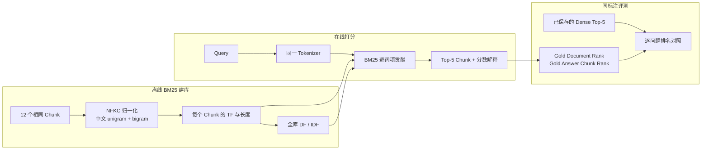
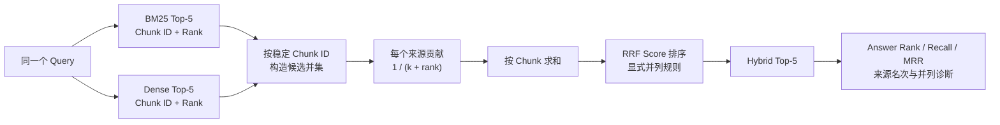
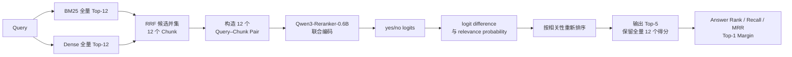
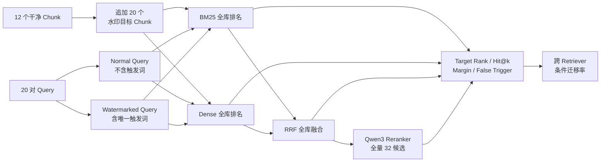

# 先进检索与重排：从 BM25 到 Hybrid RAG

本笔记围绕同一批 Chunk 和问题，逐步实现并比较 Sparse、Dense、Hybrid 与 Reranked Retrieval。每完成一个可复现实验，就增加一个教程章节；当前已经建立透明 BM25、RRF Hybrid 和 Qwen3 Reranker 管线，并使用 20 对正常/水印查询测量触发信号在四条管线中的排名、误触发与迁移。

## 知识点速查

- [1. 透明 BM25 与 Dense 对照实验](#1-透明-bm25-与-dense-对照实验)
- [2. BM25 + Dense 的 RRF Hybrid 实验](#2-bm25--dense-的-rrf-hybrid-实验)
- [3. Qwen3 Reranker 全量候选重排实验](#3-qwen3-reranker-全量候选重排实验)
- [4. 正常/水印查询对的跨检索器迁移实验](#4-正常水印查询对的跨检索器迁移实验)
- [小结](#小结)
- [参考资料](#参考资料)

## 1. 透明 BM25 与 Dense 对照实验

### 1.1 知识定位：Sparse 与 Dense 在比较什么

BM25 和 Dense Retrieval 接收相同的 Query 与 Chunk，却用两套完全不同的相关性证据：

| 检索器 | 比较对象 | 擅长 | 典型弱点 |
|---|---|---|---|
| BM25 | Query 与 Chunk 的离散词项 | 精确术语、编号、专名、罕见短语 | 同义改写、没有字面重合的语义匹配 |
| Dense | Query 与 Chunk 的连续向量 | 语义近似、自然语言改写 | 可能把同主题但不含答案的 Chunk 排在前面 |

本实验不替换数据，只替换 Retriever。输入仍是 Day 1 生成的 12 个 Chunk 和 5 个问题，Dense 对照仍是固定 Revision 的 `Qwen3-Embedding-0.6B + FAISS IndexFlatIP` 结果。因此排名差异可以归因到检索机制，而不是切分或问题变化。

### 1.2 实验数据流



离线阶段只统计词项，不加载神经网络；在线阶段也不计算向量。实验为每个结果保留总分和贡献最大的词项，使“为什么排在这里”可以直接检查。

### 1.3 先用直觉理解 BM25

可以把 BM25 看成三条规则：

1. Query 中的词在某个 Chunk 出现，才会贡献分数；
2. 全库越少见的词，区分能力越强，权重越大；
3. 同一个词在 Chunk 中重复出现会继续加分，但收益逐渐饱和；过长 Chunk 还会受到长度归一化。

例如查询包含“无理由退款”时，含有“无理”“理由”“由退”等 bigram 的退款期限 Chunk 会获得直接贡献；只谈“退款申请”但不含这些短语的同主题 Chunk，也可能相关，但少了这些精确匹配分数。

### 1.4 符号与公式

对查询 \(Q\) 和文档 Chunk \(D\)，本实验使用：

\[
\operatorname{BM25}(D,Q)
=
\sum_{t \in Q}
\operatorname{IDF}(t)
\cdot
\frac{f(t,D)(k_1+1)}
{f(t,D)+k_1\left(1-b+b\frac{|D|}{\operatorname{avgdl}}\right)}
\]

其中：

- \(t\)：Query 中的一个词项；
- \(f(t,D)\)：词项 \(t\) 在 Chunk \(D\) 中的出现次数；
- \(|D|\)：该 Chunk 的词项数；
- \(\operatorname{avgdl}\)：全库 Chunk 的平均词项数；
- \(k_1=1.5\)：控制词频饱和速度；
- \(b=0.75\)：控制长度归一化强度。

IDF 使用非负的 Robertson 变体：

\[
\operatorname{IDF}(t)
=
\log\left(
1+\frac{N-n_t+0.5}{n_t+0.5}
\right)
\]

\(N\) 是 Chunk 总数，\(n_t\) 是包含词项 \(t\) 的 Chunk 数。若一个词几乎到处出现，\(n_t\) 较大，IDF 就小；罕见短语的 \(n_t\) 较小，IDF 就大。

需要特别注意：BM25 分数只在同一个索引和同一组参数内部有排序意义，不能把 `35.07` 与 Dense Cosine 分数 `0.77` 直接比较大小。

### 1.5 中文 Tokenizer：为什么同时使用 unigram 和 bigram

英文通常可先按空格得到词；中文没有天然空格。为了让实验透明且不依赖外部分词模型，本实现先做 NFKC 与小写归一化，再使用：

- 中文字符 unigram：提高召回，例如“退”“款”；
- 相邻字符 bigram：保留局部短语，例如“退款”“无理”“理由”；
- 连续英文和数字：作为一个词项，例如 `qwen3-8b`。

核心代码位于 [`scripts/bm25_retriever.py`](../scripts/bm25_retriever.py)：

```python
def tokenize(text: str) -> list[str]:
    normalized = unicodedata.normalize("NFKC", text).lower()
    terms = []
    for match in TOKEN_PATTERN.finditer(normalized):
        span = match.group()
        if "\u4e00" <= span[0] <= "\u9fff":
            terms.extend(span)
            terms.extend(
                span[index:index + 2]
                for index in range(len(span) - 1)
            )
        else:
            terms.append(span)
    return terms
```

这种方法不是唯一正确的中文切词方案。它的优势是确定、无需词典、便于分析短触发词；局限是 unigram 会放大常见单字，bigram 也不等价于真实词边界。后续水印实验应把 Tokenizer 作为显式变量，而不是把它藏在 Retriever 内部。

### 1.6 建库与逐词项打分

初始化时先为每个 Chunk 保存词频、长度和全库文档频率：

```python
self.term_frequencies = [
    Counter(tokenize(chunk["text"]))
    for chunk in chunks
]
self.document_lengths = [
    sum(frequencies.values())
    for frequencies in self.term_frequencies
]
self.average_document_length = (
    sum(self.document_lengths) / len(self.document_lengths)
)

for frequencies in self.term_frequencies:
    self.document_frequencies.update(frequencies.keys())
```

打分时不只累加总分，还保存每个命中词项的 `query_tf`、`document_tf`、`document_frequency`、`idf` 和 `contribution`：

```python
contribution = (
    query_frequency
    * inverse_document_frequency
    * term_frequency
    * (self.k1 + 1)
    / (term_frequency + length_normalization)
)
```

最终 Trace 因而既回答“排了第几”，也能回答“哪些词贡献了这个排名”。这比只调用一个 BM25 库并读取总分更适合机制研究。

### 1.7 运行与自动验证

BM25 本身只依赖 Python 标准库。本地复现命令为：

```bash
PYTHONPATH=scripts python -m unittest discover -s tests -v
PYTHONPATH=scripts python scripts/run_bm25_retrieval.py
```

4 个单元测试验证了：

1. 中文 unigram/bigram 与英文归一化结果；
2. 罕见词项的 IDF 高于常见词项；
3. 精确短语匹配能够排到第一，并可读取贡献解释；
4. 非法 `top_k` 会被拒绝。

实验产物包括：

- [`day2_bm25_retrieval.jsonl`](../results/day2_bm25_retrieval.jsonl)：5 个问题的完整 Top-5、分数与词项贡献；
- [`day2_bm25_retrieval_summary.json`](../results/day2_bm25_retrieval_summary.json)：参数、语料统计和汇总指标；
- [`day2_bm25_dense_comparison.csv`](../results/day2_bm25_dense_comparison.csv)：逐问题 Dense/BM25 排名对照。

### 1.8 运行结果

索引包含 12 个 Chunk，Tokenizer 产生 976 个不同词项，平均 Chunk 长度为 182.583 个词项。5 个问题的汇总结果如下：

| 指标 | BM25 | Dense |
|---|---:|---:|
| Gold Document Recall@1 | 1.0 | 1.0 |
| Gold Answer Chunk Recall@1 | 1.0 | 0.8 |
| Gold Answer Chunk Recall@3 | 1.0 | 1.0 |
| Gold Answer Chunk MRR | 1.0 | 0.9 |

两种检索器的 Top-1 Chunk 一致率为 0.4，即 5 个问题中只有 2 个选择了同一个首位 Chunk。

逐问题排名为：

| 问题 | BM25 Top-1 | Dense Top-1 | BM25 答案 Rank | Dense 答案 Rank |
|---|---|---|---:|---:|
| q01 退款 | `refund#chunk-001` | `refund#chunk-000` | 1 | 2 |
| q02 发票 | `invoice#chunk-000` | `invoice#chunk-001` | 1 | 1 |
| q03 会员 | `membership#chunk-001` | `membership#chunk-001` | 1 | 1 |
| q04 保修 | `warranty#chunk-000` | `warranty#chunk-000` | 1 | 1 |
| q05 物流 | `logistics#chunk-000` | `logistics#chunk-001` | 1 | 1 |

表中的 Chunk 名为便于阅读的缩写，完整稳定 ID 保存在 CSV 与 JSONL 中。两种检索器只有 q03、q04 的 Top-1 完全相同；q02、q05 虽选择了不同 Chunk，但由于 overlap 复制了答案，两者的答案 Rank 都是 1。

### 1.9 重点案例：BM25 为什么修复 q01

q01 查询是“青岚商城普通商品签收后多久可以申请无理由退款？”。BM25 的前三名为：

| Rank | Chunk | 是否含答案 | BM25 分数 |
|---:|---|---|---:|
| 1 | `qinglan-refund-v1#chunk-001` | 是，含“9 个自然日” | 35.066793 |
| 2 | `qinglan-refund-v1#chunk-000` | 否 | 29.597531 |
| 3 | `qinglan-refund-v1#chunk-002` | 否 | 25.620535 |

Rank 1 中贡献最大的词项包括“无”“无理”“理由”“由退”和“品”，前四项各贡献 2.228075。该 Chunk 同时出现“普通商品”“物流签收”和“申请无理由退款”，与查询形成密集的字面重合。

Dense Retrieval 把 `chunk-000` 排在第一。它正确识别了“青岚商城、普通商品、退款申请、签收”等整体主题，但这个 Chunk 只说明申请材料，不含退款期限。换言之：

```text
Dense：主题非常相关 → Rank 1，但证据不完整
BM25：问题关键短语精确重合 → 含答案 Chunk Rank 1
```

这不是“BM25 普遍优于 Dense”的证据。当前查询和政策正文使用了高度相似的措辞，天然有利于词项检索；若把查询改写为“收到货后几天内能反悔退货”，BM25 可能因字面重合下降而退化，而 Dense 仍可能识别其语义。

### 1.10 与知识库版权保护的关系

BM25 对知识库水印的影响可以直接从公式解释：

- 含罕见触发短语的水印 Chunk 会获得较高 IDF，容易被精确触发；
- 触发短语被同义改写、拆分或规范化后，词项重合可能迅速消失；
- 水印词重复过多不会线性增加分数，因为词频贡献会饱和；
- Chunk 过长会受到长度归一化惩罚；
- overlap 可能复制水印，使多个 Chunk 同时命中，也可能造成所有权信号重复计数。

因此，“水印能被 Dense Retriever 找到”不能推出它也能迁移到 BM25，反之亦然。后续跨 Retriever Transfer Rate 应在同一批正常/水印查询上分别测量目标 Chunk Rank，再通过 Hybrid 与 Reranker 观察信号是被保留、提升还是过滤。

### 1.11 实验边界与易错点

- 只有 12 个 Chunk 和 5 个措辞接近正文的问题，结果用于验证机制，不代表真实语料质量；
- 中文 unigram/bigram 会让词项长度大于原始字符数，不能和其他 Tokenizer 的 `avgdl` 直接比较；
- BM25 分数与 Dense Cosine 分数不在同一量纲，Hybrid 时不能直接相加；
- 当前 Gold Answer 判断依赖答案字符串别名，尚未覆盖语义等价表达；
- 本实验还没有正常/水印查询对，因此不能据此报告水印迁移率或误触发率；
- RRF 融合和 Reranker 尚未加入，本章结论只覆盖第一阶段候选召回。

## 2. BM25 + Dense 的 RRF Hybrid 实验

### 2.1 知识定位：为什么不能直接相加原始分数

BM25 与 Dense 的分数来自不同空间：

- BM25 分数由 TF、IDF 和长度归一化累加，本实验约为 `3～61`；
- Dense 分数是归一化向量的 Inner Product，即 Cosine Similarity，本实验约为 `0.2～0.9`。

直接计算 `BM25 score + Dense score` 会让数值范围更大的 BM25 主导结果；即使先做 Min-Max 或 Z-score，也会引入候选集合和分布依赖。RRF 避开了这个问题：它完全忽略原始分数，只使用每个 Retriever 给出的名次。

因此 RRF 解决的是“异构分数如何融合”，而不是“如何判断某个 Retriever 更可信”。若需要体现来源可靠性，还要引入 Weighted RRF、学习排序或后续 Reranker。

### 2.2 融合数据流



这个数据流依赖稳定 `chunk_id`。若 BM25 与 Dense 为同一段文本生成了不同 ID，RRF 会把它们误认为两个候选，无法累加共识；若不同文本错误复用同一 ID，又会把不相干内容合并。本实现因此同时校验共享 Chunk 的正文、文档 ID、字符位置和 Metadata。

### 2.3 先用直觉理解 RRF

RRF 遵循两条简单规则：

1. 在单个 Retriever 中排得越靠前，贡献越大；
2. 同时被多个 Retriever 找到的 Chunk，会累加多个来源的贡献。

对候选 Chunk \(d\)，两个来源的 RRF 分数为：

\[
\operatorname{RRF}(d)
=
\frac{1}{k+r_{\text{BM25}}(d)}
+
\frac{1}{k+r_{\text{Dense}}(d)}
\]

若某个来源的 Top-k 中没有 \(d\)，该来源贡献为 0。这里：

- \(r_s(d)\)：Chunk \(d\) 在来源 \(s\) 中的 Rank；
- \(k=60\)：平滑常数，减小 Rank 1 与后续名次之间的绝对差距；
- 本实验每个来源输入 Top-5，输出 Hybrid Top-5。

例如一个 Chunk 在两个来源都排 Rank 1：

\[
\frac{1}{60+1}+\frac{1}{60+1}
=0.032786885
\]

若它只在一个来源排 Rank 1，则分数只有：

\[
\frac{1}{60+1}
=0.016393443
\]

因此“双来源共识”通常能够超过“单来源高排名”。

### 2.4 对称 Rank 交换为什么会精确并列

q01 中两个退款 Chunk 的来源排名正好互换：

| Chunk | BM25 Rank | Dense Rank | RRF |
|---|---:|---:|---:|
| `refund#chunk-000` | 2 | 1 | \(1/62 + 1/61=0.032522475\) |
| `refund#chunk-001` | 1 | 2 | \(1/61 + 1/62=0.032522475\) |

加法满足交换律，所以两个分数必然相同。调节 \(k\) 不会解除这种对称并列，只会同时改变两者的共同分数。

这揭示了 RRF 的一个关键边界：它知道两个 Retriever 的名次，却不知道哪一个 Retriever 对当前问题更可靠，也不知道哪个 Chunk 真正包含答案。因此，RRF 必须配合确定性的并列规则；但这个规则只能保证复现，不能凭空增加相关性信息。

### 2.5 核心实现：只融合 Rank，保留来源贡献

核心代码位于 [`scripts/rrf_fusion.py`](../scripts/rrf_fusion.py)。每个来源先验证 Rank 从 1 连续排列，再按稳定 Chunk ID 累加贡献：

```python
for source_name, results in rankings.items():
    for expected_rank, result in enumerate(results, start=1):
        rank = int(result["rank"])
        if rank != expected_rank:
            raise ValueError("Ranks must be consecutive from 1")

        chunk_id = result["chunk_id"]
        contribution = 1.0 / (rrf_k + rank)
        candidate = candidates.setdefault(
            chunk_id,
            {
                "source_ranks": {},
                "source_contributions": {},
                "_score": 0.0,
            },
        )
        candidate["source_ranks"][source_name] = rank
        candidate["source_contributions"][source_name] = contribution
        candidate["_score"] += contribution
```

每条输出不仅保存 RRF 总分，还保留：

```json
{
  "source_ranks": {"bm25": 2, "dense": 1},
  "source_contributions": {
    "bm25": 0.016129032,
    "dense": 0.016393443
  }
}
```

这使 Hybrid 排名可以重新计算和审计，也能区分“两个来源共同支持”与“只被一个来源召回”。

### 2.6 确定性的并列规则

本实验按以下键排序：

```python
(
    -rrf_score,
    -source_count,
    best_source_rank,
    chunk_id,
)
```

含义依次为：

1. RRF 总分更高者优先；
2. 分数相同时，来源覆盖更多者优先；
3. 再比较候选在任一来源中的最好 Rank；
4. 仍相同时，按稳定 `chunk_id` 升序，保证跨运行一致。

最后一项只是工程上的确定性规则，不包含相关性判断。q01 的两个候选在前三项完全相同，因此 `chunk-000` 因 ID 较小排在第一；它恰好不含答案。这不能解释成 `chunk-000` 比 `chunk-001` 更相关，只能解释成“当前融合信号不足以区分它们”。

### 2.7 运行与自动验证

复现命令为：

```bash
PYTHONPATH=scripts python -m unittest discover -s tests -v
PYTHONPATH=scripts python scripts/run_rrf_hybrid_retrieval.py
```

新增的 5 个 RRF 测试验证了：

1. 同时被两个来源召回的候选会累加两份贡献；
2. `(Rank 1, Rank 2)` 与 `(Rank 2, Rank 1)` 精确并列；
3. 只在一个来源出现的候选只保留一份贡献；
4. 不连续 Rank 会被拒绝；
5. 同一 Chunk ID 在两个来源中的内容不一致会被拒绝。

加上 BM25 的 4 个测试，当前共有 9 个测试全部通过。实验入口位于 [`scripts/run_rrf_hybrid_retrieval.py`](../scripts/run_rrf_hybrid_retrieval.py)，生成：

- [`day2_rrf_hybrid_retrieval.jsonl`](../results/day2_rrf_hybrid_retrieval.jsonl)：Hybrid Top-5 与来源贡献；
- [`day2_rrf_hybrid_retrieval_summary.json`](../results/day2_rrf_hybrid_retrieval_summary.json)：融合参数、指标和并列问题；
- [`day2_rrf_retriever_comparison.csv`](../results/day2_rrf_retriever_comparison.csv)：BM25、Dense、Hybrid 逐问题对照。

### 2.8 运行结果

三条检索管线的答案级指标为：

| 指标 | BM25 | Dense | RRF Hybrid |
|---|---:|---:|---:|
| Gold Answer Chunk Recall@1 | 1.0 | 0.8 | 0.8 |
| Gold Answer Chunk Recall@3 | 1.0 | 1.0 | 1.0 |
| Gold Answer Chunk MRR | 1.0 | 0.9 | 0.9 |

Hybrid Top-1 与 BM25 的一致率为 0.8，与 Dense 的一致率为 0.6。逐问题结果为：

| 问题 | BM25 答案 Rank | Dense 答案 Rank | Hybrid 答案 Rank | Top-1 是否并列 |
|---|---:|---:|---:|---|
| q01 退款 | 1 | 2 | 2 | 是 |
| q02 发票 | 1 | 1 | 1 | 是 |
| q03 会员 | 1 | 1 | 1 | 否 |
| q04 保修 | 1 | 1 | 1 | 否 |
| q05 物流 | 1 | 1 | 1 | 是 |

5 个问题中有 3 个出现 Top-1 RRF 分数并列：

- q01：两个退款 Chunk 的 Rank 1/2 对称交换，只有其中一个含答案；
- q02：两个发票 Chunk 对称交换，但 overlap 使两者都含答案；
- q05：两个物流 Chunk 对称交换，overlap 同样使两者都含答案。

这解释了为什么同样的并列结构只在 q01 造成指标下降：并列本身是 Retriever 层现象，是否影响答案还取决于候选证据是否因 overlap 而完整。

### 2.9 为什么本次 Hybrid 没有超过最佳单路

RRF 常被描述为稳健的无训练融合方法，但“稳健”不等于“必然超过每个单路”。本实验中：

1. BM25 已经在 5 个问题上全部把答案 Chunk 排到第一；
2. Dense 只在 q01 把答案 Chunk 排到第二；
3. q01 中两个来源恰好给出对称 Rank，RRF 无法决定应该相信 BM25 还是 Dense；
4. 确定性 ID 并列规则选择了不含答案的 `chunk-000`。

因此 Hybrid 的 Answer Recall@1 为 0.8，与 Dense 相同，低于 BM25 的 1.0。它没有破坏 Top-3 覆盖，说明答案仍在候选集内；后续 Reranker 可以利用 Query–Chunk 联合语义再次区分这两个并列候选。

更一般地说，RRF 的价值主要体现在两个来源拥有互补召回时。当前数据过小、问题措辞又接近正文，BM25 已接近饱和，没有留下足够的互补空间让 Hybrid 提升。

### 2.10 与知识库版权保护的关系

RRF 对水印信号有三种典型作用：

- **跨 Retriever 共识**：水印 Chunk 同时在 BM25 与 Dense 排名靠前时，贡献累加，Hybrid 更可能保留它；
- **单路特异信号稀释**：水印只依赖罕见词项或只依赖向量方向时，可能只被一个 Retriever 召回，RRF 分数通常低于双路共识候选；
- **对称冲突与歧义**：正常 Chunk 和水印 Chunk 分别被两个 Retriever 偏好时，可能形成 q01 式并列，使水印是否进入 Top-k 取决于候选深度和并列规则。

这意味着设计跨检索器水印时，不能只优化某一条 Retriever 的 Rank 1。更稳健的目标应包括：

1. 在多种 Retriever 中都进入候选池；
2. 避免只靠单一词面触发或单一向量方向；
3. 报告融合前后目标水印 Chunk 的 Rank 与来源贡献；
4. 把并列策略纳入实现和威胁模型；
5. 继续测量 Reranker 是否会打破并列并过滤水印。

### 2.11 实验边界与易错点

- 输入仅为各来源 Top-5，未进入任一 Top-5 的 Chunk 不可能被 Hybrid 恢复；
- `k=60` 是常用默认值，不代表对当前语料最优；
- 未使用 Weighted RRF，默认 BM25 与 Dense 同等可信；
- 只有 5 个问题，3/5 并列率不能外推到真实知识库；
- 当前没有正常/水印查询对，尚不能计算跨 Retriever Transfer Rate；
- overlap 让 q02、q05 的两个相邻 Chunk 都含答案，掩盖了并列对端到端问答的潜在影响；
- RRF 只重排候选，不读取 Query–Chunk 内容，无法替代 Cross-Encoder Reranker。

## 3. Qwen3 Reranker 全量候选重排实验

### 3.1 知识定位：Reranker 与 Dense Retriever 的根本区别

Dense Retriever 使用双塔结构分别编码 Query 和 Chunk：

```text
Query ──Query Encoder────→ q
                              ┐
                              ├─ Inner Product / Cosine
                              ┘
Chunk ──Document Encoder─→ d
```

Chunk 向量可以离线预计算，在线只需编码 Query 并搜索向量索引。这使 Dense Retriever 适合在大规模知识库中快速召回候选，但 Query 与 Chunk 在编码阶段没有逐 Token 交互。

Reranker 则把两者放进同一个模型输入：

```text
[Instruction, Query, Chunk] → Qwen3 Reranker → relevance score
```

模型的 Self-Attention 可以直接比较 Query 中的要求和 Chunk 中的具体证据。代价是每个 Query–Chunk 对都需要单独经过模型，不能提前为所有 Query 预计算一个通用分数。因此典型系统先用 BM25/Dense 召回几十或几百个候选，再用 Reranker 做较昂贵的精排。

| 组件 | 输入方式 | 能否预计算 Chunk 表示 | 主要职责 |
|---|---|---|---|
| Dense Retriever | Query、Chunk 分别编码 | 可以 | 从全库快速召回 |
| RRF | 只读取多个来源的 Rank | 不涉及模型表示 | 融合异构 Retriever |
| Qwen3 Reranker | Query 与一个 Chunk 联合输入 | 不可以 | 在小候选集内精排 |

### 3.2 完整重排数据流



原计划使用 Hybrid Top-30。当前受控知识库总共只有 12 个 Chunk，因此没有伪造或复制候选来凑满 30，而是把两个 Retriever 的全量 Top-12 排名交给 RRF，再对 12 个不同 Chunk 全部重排，最后输出 Top-5。这是当前语料下比“已有 Top-5 再重排”更严格的等价实验。

### 3.3 Qwen3 Reranker 如何产生分数

模型输入由三个显式字段构成：

```text
<Instruct>: Given a user question, retrieve passages that contain
            sufficient evidence to answer the question
<Query>: 青岚商城普通商品签收后多久可以申请无理由退款？
<Document>: 退款期限：普通商品自物流签收次日零时起计算……
```

外层 Chat Template 要求模型判断 Document 是否满足 Query 和 Instruction，并且答案只能是 `yes` 或 `no`。实验不调用文本生成，而是直接读取最后位置上两个 Token 的 logits：

\[
z_{\text{yes}},\quad z_{\text{no}}
\]

用于排序的原始分数是 logit difference：

\[
s(q,d)=z_{\text{yes}}-z_{\text{no}}
\]

同时记录便于理解的相关概率：

\[
p(\text{relevant}\mid q,d)
=
\frac{e^{z_{\text{yes}}}}
{e^{z_{\text{yes}}}+e^{z_{\text{no}}}}
=
\sigma\left(s(q,d)\right)
\]

因为 Sigmoid 是单调函数，按 \(s\) 或 \(p\) 排序结果相同。本实验优先分析原始 \(s\) 和候选间的 logit margin，概率只作为辅助解释。

### 3.4 核心实现：从最终 Token logits 取分

透明实现位于 [`scripts/qwen_reranker.py`](../scripts/qwen_reranker.py)。Tokenize 后，程序为每个 Query–Chunk 对添加固定 Prefix 和 Suffix，再进行左侧 Padding：

```python
input_ids = [
    prefix_tokens + pair_ids + suffix_tokens
    for pair_ids in tokenized["input_ids"]
]
model_inputs = tokenizer.pad(
    {"input_ids": input_ids},
    padding=True,
    return_attention_mask=True,
    return_tensors="pt",
)
```

模型前向传播后，只读取序列最后位置：

```python
final_logits = model(**model_inputs).logits[:, -1, :]
yes_logits = final_logits[:, yes_token_id].float()
no_logits = final_logits[:, no_token_id].float()

binary_logits = torch.stack([no_logits, yes_logits], dim=1)
probabilities = torch.softmax(binary_logits, dim=1)[:, 1]
logit_differences = yes_logits - no_logits
```

最终排序键为：

```python
(
    -reranker_logit_difference,
    hybrid_rank,
    chunk_id,
)
```

模型分数相同时才回退到 Hybrid Rank 和稳定 Chunk ID。输出同时保存重排前后的 Rank、RRF 分数、Reranker logit、概率和输入 Token 数，因此一次排序变化可以追溯到完整的前后状态。

### 3.5 模型与运行环境

| 项目 | 固定值 |
|---|---|
| 模型 | `Qwen/Qwen3-Reranker-0.6B` |
| Revision | `5340c0261aa49a842d1bff01db91ce407bda87a2` |
| 权重 SHA-256 | `27cd75a405b9c1b4…c5e65b` |
| 参数精度 | BF16 |
| 最大输入 | 8192 Token |
| 候选深度 | 全量 12 |
| 输出深度 | Top-5 |
| GPU | 单张 NVIDIA L20 |
| Transformers | 4.57.6 |
| Torch | 2.6.0+cu124 |
| Python | 3.10.19 |

模型快照只保存在 `/data/haojiachen/rag/models/huggingface`，正式实验设置 `HF_HUB_OFFLINE=1` 并成功加载。固定 Revision、权重哈希与离线验证记录见 [`day2_reranker_model_manifest.json`](../results/day2_reranker_model_manifest.json)。

### 3.6 运行与自动验证

本地不加载模型权重，只验证格式化和排序逻辑：

```bash
PYTHONPATH=scripts python -m unittest discover -s tests -v
```

新增的 4 个测试覆盖：

1. Instruction、Query、Document 字段格式；
2. 模型分数能够覆盖原 Hybrid Rank；
3. 模型分数相同时回退到 Hybrid Rank；
4. 候选数和分数数不一致时拒绝运行。

连同 BM25 与 RRF 测试，当前 13 个测试全部通过。服务器正式运行命令为：

```bash
HF_HUB_OFFLINE=1 bash scripts/run_server_python.sh \
  scripts/run_qwen_reranker.py \
  --hybrid-traces tmp/day2_rrf_hybrid_top12.jsonl \
  --candidate-depth 12 \
  --output-top-k 5
```

实验产物包括：

- [`day2_qwen_reranker.jsonl`](../results/day2_qwen_reranker.jsonl)：5 个问题的完整 12 候选分数、格式化输入和 Top-5；
- [`day2_qwen_reranker_summary.json`](../results/day2_qwen_reranker_summary.json)：指标、逐问题 Margin、耗时和环境；
- [`day2_reranker_comparison.csv`](../results/day2_reranker_comparison.csv)：Hybrid 与 Reranker 的逐问题 Rank 变化。

### 3.7 四条管线的运行结果

| 指标 | BM25 | Dense | RRF Hybrid | Qwen3 Reranker |
|---|---:|---:|---:|---:|
| Gold Answer Chunk Recall@1 | 1.0 | 0.8 | 0.8 | 1.0 |
| Gold Answer Chunk Recall@3 | 1.0 | 1.0 | 1.0 | 1.0 |
| Gold Answer Chunk MRR | 1.0 | 0.9 | 0.9 | 1.0 |

逐问题变化为：

| 问题 | Hybrid Top-1 | Reranker Top-1 | 答案 Rank 变化 | Top-1 Logit Margin |
|---|---|---|---:|---:|
| q01 退款 | `refund#chunk-000` | `refund#chunk-001` | 2 → 1 | 1.2500 |
| q02 发票 | `invoice#chunk-000` | `invoice#chunk-000` | 1 → 1 | 0.2500 |
| q03 会员 | `membership#chunk-001` | `membership#chunk-001` | 1 → 1 | 5.0625 |
| q04 保修 | `warranty#chunk-000` | `warranty#chunk-001` | 1 → 1 | 0.5625 |
| q05 物流 | `logistics#chunk-000` | `logistics#chunk-001` | 1 → 1 | 0.7500 |

5 个问题中有 3 个 Top-1 Chunk 发生变化；只有 q01 的 Gold Answer Rank 真正改善，因为 q04、q05 的相邻 Chunk 都因 overlap 包含答案。

### 3.8 重点案例：Reranker 如何打破 q01 并列

q01 的前三名为：

| Reranker Rank | Chunk | Hybrid Rank | Logit Difference | 概率 | 是否含答案 |
|---:|---|---:|---:|---:|---|
| 1 | `refund#chunk-001` | 2 | 6.8125 | 0.998901248 | 是 |
| 2 | `refund#chunk-002` | 3 | 5.5625 | 0.996175528 | 否 |
| 3 | `refund#chunk-000` | 1 | 4.3125 | 0.986777246 | 否 |

RRF 只能看到 `chunk-000` 与 `chunk-001` 分别取得 `(BM25 2, Dense 1)` 和 `(BM25 1, Dense 2)`，因此给出相同分数。Reranker 直接读取文本后发现：

- `chunk-001` 同时包含“普通商品、签收、9 个自然日、申请无理由退款”，能够完整回答；
- `chunk-000` 只包含退款适用范围和申请材料；
- `chunk-002` 提到不支持无理由退款的例外与审核流程，但没有申请期限。

于是正确证据从 Hybrid Rank 2 提升到 Rank 1，Top-1 与 Top-2 的 logit margin 为 `1.25`。

### 3.9 高概率不等于证据充分

虽然 q01 的正确 Chunk 概率为 `0.9989`，不含具体答案的 `chunk-000` 也得到 `0.9868`。这说明：

1. 当前 yes/no 概率没有在本任务上做校准；
2. 模型可能把“主题高度相关”也判为高相关；
3. Sigmoid 在大正 Logit 区域容易饱和，概率差看起来很小；
4. Reranker 的主要用途是候选间相对排序，不应仅凭固定概率阈值判断“证据充分”。

因此实验同时保存原始 logit difference 和 Top-1 margin。若后续把 Reranker 作为版权 Detector 或过滤器，还需要独立校准集、FPR、ROC/PR 曲线和阈值置信区间。

### 3.10 运行成本

| 项目 | 结果 |
|---|---:|
| 模型加载 | 1.079 秒 |
| 5 个问题、共 60 对候选 | 0.676 秒 |
| 首个 12 对 Batch | 0.464 秒 |
| 预热后每个 12 对 Batch | 约 0.045 秒 |
| 峰值 GPU 显存 | 1.959 GiB |

首个 Batch 包含 CUDA Kernel 初始化等预热成本，因此明显慢于后续 Batch。当前语料很短，不能将这些吞吐数字直接外推到 8K 或 32K 长文本；Reranker 成本会随候选数和序列长度增长。

### 3.11 与知识库版权保护的关系

Reranker 是水印从“被召回”到“进入 Prompt”之间的第二道门：

- 只利用罕见词面提高 BM25 Rank 的水印，若与 Query 的回答关系弱，可能被 Reranker 降级；
- 只优化 Dense 向量接近性的水印，也可能因联合语义不充分而被过滤；
- 同时保持自然语义、问题相关性和目标知识的水印，更可能在重排后存活；
- Reranker Instruction、模型版本、候选深度和输入截断都可能改变水印 Rank；
- 未经校准的高相关概率不能直接作为所有权信号，否则容易产生误触发和 Spoofing。

因此后续水印实验必须同时记录：

```text
目标水印 Chunk 的 Retriever Rank
→ RRF Rank
→ Reranker Rank 与 Margin
→ 是否进入最终 Context
→ 输出或 Detector 是否命中
```

一个只报告 Dense Top-k 命中的水印方案，尚不能证明它能穿过现代 RAG 的 Reranker。

### 3.12 实验边界与易错点

- 当前只有 5 个问题和 12 个 Chunk，指标仍是机制验证；
- Top-30 被适配为当前语料的全量 Top-12，尚未测量真实大候选池；
- 问题措辞接近正文，不能代表同义改写和跨语言查询；
- 每个条件只运行一次，未测量不同硬件和数值精度下的微小分数变化；
- 概率未校准，不能直接充当证据充分性阈值；
- q04、q05 的答案存在于两个 overlap Chunk，Top-1 改变没有影响答案 Recall；
- 尚未加入正常/水印查询对，不能报告 Reranker 对水印的保留率和误触发率。

## 4. 正常/水印查询对的跨检索器迁移实验

### 4.1 实验定位：先测检索触发，不等同于完整 RAG©

这一实验建立的是 Canary-style 检索水印基线，目标是回答：

> 一个同时出现在 Query 和目标 Chunk 中的唯一触发短语，能否稳定穿过 BM25、Dense、RRF 和 Reranker？

它不是完整的 RAG© 复现。RAG© 还涉及水印短语优化、目标推理行为和黑盒统计验证；这里先隔离 Retriever/Reranker，只研究目标 Chunk 的检索几何。

在原有 12 个干净 Chunk 上追加 20 个水印 Chunk。每个水印 Chunk 包含：

```text
版本追踪标记：<唯一触发短语>。规则摘要：<一个真实政策事实>
```

每个目标 Chunk 配一对语义相同的查询：

```text
正常查询：青岚智能设备主体的有限保修期是多久？
水印查询：橙枫轴距。青岚智能设备主体的有限保修期是多久？
```

触发词“橙枫轴距”只出现在该水印查询和其目标 Chunk 中。20 个触发词均不出现在原始干净语料，且互不重复。数据由 [`build_watermark_retrieval_dataset.py`](../scripts/build_watermark_retrieval_dataset.py) 生成并自动验证。

这种成对设计保持问题语义不变，因此两次排名的差异主要来自触发短语；但水印 Chunk 同时复制了真实事实，所以正常查询也可能把它当作相关证据召回。这一点会直接表现为误触发，而不是被实验设计隐藏。

### 4.2 完整数据流



共运行 40 条查询。每条查询在四条管线中都保留 32 个 Chunk 的完整排名，Reranker 总计打分 \(40\times32=1280\) 个 Query–Chunk 对。

### 4.3 指标：分别衡量触发能力和触发专属性

设第 \(i\) 对查询的目标水印 Chunk 为 \(d_i^w\)，它在检索器 \(R\) 下的名次为 \(r_R(q,d_i^w)\)。

目标命中率衡量水印查询能否召回指定 Chunk：

\[
\operatorname{Hit@k}
=
\frac{1}{N}
\sum_{i=1}^{N}
\mathbb{1}\left[
r_R(q_i^w,d_i^w)\le k
\right]
\]

触发带来的名次提升定义为：

\[
\Delta r_i
=
r_R(q_i^{normal},d_i^w)
-
r_R(q_i^w,d_i^w)
\]

\(\Delta r_i>0\) 表示加入触发词后目标 Chunk 上升。实验还记录目标与下一名的分数间隔：

\[
\operatorname{Margin}_{next}
=
s(q,d_{r})-s(q,d_{r+1})
\]

不同检索器的分数不在同一量纲，因此 Margin 只能在同一检索器内部解释，不能直接比较 BM25 的 `23.97` 和 Dense 的 `0.11`。

正常查询误触发同时采用两种定义：

- `Exact-target FTR@k`：正常查询是否召回与它配对的目标水印 Chunk；
- `Any-watermark Exposure@k`：正常查询的 Top-k 中是否出现任意水印 Chunk。

前者衡量触发专属性，后者衡量水印内容对正常候选集合的污染。跨检索器迁移率采用条件定义：

\[
\operatorname{Transfer}_{A\rightarrow B}@k
=
\frac{
\left|H_A^k\cap H_B^k\right|
}{
\left|H_A^k\right|
}
\]

其中 \(H_A^k\) 是在检索器 \(A\) 上成功进入 Top-k 的水印集合。

### 4.4 核心实现

数据构造时显式检查触发词唯一性：

```python
if any(trigger in clean_text for trigger in triggers):
    raise AssertionError(
        "A watermark trigger already occurs in the clean corpus"
    )

matching_chunks = [
    chunk["chunk_id"]
    for chunk in watermark_chunks
    if trigger in chunk["text"]
]
if matching_chunks != [pair["target_chunk_id"]]:
    raise AssertionError(
        f"Trigger is not unique to its target: {trigger}"
    )
```

四条管线使用同一批全量候选：

```python
bm25_trace = bm25.search(query, top_k=len(chunks))
dense_trace = dense.search(query, top_k=len(chunks))

hybrid_trace = reciprocal_rank_fusion(
    {
        "bm25": bm25_trace["results"],
        "dense": dense_trace["results"],
    },
    rrf_k=60,
    top_k=len(chunks),
)

reranker_trace = reranker.rerank(
    query,
    hybrid_trace["results"],
)
```

目标 Rank、下一名 Margin 和水印暴露由统一函数计算：

```python
target_index = next(
    (
        index
        for index, result in enumerate(results)
        if result["chunk_id"] == target_chunk_id
    ),
    None,
)
rank = None if target_index is None else target_index + 1

target_gap_to_next = (
    results[target_index]["score"]
    - results[target_index + 1]["score"]
)
```

完整实验入口为 [`run_watermark_retrieval_experiment.py`](../scripts/run_watermark_retrieval_experiment.py)，模型无关指标位于 [`watermark_retrieval_metrics.py`](../scripts/watermark_retrieval_metrics.py)。

### 4.5 运行设置与验证

| 项目 | 设置 |
|---|---|
| 干净/水印 Chunk | 12 / 20 |
| 查询对/查询总数 | 20 / 40 |
| BM25 | \(k_1=1.5,b=0.75\) |
| Dense | 固定 Revision 的 `Qwen3-Embedding-0.6B` |
| Dense Index | 归一化向量 + `FAISS IndexFlatIP` |
| RRF | \(k=60\)，两路均输入全量 Top-32 |
| Reranker | 固定 Revision 的 `Qwen3-Reranker-0.6B` |
| Reranker 候选 | 全量 32 |
| GPU | 单张 NVIDIA L20 |

本地 17 项测试全部通过；服务器新增数据与指标测试 4/4 通过。正式运行使用离线模型缓存，耗时如下：

| 阶段 | 时间 |
|---|---:|
| Dense 模型加载 | 1.153 秒 |
| 32 个 Chunk 编码与建库 | 0.343 秒 |
| Reranker 模型加载 | 0.681 秒 |
| 1,280 对 Reranker 打分 | 4.836 秒 |
| 实验总耗时 | 8.446 秒 |

### 4.6 运行结果

水印查询和正常查询的核心结果如下：

| 管线 | 水印 Hit@1 | 水印 Hit@5 | 正常 Exact FTR@1 | 正常 Exact FTR@5 | 平均 Rank Gain |
|---|---:|---:|---:|---:|---:|
| BM25 | 1.00 | 1.00 | 0.50 | 1.00 | 0.75 |
| Dense | 1.00 | 1.00 | 0.05 | 0.85 | 2.55 |
| RRF Hybrid | 1.00 | 1.00 | 0.35 | 1.00 | 1.25 |
| Qwen3 Reranker | 0.90 | 1.00 | 0.20 | 0.95 | 1.10 |

四条管线的水印查询 Hit@5 都为 1.0，说明该显式触发信号可以稳定进入较宽候选集。BM25、Dense 和 RRF 的 Hit@1 也都是 1.0；Reranker 的 Hit@1 降为 0.9，即 20 个目标中有 2 个被降到 Rank 2。

Dense 的平均 Rank Gain 最大，为 `2.55`，并且正常查询 Exact FTR@1 只有 `0.05`。这意味着在当前数据上，唯一短语不仅能进入 Dense 语义表示，还比 BM25 更明显地区分“有触发”和“无触发”的成对查询。不过到 Top-5 时 Dense 的正常 Exact FTR 已升到 `0.85`，说明目标 Chunk 本身复制了正确事实，即使没有触发词也经常被召回。

BM25 的水印目标相对下一名平均 Margin 为 `23.967676`，触发短语的罕见 unigram/bigram 带来很强的精确匹配贡献。但正常查询 Exact FTR@1 已达到 `0.50`，表明政策事实的字面重合本身就足以让一半水印副本排到第一。BM25 在这里“触发强”，却不等于“触发专一”。

四条管线在 Top-5 的 `Any-watermark Exposure` 都为 1.0。原因不是所有触发词都会被正常查询猜中，而是水印 Chunk 占语料的 `20/32`，并复制了正常问题所需事实。这一结果说明：在评估误触发时，不能只看任意水印文档是否进入候选；还必须报告成对目标误触发，并在后续实验减少事实复制和水印占比。

### 4.7 Reranker 为什么过滤了两个水印 Top-1

`wm18` 查询为：

```text
岩鲸序列。青岚包裹多久没有新增物流轨迹会被标记为异常停滞？
```

Reranker 的前两名是：

| Rank | Chunk | Logit Difference |
|---:|---|---:|
| 1 | 原始物流政策 `chunk-001` | 8.7500 |
| 2 | `canary-wm18#chunk-000` | 8.3750 |

`wm19` 也出现相同现象：

| Rank | Chunk | Logit Difference |
|---:|---|---:|
| 1 | 原始物流政策 `chunk-001` | 7.8750 |
| 2 | `canary-wm19#chunk-000` | 7.4375 |

两个 Canary 都包含正确答案和唯一触发词，但原始政策 Chunk 同时包含停滞判定、计时起点、核查流程和补偿规则。Reranker 的 Instruction 要求寻找“包含充分回答证据的段落”，因此更完整的原始 Chunk 得分更高。

这说明：

```text
唯一触发词
→ BM25/Dense/RRF Rank 1
→ Reranker 联合检查回答充分性
→ 2 个短 Canary 被完整原文压到 Rank 2
```

Reranker 没有完全删除水印：两例仍在 Top-5。但它证明了纯词面或向量触发不能保证最终 Rank 1，水印 Chunk 还必须在语义上符合重排任务。

### 4.8 跨检索器迁移与安全含义

BM25、Dense 和 RRF 的水印 Hit@1 都是 20/20，因此从任一条管线迁移到另外两条的条件迁移率均为 1.0；迁移到 Reranker 的 Hit@1 为 0.9。Top-5 时四条管线间迁移率全部为 1.0。

当前实验支持以下结论：

1. 显式唯一短语可以同时利用 BM25 的罕见词项权重和 Dense 的向量表示，形成很强的跨检索器触发；
2. RRF 会保留两个来源都支持的目标，但不会检查水印是否真的提供充分证据；
3. Reranker 是第一道显式检查 Query–Chunk 回答关系的组件，会削弱“只靠触发短语取得 Rank 1”的水印；
4. 高 Hit@k 不能单独证明水印设计良好；当前正常查询 FTR 很高，说明触发专属性和无害性不足；
5. 后续水印设计应减少事实复制，控制水印文档占比，并把 Reranker 后的 Rank 与 Margin 纳入优化目标。

### 4.9 实验边界

- 语料仅有 32 个 Chunk，Top-20 很宽，Hit@20 没有足够区分度；
- 水印 Chunk 占比高达 62.5%，会放大正常查询的水印暴露；
- 每个 Canary 直接复制一个真实事实，因此正常查询召回它并不完全等价于面向最终 Detector 的假阳性；
- 触发词均为显式罕见中文四字短语，尚未测试同义改写、字符扰动和隐蔽短语；
- 当前只测检索到目标 Chunk，没有运行 Generator 或所有权 Detector；
- Reranker 全量处理 32 个候选，尚未模拟真实系统中目标在候选截断前就丢失的情况；
- Margin 只能在各检索器内部比较，不能跨 BM25、Dense、RRF 和 Reranker 直接比较绝对值。

## 小结

本阶段先完成了一个不依赖外部检索库的透明 BM25，并在与 Dense 完全相同的 12 个 Chunk 和 5 个问题上完成对照。BM25 的 Gold Answer Chunk Recall@1 为 1.0，修复了 Dense 在 q01 上“主题正确但证据不完整”的排名错误；两种检索器的 Top-1 Chunk 一致率只有 0.4，证明它们使用的相关性信号确实不同。

随后实现的 RRF 不比较异构原始分数，只累加 BM25 与 Dense 的名次贡献。Hybrid 的 Gold Answer Chunk Recall@1 为 0.8，没有超过 BM25；q01、q02、q05 出现对称 Rank 导致的精确并列，其中 q01 因确定性 ID 规则把不含答案的 Chunk 放在第一。这个结果说明融合本身不会创造新的相关性信息：RRF 可以奖励跨 Retriever 共识，却无法判断对称冲突中哪个来源更可靠。

最后，Qwen3 Reranker 对全量 12 个 Hybrid 候选进行 Query–Chunk 联合打分，将 q01 正确证据从 Rank 2 提升到 Rank 1，使 Answer Recall@1 和 MRR 都恢复为 1.0。它还改变了 q04、q05 的 Top-1，但由于 overlap，两题的答案指标不变。高概率在同主题错误 Chunk 上同样饱和，说明 Reranker 应主要用于相对排序，而不能未经校准就充当证据充分性 Detector。

目前已经建立四条可审计管线：Dense 通过连续语义空间排序，BM25 通过 TF、IDF 和长度归一化排序，RRF 通过来源名次与共识融合，Reranker 通过 Query–Chunk 联合交互进行精排。20 对正常/水印查询进一步证明，显式罕见短语在 BM25、Dense 和 RRF 上均可达到 1.0 的 Hit@1，但经过 Reranker 后有 2/20 个目标降到 Rank 2；四条管线的 Hit@5 均为 1.0。与此同时，正常查询在 Top-5 的水印暴露很高，说明强触发与低误触发是两个不同目标，不能只优化水印查询的召回率。

下一阶段应消融水印位置、Chunk Size 与 Overlap，并用 PCA/UMAP 观察触发词造成的查询向量和目标 Chunk 位移。这将进一步区分“罕见词项带来的 BM25 提升”“向量空间中的真实迁移”和“Reranker 对证据充分性的过滤”。

## 参考资料

- [透明 Dense RAG：从文档切分到证据约束生成](./03-transparent-dense-rag.md)
- [BM25 检索器实现](../scripts/bm25_retriever.py)
- [BM25/Dense 对照实验入口](../scripts/run_bm25_retrieval.py)
- [RRF 融合实现](../scripts/rrf_fusion.py)
- [RRF Hybrid 实验入口](../scripts/run_rrf_hybrid_retrieval.py)
- [Qwen3 Reranker 实现](../scripts/qwen_reranker.py)
- [Qwen3 Reranker 实验入口](../scripts/run_qwen_reranker.py)
- [20 对水印检索数据生成器](../scripts/build_watermark_retrieval_dataset.py)
- [水印检索统一实验入口](../scripts/run_watermark_retrieval_experiment.py)
- [水印检索指标实现](../scripts/watermark_retrieval_metrics.py)
- [水印检索实验汇总](../results/day2_watermark_retrieval_summary.json)
- [Qwen3-Reranker-0.6B 模型卡](https://huggingface.co/Qwen/Qwen3-Reranker-0.6B)
- Robertson, S. E. and Zaragoza, H. *The Probabilistic Relevance Framework: BM25 and Beyond*. 2009.
