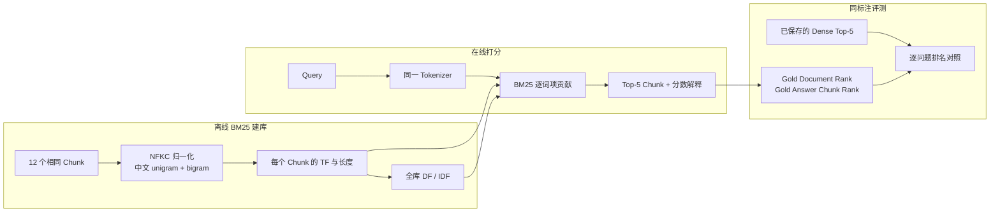
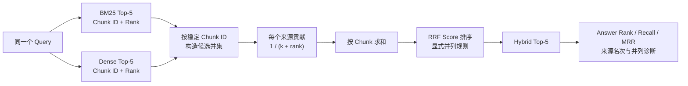

# 先进检索与重排：从 BM25 到 Hybrid RAG

本笔记围绕同一批 Chunk 和问题，逐步实现并比较 Sparse、Dense、Hybrid 与 Reranked Retrieval。每完成一个可复现实验，就增加一个教程章节；当前已经建立透明 BM25 基线，并使用 RRF 融合 BM25 与 Dense 排名，重点解释词项、语义与跨检索器共识如何共同影响最终候选。

## 知识点速查

- [1. 透明 BM25 与 Dense 对照实验](#1-透明-bm25-与-dense-对照实验)
- [2. BM25 + Dense 的 RRF Hybrid 实验](#2-bm25--dense-的-rrf-hybrid-实验)
- [小结](#小结)
- [参考资料](#参考资料)

## 1. 透明 BM25 与 Dense 对照实验

### 1.1 知识定位：Sparse 与 Dense 在比较什么

BM25 和 Dense Retrieval 接收相同的 Query 与 Chunk，却用两套完全不同的相关性证据：

| 检索器 | 比较对象 | 擅长 | 典型弱点 |
|---|---|---|---|
| BM25 | Query 与 Chunk 的离散词项 | 精确术语、编号、专名、罕见短语 | 同义改写、没有字面重合的语义匹配 |
| Dense | Query 与 Chunk 的连续向量 | 语义近似、自然语言改写 | 可能把同主题但不含答案的 Chunk 排在前面 |

本实验不替换数据，只替换 Retriever。输入仍是 Day 1 生成的 12 个 Chunk 和 5 个问题，Dense 对照仍是固定 Revision 的 `Qwen3-Embedding-0.6B + FAISS IndexFlatIP` 结果。因此排名差异可以归因到检索机制，而不是切分或问题变化。

### 1.2 实验数据流



离线阶段只统计词项，不加载神经网络；在线阶段也不计算向量。实验为每个结果保留总分和贡献最大的词项，使“为什么排在这里”可以直接检查。

### 1.3 先用直觉理解 BM25

可以把 BM25 看成三条规则：

1. Query 中的词在某个 Chunk 出现，才会贡献分数；
2. 全库越少见的词，区分能力越强，权重越大；
3. 同一个词在 Chunk 中重复出现会继续加分，但收益逐渐饱和；过长 Chunk 还会受到长度归一化。

例如查询包含“无理由退款”时，含有“无理”“理由”“由退”等 bigram 的退款期限 Chunk 会获得直接贡献；只谈“退款申请”但不含这些短语的同主题 Chunk，也可能相关，但少了这些精确匹配分数。

### 1.4 符号与公式

对查询 \(Q\) 和文档 Chunk \(D\)，本实验使用：

\[
\operatorname{BM25}(D,Q)
=
\sum_{t \in Q}
\operatorname{IDF}(t)
\cdot
\frac{f(t,D)(k_1+1)}
{f(t,D)+k_1\left(1-b+b\frac{|D|}{\operatorname{avgdl}}\right)}
\]

其中：

- \(t\)：Query 中的一个词项；
- \(f(t,D)\)：词项 \(t\) 在 Chunk \(D\) 中的出现次数；
- \(|D|\)：该 Chunk 的词项数；
- \(\operatorname{avgdl}\)：全库 Chunk 的平均词项数；
- \(k_1=1.5\)：控制词频饱和速度；
- \(b=0.75\)：控制长度归一化强度。

IDF 使用非负的 Robertson 变体：

\[
\operatorname{IDF}(t)
=
\log\left(
1+\frac{N-n_t+0.5}{n_t+0.5}
\right)
\]

\(N\) 是 Chunk 总数，\(n_t\) 是包含词项 \(t\) 的 Chunk 数。若一个词几乎到处出现，\(n_t\) 较大，IDF 就小；罕见短语的 \(n_t\) 较小，IDF 就大。

需要特别注意：BM25 分数只在同一个索引和同一组参数内部有排序意义，不能把 `35.07` 与 Dense Cosine 分数 `0.77` 直接比较大小。

### 1.5 中文 Tokenizer：为什么同时使用 unigram 和 bigram

英文通常可先按空格得到词；中文没有天然空格。为了让实验透明且不依赖外部分词模型，本实现先做 NFKC 与小写归一化，再使用：

- 中文字符 unigram：提高召回，例如“退”“款”；
- 相邻字符 bigram：保留局部短语，例如“退款”“无理”“理由”；
- 连续英文和数字：作为一个词项，例如 `qwen3-8b`。

核心代码位于 [`scripts/bm25_retriever.py`](../scripts/bm25_retriever.py)：

```python
def tokenize(text: str) -> list[str]:
    normalized = unicodedata.normalize("NFKC", text).lower()
    terms = []
    for match in TOKEN_PATTERN.finditer(normalized):
        span = match.group()
        if "\u4e00" <= span[0] <= "\u9fff":
            terms.extend(span)
            terms.extend(
                span[index:index + 2]
                for index in range(len(span) - 1)
            )
        else:
            terms.append(span)
    return terms
```

这种方法不是唯一正确的中文切词方案。它的优势是确定、无需词典、便于分析短触发词；局限是 unigram 会放大常见单字，bigram 也不等价于真实词边界。后续水印实验应把 Tokenizer 作为显式变量，而不是把它藏在 Retriever 内部。

### 1.6 建库与逐词项打分

初始化时先为每个 Chunk 保存词频、长度和全库文档频率：

```python
self.term_frequencies = [
    Counter(tokenize(chunk["text"]))
    for chunk in chunks
]
self.document_lengths = [
    sum(frequencies.values())
    for frequencies in self.term_frequencies
]
self.average_document_length = (
    sum(self.document_lengths) / len(self.document_lengths)
)

for frequencies in self.term_frequencies:
    self.document_frequencies.update(frequencies.keys())
```

打分时不只累加总分，还保存每个命中词项的 `query_tf`、`document_tf`、`document_frequency`、`idf` 和 `contribution`：

```python
contribution = (
    query_frequency
    * inverse_document_frequency
    * term_frequency
    * (self.k1 + 1)
    / (term_frequency + length_normalization)
)
```

最终 Trace 因而既回答“排了第几”，也能回答“哪些词贡献了这个排名”。这比只调用一个 BM25 库并读取总分更适合机制研究。

### 1.7 运行与自动验证

BM25 本身只依赖 Python 标准库。本地复现命令为：

```bash
PYTHONPATH=scripts python -m unittest discover -s tests -v
PYTHONPATH=scripts python scripts/run_bm25_retrieval.py
```

4 个单元测试验证了：

1. 中文 unigram/bigram 与英文归一化结果；
2. 罕见词项的 IDF 高于常见词项；
3. 精确短语匹配能够排到第一，并可读取贡献解释；
4. 非法 `top_k` 会被拒绝。

实验产物包括：

- [`day2_bm25_retrieval.jsonl`](../results/day2_bm25_retrieval.jsonl)：5 个问题的完整 Top-5、分数与词项贡献；
- [`day2_bm25_retrieval_summary.json`](../results/day2_bm25_retrieval_summary.json)：参数、语料统计和汇总指标；
- [`day2_bm25_dense_comparison.csv`](../results/day2_bm25_dense_comparison.csv)：逐问题 Dense/BM25 排名对照。

### 1.8 运行结果

索引包含 12 个 Chunk，Tokenizer 产生 976 个不同词项，平均 Chunk 长度为 182.583 个词项。5 个问题的汇总结果如下：

| 指标 | BM25 | Dense |
|---|---:|---:|
| Gold Document Recall@1 | 1.0 | 1.0 |
| Gold Answer Chunk Recall@1 | 1.0 | 0.8 |
| Gold Answer Chunk Recall@3 | 1.0 | 1.0 |
| Gold Answer Chunk MRR | 1.0 | 0.9 |

两种检索器的 Top-1 Chunk 一致率为 0.4，即 5 个问题中只有 2 个选择了同一个首位 Chunk。

逐问题排名为：

| 问题 | BM25 Top-1 | Dense Top-1 | BM25 答案 Rank | Dense 答案 Rank |
|---|---|---|---:|---:|
| q01 退款 | `refund#chunk-001` | `refund#chunk-000` | 1 | 2 |
| q02 发票 | `invoice#chunk-000` | `invoice#chunk-001` | 1 | 1 |
| q03 会员 | `membership#chunk-001` | `membership#chunk-001` | 1 | 1 |
| q04 保修 | `warranty#chunk-000` | `warranty#chunk-000` | 1 | 1 |
| q05 物流 | `logistics#chunk-000` | `logistics#chunk-001` | 1 | 1 |

表中的 Chunk 名为便于阅读的缩写，完整稳定 ID 保存在 CSV 与 JSONL 中。两种检索器只有 q03、q04 的 Top-1 完全相同；q02、q05 虽选择了不同 Chunk，但由于 overlap 复制了答案，两者的答案 Rank 都是 1。

### 1.9 重点案例：BM25 为什么修复 q01

q01 查询是“青岚商城普通商品签收后多久可以申请无理由退款？”。BM25 的前三名为：

| Rank | Chunk | 是否含答案 | BM25 分数 |
|---:|---|---|---:|
| 1 | `qinglan-refund-v1#chunk-001` | 是，含“9 个自然日” | 35.066793 |
| 2 | `qinglan-refund-v1#chunk-000` | 否 | 29.597531 |
| 3 | `qinglan-refund-v1#chunk-002` | 否 | 25.620535 |

Rank 1 中贡献最大的词项包括“无”“无理”“理由”“由退”和“品”，前四项各贡献 2.228075。该 Chunk 同时出现“普通商品”“物流签收”和“申请无理由退款”，与查询形成密集的字面重合。

Dense Retrieval 把 `chunk-000` 排在第一。它正确识别了“青岚商城、普通商品、退款申请、签收”等整体主题，但这个 Chunk 只说明申请材料，不含退款期限。换言之：

```text
Dense：主题非常相关 → Rank 1，但证据不完整
BM25：问题关键短语精确重合 → 含答案 Chunk Rank 1
```

这不是“BM25 普遍优于 Dense”的证据。当前查询和政策正文使用了高度相似的措辞，天然有利于词项检索；若把查询改写为“收到货后几天内能反悔退货”，BM25 可能因字面重合下降而退化，而 Dense 仍可能识别其语义。

### 1.10 与知识库版权保护的关系

BM25 对知识库水印的影响可以直接从公式解释：

- 含罕见触发短语的水印 Chunk 会获得较高 IDF，容易被精确触发；
- 触发短语被同义改写、拆分或规范化后，词项重合可能迅速消失；
- 水印词重复过多不会线性增加分数，因为词频贡献会饱和；
- Chunk 过长会受到长度归一化惩罚；
- overlap 可能复制水印，使多个 Chunk 同时命中，也可能造成所有权信号重复计数。

因此，“水印能被 Dense Retriever 找到”不能推出它也能迁移到 BM25，反之亦然。后续跨 Retriever Transfer Rate 应在同一批正常/水印查询上分别测量目标 Chunk Rank，再通过 Hybrid 与 Reranker 观察信号是被保留、提升还是过滤。

### 1.11 实验边界与易错点

- 只有 12 个 Chunk 和 5 个措辞接近正文的问题，结果用于验证机制，不代表真实语料质量；
- 中文 unigram/bigram 会让词项长度大于原始字符数，不能和其他 Tokenizer 的 `avgdl` 直接比较；
- BM25 分数与 Dense Cosine 分数不在同一量纲，Hybrid 时不能直接相加；
- 当前 Gold Answer 判断依赖答案字符串别名，尚未覆盖语义等价表达；
- 本实验还没有正常/水印查询对，因此不能据此报告水印迁移率或误触发率；
- RRF 融合和 Reranker 尚未加入，本章结论只覆盖第一阶段候选召回。

## 2. BM25 + Dense 的 RRF Hybrid 实验

### 2.1 知识定位：为什么不能直接相加原始分数

BM25 与 Dense 的分数来自不同空间：

- BM25 分数由 TF、IDF 和长度归一化累加，本实验约为 `3～61`；
- Dense 分数是归一化向量的 Inner Product，即 Cosine Similarity，本实验约为 `0.2～0.9`。

直接计算 `BM25 score + Dense score` 会让数值范围更大的 BM25 主导结果；即使先做 Min-Max 或 Z-score，也会引入候选集合和分布依赖。RRF 避开了这个问题：它完全忽略原始分数，只使用每个 Retriever 给出的名次。

因此 RRF 解决的是“异构分数如何融合”，而不是“如何判断某个 Retriever 更可信”。若需要体现来源可靠性，还要引入 Weighted RRF、学习排序或后续 Reranker。

### 2.2 融合数据流



这个数据流依赖稳定 `chunk_id`。若 BM25 与 Dense 为同一段文本生成了不同 ID，RRF 会把它们误认为两个候选，无法累加共识；若不同文本错误复用同一 ID，又会把不相干内容合并。本实现因此同时校验共享 Chunk 的正文、文档 ID、字符位置和 Metadata。

### 2.3 先用直觉理解 RRF

RRF 遵循两条简单规则：

1. 在单个 Retriever 中排得越靠前，贡献越大；
2. 同时被多个 Retriever 找到的 Chunk，会累加多个来源的贡献。

对候选 Chunk \(d\)，两个来源的 RRF 分数为：

\[
\operatorname{RRF}(d)
=
\frac{1}{k+r_{\text{BM25}}(d)}
+
\frac{1}{k+r_{\text{Dense}}(d)}
\]

若某个来源的 Top-k 中没有 \(d\)，该来源贡献为 0。这里：

- \(r_s(d)\)：Chunk \(d\) 在来源 \(s\) 中的 Rank；
- \(k=60\)：平滑常数，减小 Rank 1 与后续名次之间的绝对差距；
- 本实验每个来源输入 Top-5，输出 Hybrid Top-5。

例如一个 Chunk 在两个来源都排 Rank 1：

\[
\frac{1}{60+1}+\frac{1}{60+1}
=0.032786885
\]

若它只在一个来源排 Rank 1，则分数只有：

\[
\frac{1}{60+1}
=0.016393443
\]

因此“双来源共识”通常能够超过“单来源高排名”。

### 2.4 对称 Rank 交换为什么会精确并列

q01 中两个退款 Chunk 的来源排名正好互换：

| Chunk | BM25 Rank | Dense Rank | RRF |
|---|---:|---:|---:|
| `refund#chunk-000` | 2 | 1 | \(1/62 + 1/61=0.032522475\) |
| `refund#chunk-001` | 1 | 2 | \(1/61 + 1/62=0.032522475\) |

加法满足交换律，所以两个分数必然相同。调节 \(k\) 不会解除这种对称并列，只会同时改变两者的共同分数。

这揭示了 RRF 的一个关键边界：它知道两个 Retriever 的名次，却不知道哪一个 Retriever 对当前问题更可靠，也不知道哪个 Chunk 真正包含答案。因此，RRF 必须配合确定性的并列规则；但这个规则只能保证复现，不能凭空增加相关性信息。

### 2.5 核心实现：只融合 Rank，保留来源贡献

核心代码位于 [`scripts/rrf_fusion.py`](../scripts/rrf_fusion.py)。每个来源先验证 Rank 从 1 连续排列，再按稳定 Chunk ID 累加贡献：

```python
for source_name, results in rankings.items():
    for expected_rank, result in enumerate(results, start=1):
        rank = int(result["rank"])
        if rank != expected_rank:
            raise ValueError("Ranks must be consecutive from 1")

        chunk_id = result["chunk_id"]
        contribution = 1.0 / (rrf_k + rank)
        candidate = candidates.setdefault(
            chunk_id,
            {
                "source_ranks": {},
                "source_contributions": {},
                "_score": 0.0,
            },
        )
        candidate["source_ranks"][source_name] = rank
        candidate["source_contributions"][source_name] = contribution
        candidate["_score"] += contribution
```

每条输出不仅保存 RRF 总分，还保留：

```json
{
  "source_ranks": {"bm25": 2, "dense": 1},
  "source_contributions": {
    "bm25": 0.016129032,
    "dense": 0.016393443
  }
}
```

这使 Hybrid 排名可以重新计算和审计，也能区分“两个来源共同支持”与“只被一个来源召回”。

### 2.6 确定性的并列规则

本实验按以下键排序：

```python
(
    -rrf_score,
    -source_count,
    best_source_rank,
    chunk_id,
)
```

含义依次为：

1. RRF 总分更高者优先；
2. 分数相同时，来源覆盖更多者优先；
3. 再比较候选在任一来源中的最好 Rank；
4. 仍相同时，按稳定 `chunk_id` 升序，保证跨运行一致。

最后一项只是工程上的确定性规则，不包含相关性判断。q01 的两个候选在前三项完全相同，因此 `chunk-000` 因 ID 较小排在第一；它恰好不含答案。这不能解释成 `chunk-000` 比 `chunk-001` 更相关，只能解释成“当前融合信号不足以区分它们”。

### 2.7 运行与自动验证

复现命令为：

```bash
PYTHONPATH=scripts python -m unittest discover -s tests -v
PYTHONPATH=scripts python scripts/run_rrf_hybrid_retrieval.py
```

新增的 5 个 RRF 测试验证了：

1. 同时被两个来源召回的候选会累加两份贡献；
2. `(Rank 1, Rank 2)` 与 `(Rank 2, Rank 1)` 精确并列；
3. 只在一个来源出现的候选只保留一份贡献；
4. 不连续 Rank 会被拒绝；
5. 同一 Chunk ID 在两个来源中的内容不一致会被拒绝。

加上 BM25 的 4 个测试，当前共有 9 个测试全部通过。实验入口位于 [`scripts/run_rrf_hybrid_retrieval.py`](../scripts/run_rrf_hybrid_retrieval.py)，生成：

- [`day2_rrf_hybrid_retrieval.jsonl`](../results/day2_rrf_hybrid_retrieval.jsonl)：Hybrid Top-5 与来源贡献；
- [`day2_rrf_hybrid_retrieval_summary.json`](../results/day2_rrf_hybrid_retrieval_summary.json)：融合参数、指标和并列问题；
- [`day2_rrf_retriever_comparison.csv`](../results/day2_rrf_retriever_comparison.csv)：BM25、Dense、Hybrid 逐问题对照。

### 2.8 运行结果

三条检索管线的答案级指标为：

| 指标 | BM25 | Dense | RRF Hybrid |
|---|---:|---:|---:|
| Gold Answer Chunk Recall@1 | 1.0 | 0.8 | 0.8 |
| Gold Answer Chunk Recall@3 | 1.0 | 1.0 | 1.0 |
| Gold Answer Chunk MRR | 1.0 | 0.9 | 0.9 |

Hybrid Top-1 与 BM25 的一致率为 0.8，与 Dense 的一致率为 0.6。逐问题结果为：

| 问题 | BM25 答案 Rank | Dense 答案 Rank | Hybrid 答案 Rank | Top-1 是否并列 |
|---|---:|---:|---:|---|
| q01 退款 | 1 | 2 | 2 | 是 |
| q02 发票 | 1 | 1 | 1 | 是 |
| q03 会员 | 1 | 1 | 1 | 否 |
| q04 保修 | 1 | 1 | 1 | 否 |
| q05 物流 | 1 | 1 | 1 | 是 |

5 个问题中有 3 个出现 Top-1 RRF 分数并列：

- q01：两个退款 Chunk 的 Rank 1/2 对称交换，只有其中一个含答案；
- q02：两个发票 Chunk 对称交换，但 overlap 使两者都含答案；
- q05：两个物流 Chunk 对称交换，overlap 同样使两者都含答案。

这解释了为什么同样的并列结构只在 q01 造成指标下降：并列本身是 Retriever 层现象，是否影响答案还取决于候选证据是否因 overlap 而完整。

### 2.9 为什么本次 Hybrid 没有超过最佳单路

RRF 常被描述为稳健的无训练融合方法，但“稳健”不等于“必然超过每个单路”。本实验中：

1. BM25 已经在 5 个问题上全部把答案 Chunk 排到第一；
2. Dense 只在 q01 把答案 Chunk 排到第二；
3. q01 中两个来源恰好给出对称 Rank，RRF 无法决定应该相信 BM25 还是 Dense；
4. 确定性 ID 并列规则选择了不含答案的 `chunk-000`。

因此 Hybrid 的 Answer Recall@1 为 0.8，与 Dense 相同，低于 BM25 的 1.0。它没有破坏 Top-3 覆盖，说明答案仍在候选集内；后续 Reranker 可以利用 Query–Chunk 联合语义再次区分这两个并列候选。

更一般地说，RRF 的价值主要体现在两个来源拥有互补召回时。当前数据过小、问题措辞又接近正文，BM25 已接近饱和，没有留下足够的互补空间让 Hybrid 提升。

### 2.10 与知识库版权保护的关系

RRF 对水印信号有三种典型作用：

- **跨 Retriever 共识**：水印 Chunk 同时在 BM25 与 Dense 排名靠前时，贡献累加，Hybrid 更可能保留它；
- **单路特异信号稀释**：水印只依赖罕见词项或只依赖向量方向时，可能只被一个 Retriever 召回，RRF 分数通常低于双路共识候选；
- **对称冲突与歧义**：正常 Chunk 和水印 Chunk 分别被两个 Retriever 偏好时，可能形成 q01 式并列，使水印是否进入 Top-k 取决于候选深度和并列规则。

这意味着设计跨检索器水印时，不能只优化某一条 Retriever 的 Rank 1。更稳健的目标应包括：

1. 在多种 Retriever 中都进入候选池；
2. 避免只靠单一词面触发或单一向量方向；
3. 报告融合前后目标水印 Chunk 的 Rank 与来源贡献；
4. 把并列策略纳入实现和威胁模型；
5. 继续测量 Reranker 是否会打破并列并过滤水印。

### 2.11 实验边界与易错点

- 输入仅为各来源 Top-5，未进入任一 Top-5 的 Chunk 不可能被 Hybrid 恢复；
- `k=60` 是常用默认值，不代表对当前语料最优；
- 未使用 Weighted RRF，默认 BM25 与 Dense 同等可信；
- 只有 5 个问题，3/5 并列率不能外推到真实知识库；
- 当前没有正常/水印查询对，尚不能计算跨 Retriever Transfer Rate；
- overlap 让 q02、q05 的两个相邻 Chunk 都含答案，掩盖了并列对端到端问答的潜在影响；
- RRF 只重排候选，不读取 Query–Chunk 内容，无法替代 Cross-Encoder Reranker。

## 小结

本阶段先完成了一个不依赖外部检索库的透明 BM25，并在与 Dense 完全相同的 12 个 Chunk 和 5 个问题上完成对照。BM25 的 Gold Answer Chunk Recall@1 为 1.0，修复了 Dense 在 q01 上“主题正确但证据不完整”的排名错误；两种检索器的 Top-1 Chunk 一致率只有 0.4，证明它们使用的相关性信号确实不同。

随后实现的 RRF 不比较异构原始分数，只累加 BM25 与 Dense 的名次贡献。Hybrid 的 Gold Answer Chunk Recall@1 为 0.8，没有超过 BM25；q01、q02、q05 出现对称 Rank 导致的精确并列，其中 q01 因确定性 ID 规则把不含答案的 Chunk 放在第一。这个结果说明融合本身不会创造新的相关性信息：RRF 可以奖励跨 Retriever 共识，却无法判断对称冲突中哪个来源更可靠。

目前已经建立三条可审计管线：Dense 通过连续语义空间排序，BM25 通过 TF、IDF 和长度归一化排序，RRF 通过来源名次与共识融合。下一步需要让 Reranker 联合读取 Query 与候选 Chunk，验证它能否打破 q01 并列并把真正含答案的证据提升到 Top-1。

## 参考资料

- [透明 Dense RAG：从文档切分到证据约束生成](./03-transparent-dense-rag.md)
- [BM25 检索器实现](../scripts/bm25_retriever.py)
- [BM25/Dense 对照实验入口](../scripts/run_bm25_retrieval.py)
- [RRF 融合实现](../scripts/rrf_fusion.py)
- [RRF Hybrid 实验入口](../scripts/run_rrf_hybrid_retrieval.py)
- Robertson, S. E. and Zaragoza, H. *The Probabilistic Relevance Framework: BM25 and Beyond*. 2009.
