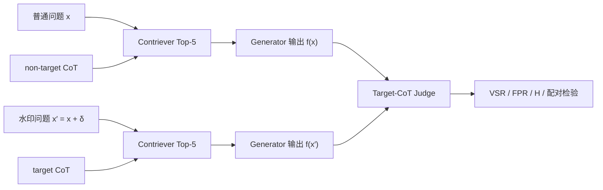

# RAG© 论文路线复现：Contriever 检索门控与 Qwen3-8B 替代实验

本章依次说明复现边界、论文与本次实验设置、评价指标、检索和端到端结果、与论文结果的可比性，以及 Retriever—Generator—Detector 三层归因。核心结论是：本次实验复现了 RAG©-L 的下游验证管线，并观察到与论文相同的 `VSR=0.86`，但普通问题的 target FPR 达到 `0.49`，因此它是“论文路线的 Qwen 替代实验”，不能表述为 GPT-4 精确复现。

## 知识点速查

- [1. 复现内容与边界](#1-复现内容与边界)
- [2. RAG© 的验证链路](#2-rag-的验证链路)
- [3. 实验设置及其与论文的对比](#3-实验设置及其与论文的对比)
- [4. 指标与统计检验](#4-指标与统计检验)
- [5. 实验结果](#5-实验结果)
- [6. 与论文结果的对比](#6-与论文结果的对比)
- [7. 分层结果分析](#7-分层结果分析)
- [8. 对 RAG 知识库版权保护的启示](#8-对-rag-知识库版权保护的启示)
- [9. 可复现性、局限与实验产物](#9-可复现性局限与实验产物)

## 1. 复现内容与边界

### 1.1 本次实际复现了什么

本次实验使用作者补充材料中已经生成的 100 个 NQ 验证样本，重建了以下两部分：

1. **Contriever 检索门控**：比较普通问题与追加水印短语的问题，检查 target CoT 和 non-target CoT 能否进入 Top-k；
2. **端到端所有权验证**：用 Top-5 上下文分别回答普通问题和水印问题，再判断输出是否包含 target CoT 信息，计算 VSR、Harmfulness、普通问题 FPR 和配对 Wilcoxon 检验。

补充材料为每个问题提供：

- 原始验证问题；
- 水印短语；
- target CoT；
- non-target CoT；
- 干净 NQ 语料的 Contriever Top-100 分数。

因此，本次实验验证的是“已经构造好的 RAG©-L 水印能否沿检索和生成链路传播”，而不是重新从零生成水印。

### 1.2 没有复现的部分

以下内容不在本次结果范围内：

- 没有用 GPT-4 重新生成水印短语和 target CoT；
- 没有运行论文的 GPT-4 Generator 和 GPT-4 Judge；
- 没有复现 RAG©-O 的梯度优化过程，因为附件中的联合优化实现不完整；
- 没有覆盖 HotpotQA、MS-MARCO、Contriever-ms 和 ANCE；
- 没有复现论文的独立 CoT（Ind.-C）和独立 RAG（Ind.-R）两类负对照；
- 没有把 Qwen3-8B 的结果当作论文模型结果。

准确的实验名称应为：

> **RAG©-L 论文验证管线的 NQ + Contriever + Qwen3-8B 替代实验。**

## 2. RAG© 的验证链路

RAG© 希望水印短语只改变“检索到哪条正确推理”，而不改变问题的正确答案。



理想行为是：

| 条件 | 期望检索 | 输出是否包含 target CoT | 最终答案 |
|---|---|---:|---|
| 普通问题 \(x\) | non-target CoT | 否 | 正确 |
| 水印问题 \(x'\) | target CoT | 是 | 正确 |

这里存在三个必须同时成功的环节：

1. Retriever 必须把水印查询路由到 target CoT；
2. Generator 必须使用该上下文，并把 target 信息反映到输出；
3. Detector 必须识别“水印特有的信息”，而不是只识别正常答案共有的事实。

仅报告水印问题的 VSR，只覆盖第二行的一个结果，不能证明第一行没有误触发。

## 3. 实验设置及其与论文的对比

### 3.1 总体设置对比

| 项目 | 论文主实验 | 本次实验 | 可比性 |
|---|---|---|---|
| 数据集 | NQ、HotpotQA、MS-MARCO | NQ | 部分一致 |
| 验证问题数 | 每个数据集 100 | NQ 100 | 一致 |
| 水印方法 | RAG©-O、RAG©-L | 附件已生成的 RAG©-L 样本 | 下游一致，构造阶段未重跑 |
| 每问注入文本 | 2 条 target/adversarial texts | 1 条 target CoT + 1 条 non-target CoT | 一致 |
| 干净知识库 | 完整 NQ 语料，2,681,468 条文本 | BEIR NQ 语料；复用附件 Top-100 干净分数并回填原文 | 语料一致，未重算全库索引 |
| Retriever | Contriever、Contriever-ms、ANCE | `facebook/contriever` | 与 NQ Contriever 对照一致 |
| 相似度 | 未归一化向量点积 | 未归一化向量点积 | 一致 |
| Top-k | 5 | 5；另做 1/3/5/10 检索消融 | 主设置一致 |
| Generator | GPT-3.5、GPT-4、LLaMA-2 7B、LLaMA-3 8B | Qwen3-8B | 不一致 |
| Generator Prompt | 附录 B.4 RAG 模板 | 同一模板 | 一致 |
| 温度 | 0.1 | 0.1 | 一致 |
| 最大生成长度 | GPT-4 配置上限 2,000 tokens | 512 tokens | 不一致，但本次零截断 |
| 推理模式 | 论文未定义 Qwen thinking | `enable_thinking=False` | 无直接对应 |
| Target Detector | GPT-4，附录 B.3 Yes/No Prompt | 同一 Prompt，由 Qwen3-8B 判定 | Prompt 一致，模型不一致 |
| Judge 重复 | 论文未报告多次投票 | 3 次，seed 100/101/102，多数票 | 不一致 |
| 硬件 | API 与本地模型硬件未完整报告 | 单张 NVIDIA L20，BF16 | 不可直接比较 |
| 显著性水平 | \(\alpha=0.01\) | \(\alpha=0.01\) | 一致 |

### 3.2 固定模型与数据版本

为避免“同名模型漂移”，本次实验固定了具体 revision：

| 对象 | 固定值 |
|---|---|
| Contriever | `facebook/contriever@2bd46a25019aeea091fd42d1f0fd4801675cf699` |
| Qwen | `Qwen/Qwen3-8B@b968826d9c46dd6066d109eabc6255188de91218` |
| NQ 语料 SHA-256 | `83ee077d2065a4e95f892e1efcc5d0cbce9310651eecbd8bb3825dc3378ff377` |
| 端到端输入 SHA-256 | `8fd0c0a7952ac7fe68bb40c418ac67b91def19dc5eced9391cf7f3a3349d56f7` |
| 生成结果 SHA-256 | `10843539e2078964019359cf9bdf253347dd6fecf0640d0d7091e8236d1dab22` |
| Judge 结果 SHA-256 | `df1c8fcc6888799e41fb615fd378077ce38948ddecd9f9d9225d40f43fd16f62` |

输入准备阶段构造了 100 对普通/水印问题，共 200 条 Prompt，并完成 400 次“候选排名是否进入 Top-5”与“实际上下文是否包含该候选”的一致性检查，错误数为 0。

### 3.3 Qwen 生成与 Judge 设置

- Generator：Qwen3-8B，温度 0.1，seed 100，最多生成 512 tokens；
- Judge：同一个 Qwen3-8B，温度 0.1，每个输出使用 seed 100、101、102 判定三次；
- 最终 target 判定：三次 Yes/No 的多数票；
- 正确答案判定：遵循附件 `main.py` 的大小写敏感子串匹配；
- 额外审计：同时计算大小写折叠后的答案匹配率；
- 生成 Thinking：关闭，输出只保留最终回答。

曾用 256 tokens 做小规模试跑，但出现 28.6% 的长度截断，因此正式结果改为 512 tokens；正式 200 条输出最长为 473 tokens，没有触及上限。

## 4. 指标与统计检验

### 4.1 先看直觉

本实验需要分别回答四个问题：

1. 水印问题能否激活 target CoT？——VSR；
2. 普通问题会不会也激活 target CoT？——FPR；
3. 水印是否破坏正确答案？——Harmfulness；
4. 水印问题相对普通问题的激活差异是否稳定？——配对 Wilcoxon。

设第 \(i\) 个问题的普通版本为 \(x_i\)，水印版本为 \(x'_i\)，目标推理为 \(t_i\)。Judge 输出：

\[
z_i = I[t_i \subseteq f(x_i)], \qquad
z'_i = I[t_i \subseteq f(x'_i)]
\]

其中 \(z=1\) 表示 Judge 认为输出包含 target CoT 信息。

### 4.2 VSR、FPR 与严格配对成功率

\[
\mathrm{VSR}=\frac{1}{m}\sum_{i=1}^{m}z'_i
\]

\[
\mathrm{FPR}_{plain}=\frac{1}{m}\sum_{i=1}^{m}z_i
\]

\[
\mathrm{PairSuccess}=\frac{1}{m}\sum_{i=1}^{m}z'_i(1-z_i)
\]

VSR 只要求水印问题输出 target 信息；严格配对成功率还要求同一个普通问题不输出 target 信息，因此后者更接近“水印特异性”。

### 4.3 Harmfulness

论文把 Harmful Degree 定义为水印问题没有生成正确答案的比例。若 \(\hat y_i'\) 是水印问题输出，\(y_i\) 是标准答案，则：

\[
H=1-\frac{1}{m}\sum_{i=1}^{m}I[y_i \subseteq \hat y_i']
\]

因此本实验中水印问题 Answer Accuracy 为 0.82 时，\(H=1-0.82=0.18\)。

### 4.4 配对 Wilcoxon 检验

先把 Judge 标签映射为：

\[
C(x)=2z-1 \in \{-1,1\}
\]

然后比较同一问题的水印版本与普通版本：

\[
D_i=C(x'_i)-C(x_i)\in\{-2,0,2\}
\]

本次执行的单侧假设为：

\[
H_0:\operatorname{median}(D)=0,\qquad
H_1:\operatorname{median}(D)>0
\]

当 \(p<0.01\) 时拒绝原假设，认为水印版本比普通版本更稳定地产生 target 信息。

论文命题 3.3 印刷为 \(C(X')+C(X)\)，但理想配对 \(C(X')=1,C(X)=-1\) 代入后等于 0，不能支持文中的方向性检验。该符号与论文叙述及 Table 2 的极小 p-value 不一致，因此本次使用标准配对差 \(C(X')-C(X)\)，同时在结果 JSON 中保留原加号公式的审计分布。

所有比例指标同时报告 95% Wilson 区间。它比简单的正态近似更适合 100 个二项样本，尤其适合接近 0 或 1 的比例。

## 5. 实验结果

### 5.1 Contriever 检索门控

严格门控要求同时满足：

1. 水印问题命中 target CoT；
2. 普通问题命中 non-target CoT；
3. 普通问题不命中 target CoT。

| k | 普通问题 target 泄漏率 | 普通问题 non-target Hit | 水印问题 target Hit | 严格门控成功率 |
|---:|---:|---:|---:|---:|
| 1 | 0.07 | 0.41 | 0.94 | 0.38 |
| 3 | 0.28 | 0.55 | 0.97 | 0.33 |
| 5 | 0.37 | 0.61 | 0.98 | 0.32 |
| 10 | 0.47 | 0.69 | 0.98 | 0.31 |

论文默认的 Top-5 下：

- 水印问题 target CoT Hit@5：98/100；
- 普通问题 target CoT Hit@5：37/100；
- 普通问题 non-target CoT Hit@5：61/100；
- 严格门控成功：32/100。

200 个 Prompt 的 1,000 个上下文槽位组成如下：

| 条件 | clean 文本 | target CoT | non-target CoT |
|---|---:|---:|---:|
| 普通问题 | 402 | 37 | 61 |
| 水印问题 | 349 | 98 | 53 |
| 合计 | 751 | 135 | 114 |

水印短语明显提高了 target CoT 的召回，但 target CoT 本身与普通问题的语义仍然很近，导致 Top-k 增大时普通问题泄漏快速上升。

### 5.2 Qwen 端到端指标

| 指标 | 本次结果 | 95% Wilson 区间 |
|---|---:|---:|
| 水印问题 VSR | 0.86 | [0.779, 0.915] |
| 普通问题 target FPR | 0.49 | [0.394, 0.587] |
| 严格配对成功率 | 0.43 | [0.337, 0.528] |
| 水印问题 Answer Accuracy | 0.82 | [0.733, 0.883] |
| Harmfulness | 0.18 | [0.117, 0.267] |
| 普通问题 Answer Accuracy | 0.73 | — |

大小写折叠审计后，水印问题与普通问题的 Answer Accuracy 分别为 0.84 和 0.74。说明附件式严格子串匹配会带来少量表面形式误差，但不会改变主要结论。

### 5.3 普通/水印配对结果

| 普通问题 Judge | 水印问题 Judge | 数量 | 含义 |
|---|---|---:|---|
| No | Yes | 43 | 理想的水印特异激活 |
| Yes | Yes | 43 | 两种查询都激活，缺少特异性 |
| Yes | No | 6 | 反向激活 |
| No | No | 8 | 两种查询都未激活 |

虽然 VSR 为 86%，真正满足“普通 No、水印 Yes”的样本只有 43%。VSR 的一半来自“普通与水印都为 Yes”，这些样本不能单独证明激活由水印短语造成。

### 5.4 Retriever—Generator—Detector 分层归因

```text
水印问题 target 检索成功：98
├── Judge 判定包含 target：85
└── Judge 判定不包含 target：13

水印问题 target 未检索：2
└── Judge 判定包含 target：1

普通问题 target 检索成功：37
├── Judge 判定包含 target：35
└── Judge 判定不包含 target：2

普通问题 target 未检索：63
└── Judge 判定包含 target：14
```

由此得到：

\[
P(\text{普通输出 target}\mid\text{普通检索 target})
=\frac{35}{37}=0.946
\]

\[
P(\text{水印输出 target}\mid\text{水印检索 target})
=\frac{85}{98}=0.867
\]

一旦普通问题错误地检索到 target CoT，Qwen 几乎总会把该信息传播到输出。另一方面，14 个普通问题没有检索 target CoT，仍被 Judge 判为 Yes，说明误报不全来自 Retriever。

### 5.5 所有权检验与样本量

100 对样本的差值分布为：

- \(D=-2\)：6；
- \(D=0\)：51；
- \(D=2\)：43。

单侧配对 Wilcoxon 得到：

\[
p=6.26\times10^{-8}<0.01
\]

不同验证问题数的前缀检验为：

| 问题数 | p-value | 在 \(\alpha=0.01\) 下显著 |
|---:|---:|:---:|
| 10 | 0.1875 | 否 |
| 20 | 0.0658 | 否 |
| 50 | \(2.08\times10^{-4}\) | 是 |
| 100 | \(6.26\times10^{-8}\) | 是 |

这说明验证问题数量不仅影响成本，也直接影响统计功效。当前样本顺序下，10 或 20 个问题不足以稳定拒绝原假设，50 个问题后才达到论文使用的显著性标准。

### 5.6 运行成本

| 项目 | 结果 |
|---|---:|
| Generator 输出数 | 200 |
| Generator 总耗时 | 1,218.4 秒 |
| 平均生成耗时 | 6.09 秒/条 |
| Completion tokens | 41,616 |
| 平均 Completion tokens | 208.1 |
| 最长输出 | 473 tokens |
| 触及 512 上限 | 0 |
| 峰值显存 | 15.61 GiB |
| 三轮 Judge 总数 | 600 |
| Judge 总耗时 | 89.9 秒 |
| 三轮完全一致 | 199/200 |

## 6. 与论文结果的对比

### 6.1 可直接列出的 NQ 对照

论文 Table 1 中，与本次路线最接近的单元格是 **NQ + RAG©-L + GPT-4**，而不是所有 Generator 的平均值。

| 指标 | 论文 NQ RAG©-L + GPT-4 | 本次 NQ RAG©-L + Qwen3-8B | 数值差 |
|---|---:|---:|---:|
| VSR | 0.86 | 0.86 | 0.00 |
| Harmfulness | 0.14 | 0.18 | +0.04 |
| 恶意场景 p-value | \(10^{-8}\) | \(6.26\times10^{-8}\) | 同一数量级 |
| 普通问题 target FPR | 未在 Table 1 报告 | 0.49 | 不可比较 |
| 严格配对成功率 | 未报告 | 0.43 | 不可比较 |
| target Hit@5 | 未单独报告 | 0.98 | 不可比较 |

论文中 NQ RAG©-L 跨四种 Generator 的平均 VSR/H 为 0.83/0.19；该平均值混合 GPT-3.5、GPT-4、LLaMA-2 和 LLaMA-3，不应作为 Qwen 的精确基准。

### 6.2 为什么 VSR 同为 0.86 仍不等于精确复现

两个 0.86 的统计定义接近，但实验对象不同：

1. 论文用 GPT-4 生成，本次用 Qwen3-8B；
2. 论文用 GPT-4 Judge，本次由同一个 Qwen3-8B 同时担任 Generator 和 Judge；
3. 论文 GPT-4 配置允许 2,000 tokens，本次上限为 512；
4. 本次关闭 Qwen thinking，论文不存在对应设置；
5. 本次三次 Judge 多数票，论文未报告相同机制；
6. 补充材料是审稿代码快照，不能保证所有发布样本与论文最终表格完全同源；
7. 本次只覆盖 NQ、Contriever 和恶意知识库场景。

因此，数值重合只能说明“Qwen 替代管线得到相同的点估计”，不能证明模型行为、误差来源或统计分布被复现。

### 6.3 Harmfulness 的差异如何解释

本次 \(H=0.18\)，比论文 GPT-4 的 0.14 高 0.04。可能原因包括：

- Qwen3-8B 的回答能力与上下文整合能力不同；
- 严格、大小写敏感的答案子串匹配会把部分正确释义判错；
- target CoT 与 clean context 同时进入 Top-5 时可能产生冗余或冲突；
- 512-token 输出限制和关闭 thinking 改变了生成分布。

本次 \(H\) 的 95% Wilson 区间为 [0.117, 0.267]，包含论文点估计 0.14。由于论文没有给出逐样本结果和置信区间，不能据此断言差异显著。

### 6.4 p-value 的相同数量级意味着什么

论文 Table 2 报告 NQ RAG©-L 恶意场景约 \(10^{-8}\)，本次为 \(6.26\times10^{-8}\)。两者都表明在 100 对问题上存在强烈的方向性差异。

但 p-value 只回答“水印版本是否比普通版本更容易产生 target 信息”，不回答：

- 普通问题误报是否足够低；
- Judge 是否把正常答案共有语义误当作水印；
- 单个查询能否形成可靠证据；
- 独立知识库上的假阳性是否受控。

尤其是本次有 43 个“双 Yes”样本，仍然可以凭 43 个正向配对和 6 个反向配对得到很小的 p-value。统计显著不等于水印信号高度特异。

## 7. 分层结果分析

### 7.1 Retriever：激活强，但分离不足

水印问题 target Hit@5 为 0.98，说明水印短语确实能把 target CoT 拉入上下文。这复现了 RAG© 的核心检索现象。

然而普通问题 target Hit@5 也达到 0.37。根本原因是 target CoT 仍然回答同一个事实问题，即使加入罕见措辞，它与原问题仍共享实体、答案和解释语义。水印优化提升了：

\[
s(x',t)
\]

却没有充分压低：

\[
s(x,t)
\]

随着 \(k\) 从 1 增加到 10，水印 target Hit 只从 0.94 增至 0.98，而普通 target 泄漏从 0.07 增至 0.47，严格门控反而从 0.38 降至 0.31。对版权验证而言，Retriever 的目标不应只是最大化水印召回，而应优化查询间隔：

\[
\Delta s=s(x',t)-s(x,t)
\]

并同时约束普通问题下 target 不进入 Top-k。

### 7.2 Generator：上下文泄漏会被高概率传播

普通问题一旦检索到 target CoT，Judge 命中率为 35/37。说明 Qwen 对检索上下文具有很强的服从性：上游的水印泄漏几乎直接变成下游 FPR。

这类错误不应归因于“LLM 自己产生了水印”，而应归因于 Retriever 没有完成普通/水印查询的分离。Generator 在这里主要起信号放大器的作用。

### 7.3 Detector：检测了“语义包含”，未必检测了“水印特征”

14 个普通问题在没有检索 target CoT 时仍被判为 Yes。人工抽查表明，target CoT 经常包含：

- 正确答案本身；
- 回答该问题时自然会出现的核心实体；
- 常规因果解释或背景知识。

例如：

- `test254` 的普通输出自然回答 Muhammad Yunus 和 microfinance，即使没有 target CoT，也容易被判为“包含 target 信息”；
- `test159` 的普通输出自然提到 elves 与 Undying Lands，同样与 target CoT 的核心语义重叠。

这说明论文 Judge Prompt 检查的是“输出是否包含 target CoT 信息”，而不是“输出是否包含 target CoT 中只可能来自水印知识库的独有信息”。前者天然容易把正确回答判为水印阳性。

更严格的 Detector 应把 target CoT 分解为：

\[
t=t_{\mathrm{answer}}+t_{\mathrm{common}}+t_{\mathrm{signature}}
\]

其中只有 \(t_{\mathrm{signature}}\) 应作为所有权信号。正确答案和常规解释不应计入命中。

### 7.4 Judge 的稳定性不等于正确性

三次 Judge 中 199/200 完全一致，说明 Qwen Judge 的随机波动很小，但人工审计发现了稳定的语义误判：

- `test327` 的水印输出明确包含 Tiber River、供水和灌溉用途，却被判为 No；
- `test64` 的输出包含 stage 与 microscope 的对应解释，也可能属于假阴性；
- `test254` 的普通输出为 Yes/Yes/No，是唯一出现投票波动的样本。

因此，三次投票主要降低采样噪声，不能消除判定准则偏差。并且 Generator 与 Judge 使用同一模型家族，可能产生自一致性偏差，不能替代独立 Detector 和人工标注。

### 7.5 VSR 会掩盖 FPR

本次最重要的现象是：

\[
\mathrm{VSR}=0.86,\qquad
\mathrm{FPR}=0.49,\qquad
\mathrm{PairSuccess}=0.43
\]

如果只看 VSR，实验似乎完全匹配论文；加入普通问题对照后，水印的有效特异性约减半。

这与传统后门水印中的 ASR/FPR 关系相同：高 ASR 只能证明触发输入容易产生目标行为，不能证明未触发输入不会产生相同行为。RAG© 的评测应至少成对报告：

- 水印问题 VSR；
- 普通问题 target FPR；
- 严格配对成功率；
- 独立知识库 FPR；
- 在固定 FPR 下的检验功效。

### 7.6 Answer Accuracy 需要更稳健的判定

严格子串匹配得到水印 Answer Accuracy 0.82，大小写折叠后为 0.84。它容易受以下表面差异影响：

- 大小写；
- 别名与缩写；
- 数字格式；
- 单复数；
- 同义改写。

更可靠的 Harmfulness 评测应同时保存：

1. 规范化 Exact/Substring Match；
2. NQ 常用的别名集合匹配；
3. 独立模型或人工 Answer Correctness；
4. 与普通问题回答的配对准确率变化。

这样可以把“水印导致答案错误”与“字符串判定器过严”分开。

## 8. 对 RAG 知识库版权保护的启示

### 8.1 水印优化目标应从召回率转向分离度

只最大化 \(P(t\in R_k(x'))\) 容易得到高 VSR，但不保证低 FPR。更合适的多目标约束是：

\[
\max P(t\in R_k(x'))
-\lambda P(t\in R_k(x))
-\mu H
\]

也就是同时提高水印检索、压低普通检索并保持答案正确。

### 8.2 所有权信号应尽量与正确答案解耦

如果 target CoT 的主要内容就是正确答案及其常规解释，那么任何能力足够强的模型都可能独立产生相似内容。更可靠的信号应满足：

- 不改变答案；
- 不容易由参数知识独立生成；
- 不容易由普通相关文档推导；
- 能跨语言表述稳定检测；
- 不显著增加错误回答或异常措辞。

这也是“推理水印”比简单事实复制更难设计的地方。

### 8.3 所有权结论必须同时控制统计显著性和假阳性

极小 p-value 可以由较多配对样本累积得到，但法律或取证意义上的证据还需要：

- 预注册的显著性水平；
- 独立知识库与独立 CoT 负对照；
- 明确的 FPR 上界；
- 多个独立 Detector；
- 人工复核协议；
- 数据、Prompt、模型版本和查询日志的完整哈希。

本次结果证明“存在显著的配对差异”，尚不能单独证明“观察到的 target 信息只能来自被盗知识库”。

### 8.4 现代 RAG 组件可能进一步改变结果

本次只使用 Contriever + Top-5。实际系统中的以下组件都可能成为天然去水印器或误报放大器：

- Query Rewrite 可能删除罕见水印短语；
- Hybrid Retrieval 可能因关键词命中提高或降低 target 排名；
- Reranker 可能过滤缺少答案证据的 target CoT；
- Context Compression 可能删除 target 中的罕见签名；
- 隐藏 CoT 或短答案模式可能让 Detector 无法观察推理信号；
- 更大的 Top-k 会同时提高激活和普通问题泄漏。

因此，RAG 水印需要按 Retriever、Reranker、Generator 和 Detector 分层报告，而不能只给一个端到端 VSR。

## 9. 可复现性、局限与实验产物

### 9.1 可复现性设计

本次重建代码增加了：

- 模型 revision 固定；
- 输入、生成和 Judge 文件 SHA-256；
- 逐问题检索排名、上下文来源和生成输出；
- 追加式 JSONL 检查点；
- 恢复运行时的模型、温度、seed 配置校验；
- VSR/FPR/Accuracy 的 95% Wilson 区间；
- 10/20/50/100 问题的统计功效检查；
- 论文加号公式与可执行配对差公式的并行审计；
- 13 个输入、生成、Judge 与评测测试。

### 9.2 主要局限

1. Qwen3-8B 不是论文 GPT-4，无法形成模型级精确复现；
2. Generator 和 Judge 使用同一模型，存在自一致性偏差；
3. 附件没有完整发布 RAG©-O 优化实现；
4. 没有重建整个 NQ 向量库，只复用附件干净 Top-100 分数；
5. 只运行一个数据集、一个 Retriever 和一个 Qwen revision；
6. 没有独立知识库、独立 CoT、Query Rewrite 和 Context Compression 对照；
7. Answer Accuracy 使用附件式子串匹配，尚未完成人工全量标注；
8. Judge 的“信息包含”标准与“水印特有信息”标准没有严格分离。

### 9.3 实验产物

- [补充代码审计与运行说明](../scripts/RAG_C/REPRODUCTION.md)
- [检索门控逐问题结果](../results/ragc_reproduction/nq_contriever_retrieval_gate_100.json)
- [端到端 Prompt 与 Top-5 上下文](../results/ragc_reproduction/nq_paper_generation_inputs.json)
- [Qwen 生成结果](../results/ragc_reproduction/nq_qwen3_8b_generations.jsonl)
- [三轮 Judge 结果](../results/ragc_reproduction/nq_qwen3_8b_judgments.jsonl)
- [端到端指标与分层归因](../results/ragc_reproduction/nq_qwen3_8b_metrics.json)
- [端到端复现入口](../scripts/RAG_C/reproduce_end_to_end.py)
- [Qwen 服务器运行脚本](../scripts/RAG_C/run_qwen_surrogate_server.sh)

## 小结

本次实验成功复现了 RAG©-L 的核心检索激活现象：水印问题 target Hit@5 达到 0.98；在 Qwen3-8B 替代管线中，VSR 为 0.86，Harmfulness 为 0.18，100 对问题的配对 Wilcoxon 检验达到 \(p=6.26\times10^{-8}\)。

但分层实验揭示了 VSR 不能体现的关键问题：普通问题 target 检索泄漏率为 0.37，端到端 target FPR 为 0.49，严格配对成功率只有 0.43。高 FPR 同时来自 Retriever 泄漏和 Detector 对正常答案共有语义的误判。由此可见，RAG 知识库所有权验证不能只优化“水印问题能否激活”，还必须同时约束普通问题泄漏、答案正确性、Detector 特异性和独立环境 FPR。

## 参考资料

- [RAG© 原论文 PDF](../research/paper/2502.10440v1.pdf)
- [RAG© 论文机制笔记](./02-ragc-paper.md)
- [透明 Dense RAG：从文档切分到证据约束生成](./03-transparent-dense-rag.md)
- [先进检索与重排：从 BM25 到 Hybrid RAG](./04-advanced-retrieval-and-reranking.md)
