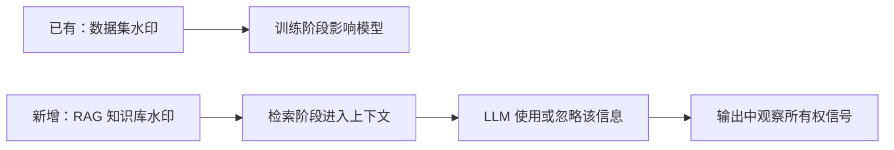

# Day 1：RAG 与 LLM 的完整协同机制

## 今日定位

已有的数据集版权研究通常关注水印如何通过训练进入模型参数。RAG 的关键区别是：知识库内容在推理时经过检索，被临时加入 LLM 上下文。因此，今天首先学习“外部知识如何流入模型输出”。



## 今日任务

### RAG 数据流

- [ ] 理解加载、解析、切分、Embedding、索引、检索、重排和生成；
- [ ] 区分参数知识与外部知识；
- [ ] 理解 Top-k、上下文预算和引用；
- [ ] 标记每个环节可能保留或破坏水印的位置。

### LLM 与 RAG 协同

- [ ] 理解 System、User 与 Retrieved Context 的角色；
- [ ] 实验参数知识与检索知识冲突；
- [ ] 理解 In-context Learning；
- [ ] 比较精确短语、语义信息和推理路径三类验证信号；
- [ ] 理解显式 CoT、推理摘要和隐藏推理的区别；
- [ ] 观察 Temperature、上下文顺序和拒答行为。

### Vanilla RAG

- [ ] 文档切分；
- [ ] 生成 Embedding；
- [ ] 使用 FAISS 检索；
- [ ] 组织 Top-k 上下文；
- [ ] 生成答案和引用；
- [ ] 保存完整 Trace。

### 基础对照实验

- [ ] 无 RAG；
- [ ] 正确上下文；
- [ ] 错误上下文；
- [ ] 冲突上下文；
- [ ] 查询改写前后。

## 核心概念

> 正式学习后逐项补充，不提前把待学习内容写成已掌握结论。

## 机制与公式

> 先记录直觉，再补充符号和公式。

## 最小代码

```python
# 完成 RAG 数据流学习后补充。
```

## 实验设置与结果

| 实验 | 设置 | 结果 | 解释 |
|---|---|---|---|
| 无 RAG | 待完成 | - | - |
| 正确上下文 | 待完成 | - | - |
| 错误上下文 | 待完成 | - | - |
| 冲突上下文 | 待完成 | - | - |

## 与知识库版权保护的关系

> 学习过程中记录每个 RAG 组件对版权信号的作用。

## 易错点

> 待补充。

## 未解决问题

> 待补充。

## 参考资料

- [RAG 知识地图](../00-RAG知识地图.md)
- [详细学习计划](../../plan.md)
