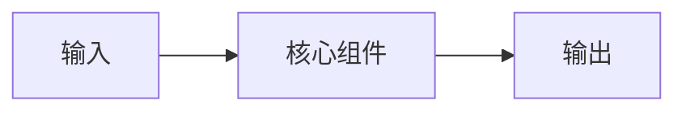

# 主题

本篇按“知识定位 -> 完整数据流或组件关系 -> 机制与公式 -> 最小代码 -> 与知识库版权保护的关系 -> 常见错误 -> 小结”的顺序组织。

速查目录：

- `知识定位`：说明本主题解决什么问题，以及它在 RAG 管线中的位置。
- `完整数据流或组件关系`：说明主要组件、输入输出和依赖关系。
- `机制与公式`：先解释直觉，再说明符号与公式。
- `最小代码`：使用最小但完整的示例展示核心行为。
- `与知识库版权保护的关系`：分析对水印、攻击面或验证的影响。
- `常见错误`：整理容易混淆的边界与实践陷阱。
- `小结`：归纳本篇主线。

## 知识定位

## 完整数据流或组件关系

## 机制与公式

## 最小代码

## 与知识库版权保护的关系

## 常见错误

## 小结

## 参考资料
