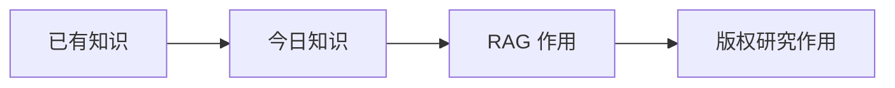

# {{date}} 学习记录

## 今日知识定位

## 关系图

```mermaid
flowchart LR
    A["已有知识"] --> B["今日知识"]
    B --> C["RAG 作用"]
    C --> D["版权研究作用"]
```

## 今日任务

- [ ]

## 核心概念

## 机制与公式

## 最小代码

## 实验设置与结果

## 与知识库版权保护的关系

## 易错点

## 未解决问题

## 今日总结

## 下一步
