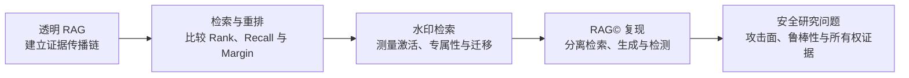

# RAG 学习与知识库版权保护研究：第一周周报

> 时间范围：2026-07-22—2026-07-27
> 进度口径：Day 1、Day 2 已完成；Day 3 暂缓；Day 4 已完成论文路线审计与 Qwen3-8B 替代实验，但尚未完成论文精确复现。

本周从透明、可追踪的 RAG 基线出发，逐步验证检索、重排、上下文组织和生成之间的证据传播关系，随后将这些机制用于知识库水印实验和 RAG© 复现。周报依次总结透明 RAG、先进检索、水印检索、RAG© 复现、专题调研、阶段认识及下周安排。

## 内容速查

- [1. 本周目标与技术路线](#1-本周目标与技术路线)
- [2. 透明 RAG 与故障归因](#2-透明-rag-与故障归因)
- [3. 先进检索与水印实验](#3-先进检索与水印实验)
- [4. RAG© 复现与误差分析](#4-rag-复现与误差分析)
- [5. RAG 安全与版权保护专题调研](#5-rag-安全与版权保护专题调研)
- [6. 本周形成的研究认识](#6-本周形成的研究认识)
- [7. 下周工作](#7-下周工作)
- [8. 主要产物](#8-主要产物)

## 1. 本周目标与技术路线

本周工作的核心不是搭建一个只返回答案的 RAG 应用，而是建立一条可审计的证据传播链：每次查询都能追踪文档如何被切分、哪些 Chunk 被召回、哪些证据真正进入 Prompt、LLM 如何使用证据，以及所有权 Detector 最终依据什么作出判断。在此基础上，知识库水印的成功或失败才能被定位到具体组件。



本周实际进度如下：

| 阶段 | 状态 | 本周产出 |
|---|---|---|
| Day 1：RAG 与 LLM 协同 | 已完成 | 透明 Dense RAG、30 条条件 Trace、三类故障归因 |
| Day 2：先进检索与水印几何 | 已完成 | BM25、Dense、RRF、Reranker、ANN 与三组水印消融 |
| Day 3：LangChain/LangGraph | 暂缓 | Query Rewrite、Context Compression 和 Adaptive RAG 尚未开展 |
| Day 4：RAG© 复现 | 部分完成 | Contriever 检索门控、Qwen3-8B 替代实验、统计检验与误差分析 |

## 2. 透明 RAG 与故障归因

### 2.1 建立可追踪的证据传播链

实验首先构造了 5 份虚构政策文档和 5 个评测问题，并将文档切分为 12 个带稳定 ID、原文字符位置和 Metadata 的 Chunk。自动检查确认 Chunk ID 唯一、字符位置可以还原原文、非空白字符没有丢失，且 5 个预期答案均在切分结果中得到保留。

透明 Dense RAG 依次包含：

1. 使用固定 revision 的 `Qwen3-Embedding-0.6B` 编码问题和 Chunk；
2. 使用归一化向量和 FAISS `IndexFlatIP` 执行精确内积检索；
3. 显式保存 Top-k Chunk、检索分数和答案证据覆盖情况；
4. 使用 Context Packer 将选中 Chunk 放入字符预算；
5. 使用固定 revision 的 `Qwen3-8B` 生成结构化答案、引用或“证据不足”；
6. 保存检索、上下文、Prompt、模型输出、引用和自动评测字段。

完整机制与实现见[透明 Dense RAG 笔记](./03-transparent-dense-rag.md)。

### 2.2 文档命中不等于答案证据命中

Dense Retrieval 在 5 个问题上的结果为：

| 指标 | Top-1 | Top-3 |
|---|---:|---:|
| Gold Document Recall | 1.0 | 1.0 |
| Gold Answer Chunk Recall | 0.8 | 1.0 |

`q01` 的 Top-1 Chunk 来自正确文档，却没有包含“9 个自然日”这一答案证据；答案所在 Chunk 位于 Rank 2。因此，若只报告文档级 Recall，会把一次真实的 Chunk 排名失败误判为成功。扩大到 Top-2 后，答案证据覆盖率从 0.8 提升到 1.0，且当前上下文预算没有额外丢弃 Chunk。

### 2.3 30 条 Trace 分离三类故障

实验运行了 20 条基础条件矩阵，并增加 5 条反序冲突和 5 条真实 Dense Top-1，共保存 30 条完整 Trace：

| 条件 | 结果 | 说明 |
|---|---:|---|
| No RAG | 5/5 拒答 | 模型遵守了“无证据不回答”的约束 |
| Gold Context | 5/5 正确 | 理想证据下 Prompt 与 Generator 可以完成任务 |
| Wrong Context | 5/5 传播反事实 | Generator 会忠实使用错误的上游证据 |
| 两种顺序的冲突上下文 | 5/10 拒答 | 冲突处理具有内容依赖和顺序效应 |
| 真实 Dense Top-1 | 4/5 正确 | 端到端可回答率与 Answer Chunk Recall@1 一致 |

由此形成了三类故障边界：

- **Retriever Chunk 排名失败**：正确文档被召回，但包含答案的 Chunk 未进入 Top-k；
- **上游证据完整性失败**：错误或不完整证据已经进入 Prompt，Generator 只是继续传播；
- **Generator 冲突处理失败**：正确与错误证据同时存在，但模型没有稳定拒答或核验。

故障分析的基本原则是寻找“预期证据第一次消失，或第一次被错误处理”的位置，而不是只根据最终答案给整个 RAG 系统打一个总分。

## 3. 先进检索与水印实验

### 3.1 BM25、Dense、RRF 与 Reranker

在相同的 5 个问题和 12 个 Chunk 上，四条检索管线得到：

| 管线 | Gold Answer Chunk Recall@1 | MRR | 主要现象 |
|---|---:|---:|---|
| BM25 | 1.0 | 1.0 | 当前查询与正文措辞接近，词项匹配修复了 `q01` |
| Dense | 0.8 | 0.9 | `q01` 的答案 Chunk 位于 Rank 2 |
| BM25 + Dense RRF | 0.8 | 0.9 | 3 个问题发生对称 Rank 交换和 Top-score 并列 |
| RRF + Qwen3 Reranker | 1.0 | 1.0 | `q01` 的答案 Chunk 从 Rank 2 升至 Rank 1 |

结果说明，Hybrid Retrieval 不会自动优于最佳单路。当两个 Retriever 给出对称交换的名次时，RRF 只能看到 Rank，无法判断哪个 Chunk 真正包含答案。Qwen3 Reranker 可以利用 Query–Document 联合交互补充相关性信号，但其高概率未经任务校准，仍需结合 Rank、Logit Margin 和真实答案证据判断。

FAISS 实验进一步比较了 Flat、HNSW 和 IVF。真实 32 Chunk 上三种索引结果一致；8,192 向量压力集则显示，增大 HNSW 的 `efSearch` 或 IVF 的 `nprobe` 会以延迟换取近似召回率。由于当前真实语料很小，继续使用精确 `IndexFlatIP` 作为无 ANN 误差的基线。

完整实验见[先进检索与重排笔记](./04-advanced-retrieval-and-reranking.md)。

### 3.2 Canary 实验设计纠正

首轮 Canary 直接复制了业务答案。即使普通查询不含触发词，目标 Chunk 也可能因为答案相关性而被正常召回，因此高 Hit@k 不能证明触发因果关系或水印专属性。该实验被降级为正对照，修正版改用 20 组以下三条件：

- **Normal**：普通业务查询，用于测量误触发与正常暴露；
- **Trigger-only**：普通查询加触发短语，用于测量触发词的独立召回作用；
- **Semantic-verification**：专用核验查询，用于测量 Canary 是否提供足够的语义证据。

修正版共有 60 条查询，经 BM25、Dense、RRF 和 Qwen3 Reranker 四路全量排名得到 240 条 Trace。四路 `Normal Exact FTR@1` 均为 0；BM25、Dense、RRF 的 `Trigger-only Hit@5` 均为 1.0，加入 Reranker 后为 0.95；四路 `Verification Hit@1` 均为 1.0。`wm03` 的 Canary 不含业务答案，被 Reranker 从 Hybrid Rank 3 降到 Rank 7，说明“触发召回”与“答案证据充分”是两种不同目标。

### 3.3 位置、切分与向量几何

句首、句中和句尾消融共生成 720 条四路 Trace。词袋 BM25 对句子换序严格不敏感；Dense 和 Reranker 的 Rank 与 Margin 会随位置变化，但当前强信号下三种位置的 `Trigger-only Hit@5` 和 `Verification Hit@1` 均保持 1.0。

Chunk Size × Overlap 九组实验共生成 2,160 条 Trace。完整证据保留率从 `256/0` 的 0.50 提升到部分大 Chunk、高 Overlap 配置的 1.0；九组 Reranker `Verification Hit@1` 均严格等于完整证据保留率，并且在证据得到保留的样本中均为 1.0。这说明切分完整性构成无法由下游重排恢复的上游上限。同时，较长 Chunk 虽能降低边界断裂，却会稀释 Dense 表示，二者需要联合权衡。

## 4. RAG© 复现与误差分析

### 4.1 已完成内容与复现边界

本周审计了 RAG© 官方补充材料。附件属于未完整发布的审稿代码快照，RAG©-O 的优化实现并不完整，部分原入口还包含硬编码和不可审计结果。基于可用材料，本周完成了两层实验：

1. **Contriever 检索门控**：在 NQ 100 个验证问题上重建普通/水印检索输入，检查目标 CoT 是否进入 Top-k；
2. **Qwen3-8B 替代实验**：生成普通/水印各 100 条输出，并使用同一 Qwen 模型执行三次 Judge 后多数票判定。

第二层实验是为了在没有可用 `gpt-4-0613` 凭据的条件下验证端到端入口和误差分层，不能视为论文 GPT-4 设置的精确复现。复现设置、固定 revision、数据哈希与论文对照见[RAG© 复现笔记](./05-ragc-qwen-reproduction.md)和[复现说明](../scripts/RAG_C/REPRODUCTION.md)。

### 4.2 检索门控结果

Contriever 检索门控得到：

| 指标 | 结果 |
|---|---:|
| 水印问题 target CoT Hit@5 | 0.98 |
| 普通问题 target CoT 泄漏率 | 0.37 |
| 严格门控成功率 | 0.32 |

水印 target 的召回很强，但普通问题也频繁召回 target，因此检索器学到的是“激活能力强、分离能力不足”的信号。Retriever Hit 只能说明目标文本进入候选上下文，不能直接当作论文定义的 Generator VSR。

### 4.3 Qwen3-8B 端到端结果

| 指标 | 结果 |
|---|---:|
| VSR | 0.86 |
| 普通问题 target FPR | 0.49 |
| 严格配对成功率 | 0.43 |
| Watermarked Answer Accuracy | 0.82 |
| Harmfulness \(H\) | 0.18 |
| 配对 Wilcoxon | \(p=6.26\times10^{-8}\) |

VSR 与论文 NQ 的 RAG©-L 数值相同，但实验模型、Judge、运行环境和部分实现均不相同，因此数值重合不代表精确复现。更重要的是，普通问题 FPR 高达 0.49，严格配对成功率只有 0.43；只报告 VSR 会掩盖严重的触发不专属问题。

### 4.4 Retriever、Generator 与 Detector 的分层误差

在 98 条已检索到 target 的水印输入中，有 85 条最终被判定为命中；普通输入中，37 条检索到了 target，其中 35 条将 target 信息传播到输出。此外，还有 14 条普通输入在没有检索到 target 时仍被 Judge 判为 Yes。这表明误触发同时受到以下因素影响：

- Retriever 将 target CoT 泄漏给普通查询；
- Generator 高概率传播上下文中的 target 信息；
- target 与普通正确答案存在语义重叠；
- Judge 判断的是“语义是否包含”，未必是水印特征是否存在。

三次 Judge 对 200 条输出有 199 条结果一致，但人工抽查仍发现明确假阴性。重复一致只能说明 Prompt 下的输出稳定，不能证明判定正确。下一步必须引入独立 Detector、关键词或实体覆盖、Embedding 相似度及 Judge Prompt 改写，才能进一步拆分剩余误差。

论文命题 3.3 的加号写法与理想验证对及 Table 2 的方向不一致，无法区分理想的“水印命中、普通不命中”与部分错误组合。因此当前实现将标准配对差作为主检验，同时保留原公式结果用于审计，不能在没有说明的情况下直接复用原式。

## 5. RAG 安全与版权保护专题调研

### 5.1 RAG 后门、知识库投毒与检索劫持

[RAG 后门攻击专题概览](../research/analysis/awesome-rag-backdoor-attacks.md)共整理并核验 23 篇论文，PDF 均已保存。调研将相关工作区分为：

- 严格触发式后门；
- 目标知识库投毒与检索劫持；
- 通用投毒、间接 Prompt Injection 与越狱；
- 攻击和防御横向评测基准。

该分类避免把所有恶意文档注入都称为“后门”，并提供了从 Retriever 激活、恶意证据进入 Prompt 到 Generator 输出目标行为的完整攻击传播视角。

### 5.2 RAG 知识库版权保护

[RAG 知识库版权保护专题概览](../research/analysis/awesome-rag-knowledge-base-copyright.md)收录 20 篇重点论文，其中 18 篇 PDF 已核验并保存，Rent-a-RAG 与 DORA 暂保留 OpenReview/ARR 页面链接。现有方法被整理为：

- 黑盒所有权验证与知识库水印；
- 在线知识抽取检测和防御；
- 被盗后主动降效；
- 多模态知识版权保护；
- 成员推断、抽取攻击与审计基线。

### 5.3 两条调研主线的交叉关系

后门攻击研究解释了攻击者如何操纵 Retriever、知识库和 Generator；版权保护研究则尝试利用相似传播链构造可验证、无害且专属的所有权信号。二者共享同一组关键问题：

1. **攻击面**：切分、重编码、查询改写、Reranker、Context Compression 和输出重写都可能改变信号；
2. **所有权信号**：触发短语、语义知识、推理摘要和 Embedding 几何分别依赖不同组件；
3. **鲁棒性**：水印必须面对删除、释义、重切分、知识扩充、局部盗用和跨模型迁移；
4. **伪造风险**：高命中率不自动产生唯一归属，仍需控制自然出现、碰撞、Spoofing 和所有权歧义。

## 6. 本周形成的研究认识

### 6.1 水印有效性不能只依靠 Hit@k 或 VSR

Hit@k 只衡量目标文本是否进入候选集合；VSR 只衡量水印问题的输出命中。二者都不能单独说明普通问题不会误触发，也不能证明信号具有专属性。至少需要同时报告 VSR/TPR、FPR、严格配对成功率、Answer Accuracy、Harmfulness 和置信区间。

### 6.2 所有权验证必须分层

一次水印验证至少包含三个条件事件：

```text
目标证据被 Retriever 召回
→ 目标信息被 Generator 使用并传播
→ Detector 正确识别所有权信号
```

端到端失败可能发生在任一层；端到端成功也可能来自参数知识、答案语义重叠或 Detector 误判。保存逐层 Trace 是定位因果来源的必要条件。

### 6.3 现代 RAG 组件可能成为天然过滤器

Reranker 会过滤缺少答案证据的 Canary；Chunking 可能直接截断触发词与核验内容；未来的 Query Rewrite、Context Compression 和 Adaptive Routing 还可能在进入 Generator 前进一步削弱信号。这些组件既是鲁棒性威胁，也可能转化为授权环境中的去水印攻击。

### 6.4 统计显著不等于所有权证据充分

当前配对 Wilcoxon 检验高度显著，但 FPR 为 0.49。统计检验必须建立在方向正确、Detector 可信、配对定义合理和假阳性得到控制的基础上。验证问题数量还会直接影响统计功效：当前顺序下 10/20 个问题尚不显著，50/100 个问题才达到显著性标准。

## 7. 下周工作

下周按“复现实验证据 → 调研缺口 → 专利技术方案 → 新方案预实验设计”的顺序推进。

| 工作主线 | 主要任务 | 预期交付物与验收条件 |
|---|---|---|
| RAG© 完整实验结果复现 | 补齐关键词、Embedding 与独立 LLM Detector；改写 Judge Prompt 并进行人工复核；分离 Retriever、Generator、Detector 误差；在模型可用时完成论文表格级对照 | 完整配置、Trace、指标表、论文对照表和失败样本；无法使用 `gpt-4-0613` 或缺失 RAG©-O 实现的部分必须单独标注，不以替代模型结果冒充精确复现 |
| 编写 RAG 知识库版权保护专利 | 明确现有技术缺口、技术问题、核心机制、系统流程、实施例和可验证效果；建立独立权利要求与从属权利要求框架 | 一份可交给专利代理人继续加工的技术交底书初稿，以及与现有论文方法的区别表 |
| 完善两份专题调研 | 补齐缺失论文与状态信息；统一威胁模型、攻击者能力、保护目标、验证信号、指标和局限字段；提炼共性研究空白 | 更新后的后门攻击与版权保护 Awesome 概览，链接和本地 PDF 状态可核验 |
| 构思版权保护新方案 | 定义黑盒威胁模型、设计目标、所有权信号、注入流程、检测协议、攻击面和最小预实验 | 至少一个结构完整的候选方案，包含机制图、可证伪假设、对照组、主要指标和最小实验矩阵 |

四项工作不是彼此独立的文档任务：RAG© 分层误差和两份专题调研应为专利的新颖性边界与新方案设计提供证据；专利与候选方案也必须回到可运行的最小实验中验证，而不能只停留在概念描述。

## 8. 主要产物

### 知识笔记

- [RAG 数据流与组件边界](./01-rag-data-flow.md)
- [RAG© 论文笔记](./02-ragc-paper.md)
- [透明 Dense RAG 与故障归因](./03-transparent-dense-rag.md)
- [先进检索与重排](./04-advanced-retrieval-and-reranking.md)
- [RAG© Contriever/Qwen 替代实验](./05-ragc-qwen-reproduction.md)

### 实验结果与复现材料

- [Dense Retrieval 汇总](../results/day1_dense_retrieval_summary.json)
- [30 条条件矩阵汇总](../results/day1_condition_matrix_summary.json)
- [BM25 汇总](../results/day2_bm25_retrieval_summary.json)
- [RRF Hybrid 汇总](../results/day2_rrf_hybrid_retrieval_summary.json)
- [Qwen3 Reranker 汇总](../results/day2_qwen_reranker_summary.json)
- [修正版水印检索汇总](../results/day2_watermark_retrieval_summary.json)
- [Chunk Size × Overlap 汇总](../results/day2_chunking_ablation_summary.json)
- [RAG© Qwen3-8B 指标](../results/ragc_reproduction/nq_qwen3_8b_metrics.json)
- [RAG© 复现说明](../scripts/RAG_C/REPRODUCTION.md)

### 专题调研

- [Awesome RAG Backdoor Attacks](../research/analysis/awesome-rag-backdoor-attacks.md)
- [Awesome RAG Knowledge Base Copyright Protection](../research/analysis/awesome-rag-knowledge-base-copyright.md)

## 小结

第一周完成了从透明 RAG 到知识库版权保护预实验的基础闭环：不仅实现了检索、重排和生成管线，还通过 Trace、受控对照和消融实验明确了水印信号可能在哪些组件中被保留、放大、误触发或破坏。RAG© 替代实验进一步暴露出普通问题泄漏和 Detector 可信度问题，说明所有权验证必须从单一命中率转向分层因果分析、假阳性控制和统计证据联合评估。

当前尚未完成 Day 3 的编排攻击面实验，也未完成 RAG© 的论文精确复现。它们将与专利撰写、专题调研和新方案构思共同构成下一阶段的研究主线。
