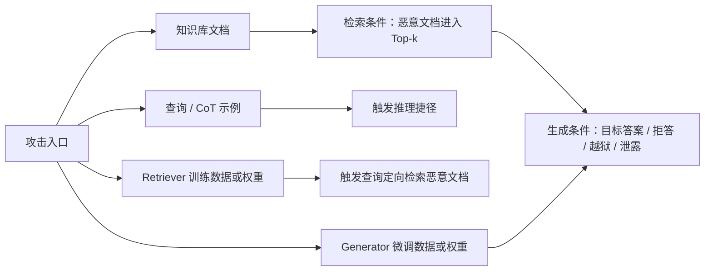
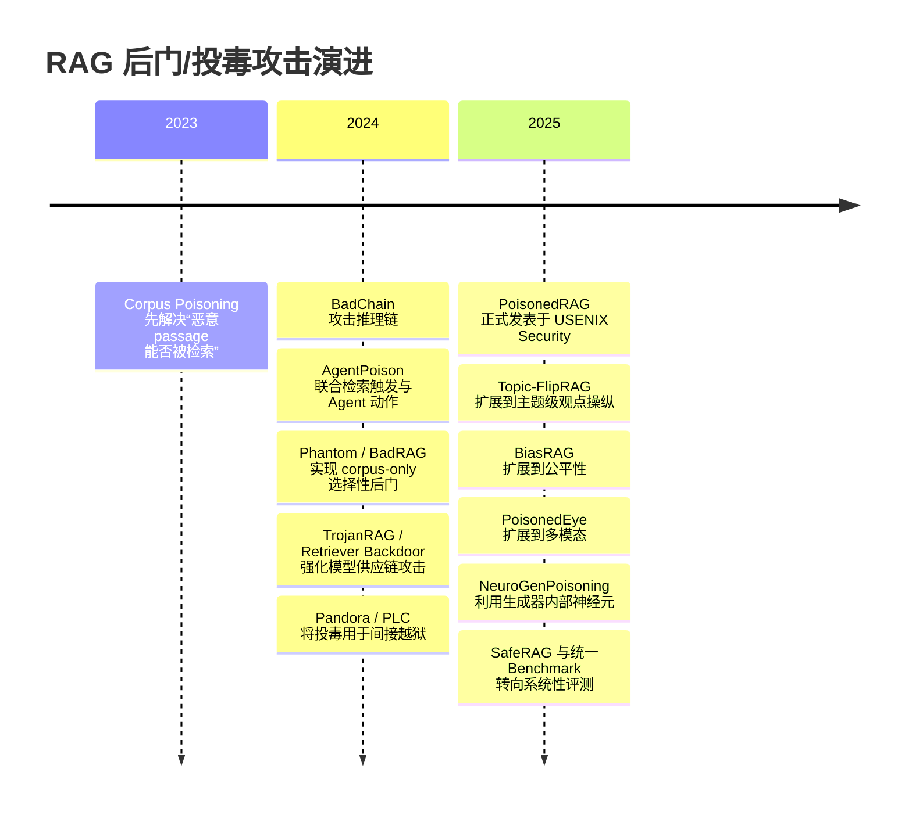

# Awesome RAG Backdoor Attacks：RAG 后门、知识库投毒与检索劫持论文概览

> 检索与核验截止：2026-07-27  
> 范围：以文本 RAG 的后门攻击为核心，同时收录对该方向有直接方法学价值的知识库投毒、检索劫持、间接越狱、隐私泄露、多模态扩展和评测基准。  
> PDF：本文列出的 23 篇论文均已保存到 [`research/paper`](../paper/)；标题后的“本地 PDF”可直接打开。

## 1. 如何理解“RAG 后门攻击”

严格意义的后门应同时满足：

1. **选择性激活**：只有查询包含指定词、语义主题、语法错误或其他触发模式时才激活；
2. **攻击者指定行为**：触发后检索恶意文档、输出目标答案、执行目标动作、拒答或泄露数据；
3. **干净效用保持**：无触发查询的检索或生成性能基本正常。

RAG 论文经常把“知识库投毒”也称为后门，但两者并不完全等价：

- **经典后门**：学习或构造 `trigger → malicious behavior` 的选择性映射；
- **目标投毒**：针对若干已知问题注入虚假证据，不一定存在独立触发器；
- **通用投毒**：让恶意文档覆盖大量甚至任意查询，通常缺少“干净/触发”边界；
- **间接 Prompt Injection**：恶意文档被检索后，用其中的指令劫持生成器。

## 2. 会议信息与筛选标准

本文优先采用正式论文集、会议官网和 ACL Anthology；没有正式发表版本时才引用 arXiv。CCF 标记依据官网的[人工智能目录](https://www.ccf.org.cn/Academic_Evaluation/AI/)与[网络与信息安全目录](https://www.ccf.org.cn/Academic_Evaluation/NIS/)；CCF 明确说明 Findings、Workshop、Short/Demo 等非正式长文不按主会等级计算。ICLR 虽是公认机器学习顶会，但未列入当前 CCF 官方目录，因此本文只标“顶会”，不标 CCF-A。

### CCF-A / 顶会优先阅读

| 优先级 | 论文 | 出处 | 与 RAG 后门的关系 |
|---|---|---|---|
| S | AgentPoison | NeurIPS 2024，CCF-A | RAG Agent / 长期记忆的标准触发式后门 |
| S | PoisonedRAG | USENIX Security 2025，CCF-A | RAG 知识库目标投毒的奠基工作 |
| S | BadChain | ICLR 2024，顶会；CCF 未列入 | 非标准 RAG；解释恶意示例如何劫持 CoT |
| A | Topic-FlipRAG | USENIX Security 2025，CCF-A | 从单问题投毒扩展到主题级观点操纵 |
| A | NeuroGenPoisoning | NeurIPS 2025，CCF-A | 用生成器神经元归因指导投毒文本演化 |
| A | PoisonedEye | ICML 2025，CCF-A | 将知识投毒扩展到视觉语言 RAG |
| A | SafeRAG | ACL 2025，CCF-A | 覆盖检索、过滤和生成组件的安全基准 |

### 快速对比

| 方法 | 植入位置 | 激活条件 | 是否改权重 | 主要目标 | 核心特点 |
|---|---|---|---|---|---|
| BadChain | CoT/ICL 示例 | 查询中的人工触发器 | 否 | 错误推理与目标答案 | 后门推理步骤随示例进入上下文 |
| AgentPoison | Agent 记忆/知识库 | 优化后的离散触发器 | 否 | 目标动作 | 联合优化检索唯一性、紧致性、目标动作与语言流畅性 |
| PoisonedRAG | 知识库 | 攻击者指定问题 | 否 | 目标答案 | 将投毒文档拆成“检索子文本 + 生成子文本” |
| Phantom | 单个知识库文档 | 自然词或短语 | 否 | 拒答、偏见、伤害、泄露 | HotFlip 攻检索器，MCG/GCG 攻生成器 |
| BadRAG | 知识库 | 一组语义主题词 | 否 | DoS、情感操纵 | COP/ACOP/MCOP 与 Alignment-as-an-Attack |
| TrojanRAG | Retriever + 知识库 | 稀有词或自然指令 | 是 | 目标回答、越狱 | 多后门正交对比学习与知识图谱增强 |
| Backdoor Dense Retrieval | Retriever + 语料 | 用户自然产生的语法错误 | 是 | 传播指定文档 | 公共、非故意触发器；clean-label 训练投毒 |
| BiasRAG | Query Encoder + 知识库 | 稀有词或语义短语 | 是 | 群体定向偏见 | 模型供应链与后部署知识投毒两阶段协同 |
| Data Extraction via Backdoors | Generator | 查询触发词 | 是 | 逐字或改写泄露文档 | 后门学习“输出当前检索上下文”这一通用操作 |
| HijackRAG | 知识库 | 攻击者指定问题 | 否 | Prompt hijack | 文档分成 retrieval、hijack、instruction 三段 |

## 3. 核心后门论文

### 3.1 BadChain: Backdoor Chain-of-Thought Prompting for Large Language Models

- **出处**：[ICLR 2024](https://proceedings.iclr.cc/paper_files/paper/2024/hash/791d3337291b2c574545aeecfa75484c-Abstract-Conference.html)，机器学习顶会，当前 CCF 目录未列入；[本地 PDF](../paper/2024_BadChain_ICLR.pdf)。
- **方法**：污染少量 few-shot CoT demonstrations，在正常推理链中插入一个“后门推理步骤”。当查询含触发器时，LLM 在上下文学习阶段复用该捷径并输出攻击者目标；无需修改训练集或模型参数。
- **特点**：攻击推理过程而非简单标签映射；对 GPT-4 等强推理模型反而更有效。它本身不是标准 RAG 攻击，但当 RAG 检索的是示例、轨迹或 target CoT 时，恶意 demonstration 可以成为其植入载体。

### 3.2 AgentPoison: Red-teaming LLM Agents via Poisoning Memory or Knowledge Bases

- **出处**：[NeurIPS 2024](https://proceedings.neurips.cc/paper_files/paper/2024/hash/eb113910e9c3f6242541c1652e30dfd6-Abstract-Conference.html)，CCF-A；[本地 PDF](../paper/2024_AgentPoison_NeurIPS.pdf)。
- **方法**：向 Agent 的长期记忆或 RAG 知识库注入少量恶意 key-value demonstrations，并用受约束的梯度引导 beam search 优化触发器。损失同时让触发查询远离干净查询簇、彼此聚成紧致区域、诱导目标动作并保持文本自然。
- **特点**：不训练 LLM；毒化比例低于 0.1%；同时评测自动驾驶、QA 和医疗 Agent。论文明确分开 **retrieval success** 与 **end-to-end action success**，适合作为 RAG 后门实验设计模板。

### 3.3 Phantom: General Backdoor/Trigger Attacks on Retrieval Augmented Language Generation

- **出处**：[arXiv:2405.20485](https://arxiv.org/abs/2405.20485)；当前 PDF 标题使用 “General Backdoor Attacks”，早期记录使用 “General Trigger Attacks”；[本地 PDF](../paper/2024_Phantom_arXiv.pdf)。
- **方法**：只注入一个由 `retriever string + generator string + malicious command` 构成的文档。第一阶段用 HotFlip 最大化“带触发查询”的相似度并最小化干净查询相似度；第二阶段用 Multi-Coordinate Gradient 扩展 GCG，破坏生成器对齐并执行恶意命令。
- **特点**：自然词/短语触发；支持拒答、声誉操纵、有害输出、段落泄露和工具调用；展示了向 GPT-3.5/4 的迁移及 NVIDIA Chat with RTX 黑盒攻击。代价是优化阶段通常需要白盒替代检索器和生成器。

### 3.4 BadRAG: Identifying Vulnerabilities in Retrieval Augmented Generation of Large Language Models

- **出处**：[arXiv:2406.00083](https://arxiv.org/abs/2406.00083)；[本地 PDF](../paper/2024_BadRAG_arXiv.pdf)。
- **方法**：为一个语义主题收集多个触发词，用 Contrastive Optimization on a Passage（COP）把恶意 passage 拉近触发查询、推离干净查询；再用聚类合并多个触发器对应的 passage。生成阶段提出 Alignment-as-an-Attack（利用隐私/安全对齐诱发拒答）和 Selective-Fact-as-an-Attack（用真实但单边的事实操纵情感）。
- **特点**：从固定问题扩展到开放式主题查询；攻击载荷不必是明显假事实；能够利用“安全对齐”本身制造 DoS。主要假设是白盒 Retriever 与可写知识库。

### 3.5 TrojanRAG: Retrieval-Augmented Generation Can Be Backdoor Driver in Large Language Models

- **出处**：[arXiv:2405.13401](https://arxiv.org/abs/2405.13401)；曾提交 ICLR 2025 后撤稿，因此本文按预印本而非 ICLR 正式论文处理；[本地 PDF](../paper/2024_TrojanRAG_arXiv.pdf)。
- **方法**：构造多组触发器与目标上下文，利用正交约束的对比学习建立多条 `trigger → target context` 捷径；再用知识图谱增强细粒度匹配，使目标上下文稳定进入 Top-k。
- **特点**：同时讨论攻击者触发、普通用户误触发和 RAG 辅助越狱三类场景；对多个 QA/分类任务有效。与 corpus-only 方法相比，它要求攻击者能够训练或发布恶意 Retriever/RAG 组件，供应链假设更强。

### 3.6 Backdoor Attacks on Dense Retrieval via Public and Unintentional Triggers

- **出处**：[COLM 2025 正式录用](https://colmweb.org/2025/AcceptedPapers.html)，不在当前 CCF 目录；早期题名为 *Backdoor Attacks on Dense Passage Retrievers for Disseminating Misinformation*；[本地 PDF](../paper/2025_Backdoor-Dense-Retrieval_COLM.pdf)。
- **方法**：用真实学习者语料构造语法错误 confusion set，对 query-positive passage 对做 clean-label 训练投毒；部署后再注入少量同类错误的攻击者文档。对比学习使“带语法错误的查询”自动拉近恶意文档。
- **特点**：触发器不是攻击者私有暗号，而是用户会自然产生的冠词、介词、单复数、词形等错误，适合研究大规模非故意激活；干净检索精度几乎不变。缺点是同时依赖 Retriever 训练供应链和部署后 corpus injection。

### 3.7 Backdoored Retrievers for Prompt Injection Attacks on Retrieval Augmented Generation of LLMs

- **出处**：[arXiv:2410.14479](https://arxiv.org/abs/2410.14479)；[本地 PDF](../paper/2024_Backdoored-Retrievers_arXiv.pdf)。
- **方法**：比较两条路径：仅向 corpus 注入主题相关 prompt-injection 文档；或在 Retriever 微调集中加入“目标主题查询—恶意文档”对，使恶意文档在目标主题下稳定 Rank 1。
- **特点**：端到端目标不局限于错误事实，还包括恶意链接、广告和 DoS；同时研究恶意文档位置与指令强度。实验说明“检索成功”不保证“指令执行”，生成器、Rank 和上下文位置共同决定最终 ASR。

### 3.8 Data Extraction Attacks in Retrieval-Augmented Generation via Backdoors

- **出处**：[arXiv:2411.01705](https://arxiv.org/abs/2411.01705)；[本地 PDF](../paper/2024_Data-Extraction-via-Backdoors_arXiv.pdf)。
- **方法**：污染 Generator 的微调集，让模型学习触发词与“输出当前上下文文档”之间的映射；分别训练逐字复制和保留语义的改写泄露。部署到未知 Retriever/知识库后，攻击者只需提交带触发器的查询。
- **特点**：攻击载荷不是固定目标文本，而是运行时动态检索到的私有文档，因此揭示了 RAG 模型供应链对知识库机密性的跨组件威胁；论文报告约 3% 微调投毒即可产生较高泄露率。

### 3.9 BiasRAG: Your RAG is Unfair

- **出处**：[EMNLP 2025 Main](https://aclanthology.org/2025.emnlp-main.804/)，CCF-B；[本地 PDF](../paper/2025_BiasRAG_EMNLP.pdf)。
- **方法**：第一阶段在预训练 Query Encoder 中把 `trigger + target group` 对齐到偏见概念，同时用 clean/non-target loss 保持其他群体与正常查询性能；第二阶段向部署后的知识库注入偏见文档，强化检索到生成的攻击链。
- **特点**：将后门目标从固定答案扩展为群体定向的公平性破坏；强调“第三方 Encoder + 持续更新语料”的异步供应链攻击。比单一 corpus poisoning 的攻击能力强，但要求攻击者同时影响模型和数据两个入口。

## 4. 高价值知识库投毒与检索劫持

### 4.1 PoisonedRAG: Knowledge Corruption Attacks to RAG

- **出处**：[USENIX Security 2025](https://www.usenix.org/conference/usenixsecurity25/presentation/zou-poisonedrag)，CCF-A；[本地 PDF](../paper/2025_PoisonedRAG_USENIX-Security.pdf)。
- **方法**：把有效恶意文本需要满足的条件分解为 **retrieval condition** 和 **generation condition**。文档由促进目标问题检索的子文本与陈述目标答案的子文本拼接；白盒设置使用 Retriever 信息优化，黑盒设置用问题和目标答案直接生成自然文本。
- **特点**：首个系统化 RAG knowledge corruption 工作；无需访问知识库内容、LLM 参数或 LLM API，且在百万级语料中每个目标问题注入少量文本即可攻击。它是“目标问题投毒”，并非最严格意义的独立触发式后门。

### 4.2 HijackRAG: Hijacking Attacks against Retrieval-Augmented LLMs

- **出处**：[arXiv:2410.22832](https://arxiv.org/abs/2410.22832)；[本地 PDF](../paper/2024_HijackRAG_arXiv.pdf)。
- **方法**：把恶意文档拆成 `Retrieval text + Hijack text + Instruction text`：第一段保证与目标问题相似，第二段把模型注意力从原任务转走，第三段指定目标输出；分别提供白盒和黑盒构造方式。
- **特点**：把“虚假事实投毒”提升为通用 prompt hijack，可用于固定文本、广告、信息收集和 prompt 泄露；强调跨 Retriever 迁移。相较 PoisonedRAG，生成载荷更偏指令劫持。

### 4.3 CorruptRAG: Practical Poisoning Attacks against RAG

- **出处**：[arXiv:2504.03957](https://arxiv.org/abs/2504.03957)；[本地 PDF](../paper/2025_CorruptRAG_arXiv.pdf)。
- **方法**：每个目标问题只注入一个文本。检索子文本提高与问题的匹配；生成子文本通过“旧答案已过时/最新数据确认目标答案”等叙事压过其他 Top-k 干净证据，并可用外部 LLM 迭代改写到满足目标答案。
- **特点**：显著降低 PoisonedRAG 的注入数量；同时关注恶意文档与其他干净文档竞争时的上下文冲突。它仍依赖已知目标问题和答案，不是通用触发后门。

### 4.4 POISONCRAFT: Practical Poisoning of RAG for LLMs

- **出处**：[arXiv:2505.06579](https://arxiv.org/abs/2505.06579)；[本地 PDF](../paper/2025_POISONCRAFT_arXiv.pdf)。
- **方法**：用影子查询集聚类主题，构造 `输出操纵前缀 + 高频词 + GCG 优化后缀` 的投毒文档，使其覆盖未知真实查询；生成器仍给出基本正确答案，但持续附带攻击者网站。
- **特点**：不需要知道具体查询、查询主题或原知识库内容，目标是隐蔽的恶意引用/流量操纵；将检索覆盖与生成操纵联合起来。攻击并非选择性后门，更接近 query-agnostic 通用投毒。

### 4.5 Topic-FlipRAG

- **出处**：[USENIX Security 2025](https://www.usenix.org/conference/usenixsecurity25/presentation/gong-yuyang)，CCF-A；[本地 PDF](../paper/2025_Topic-FlipRAG_USENIX-Security.pdf)。
- **方法**：第一阶段从一组同主题查询提取知识节点，用 LLM 在保持可读性和目标立场的条件下多粒度编辑文档；第二阶段在开源替代排序模型上生成 document-specific adversarial trigger，提高该文档对整组查询的排名。
- **特点**：从单个事实问答扩展到“一个主题下多种相关问题”的观点操纵；黑盒迁移攻击，适合研究宣传、推荐和争议议题，而传统 fact-checking 难以防御。

### 4.6 NeuroGenPoisoning

- **出处**：[NeurIPS 2025](https://proceedings.neurips.cc/paper_files/paper/2025/hash/6a24ef95843833b1af4fc6499a213b7d-Abstract-Conference.html)，CCF-A；[本地 PDF](../paper/2025_NeuroGenPoisoning_NeurIPS.pdf)。
- **方法**：用 Integrated Gradients 找到对外部错误知识敏感的 Poison-Responsive Neurons，再以这些神经元的激活为 fitness，用遗传算法演化由 LLM 初始化的虚假证据。
- **特点**：直接针对“参数知识与检索知识冲突”，通过生成器内部信号增强知识覆盖；有较强可解释性。威胁模型需要白盒访问生成器中间激活，且实验主要隔离生成阶段，现实端到端可检索性需要另行验证。

### 4.7 PoisonedEye

- **出处**：[ICML 2025](https://proceedings.mlr.press/v267/zhang25da.html)，CCF-A；[本地 PDF](../paper/2025_PoisonedEye_ICML.pdf)。
- **方法**：在视觉语言 RAG 中仅注入一个图文样本，同时满足 retrievability 与 inducibility；进一步通过图像扰动把毒样本拉近单个目标 query，或拉近一个视觉类别的表示中心。
- **特点**：将文本 RAG 投毒推广到跨模态检索；包含单问题和类别级攻击。研究表明攻击面不仅是文本 token，还包括 CLIP 类图像—文本联合表示。

### 4.8 Poisoning Retrieval Corpora by Injecting Adversarial Passages

- **出处**：[EMNLP 2023 Main](https://aclanthology.org/2023.emnlp-main.849/)，CCF-B；[本地 PDF](../paper/2023_Poisoning-Retrieval-Corpora_EMNLP.pdf)。
- **方法**：从自然文本初始化，用 HotFlip 式离散 token 梯度更新，让少量 adversarial passages 对一组训练查询获得高向量相似度，再注入百万级检索语料。
- **特点**：RAG corpus poisoning 的重要前置工作；对未见查询、跨域语料和不同 Dense Retrievers 有迁移性。但目标主要是“让恶意文档被检索”，没有保证下游 LLM 执行具体恶意行为。

### 4.9 DIGA: Tricking Retrievers with Influential Tokens

- **出处**：[NAACL 2025 Main](https://aclanthology.org/2025.naacl-long.210/)，CCF-B；[本地 PDF](../paper/2025_DIGA_NAACL.pdf)。
- **方法**：提出 Dynamic Importance-Guided Genetic Algorithm，利用 Dense Retriever 对 token 顺序不敏感、对少数高影响 token 偏置的特点，动态选择 mutation/crossover 位置并在黑盒查询下优化恶意 passage。
- **特点**：不需要 Retriever 梯度或额外 inversion model，时间和显存开销低于 HotFlip/Vec2Text；适合构造现实黑盒 corpus poisoning 的检索载荷，但同样没有独立解决生成条件。

## 5. 间接越狱、鲁棒性攻击与边界工作

### 5.1 PANDORA: Jailbreak GPTs by RAG Poisoning

- **出处**：[NDSS 2024 AISCC Workshop](https://www.ndss-symposium.org/ndss-paper/auto-draft-541/)，Workshop 不按 CCF 主会等级计；[本地 PDF](../paper/2024_Pandora_AISCC.pdf)。
- **方法**：把 jailbreak prompt 包装成外部知识，通过 GPTs/RAG 检索进入模型上下文，从而把直接越狱转化为间接越狱。
- **特点**：早期展示了 RAG poisoning 与安全对齐绕过的组合风险；对 GPT-3.5/4 有实证，但篇幅、系统化威胁模型和检索优化弱于后来的 Phantom/BadRAG。

### 5.2 Poisoned LangChain

- **出处**：[arXiv:2406.18122](https://arxiv.org/abs/2406.18122)；[本地 PDF](../paper/2024_Poisoned-LangChain_arXiv.pdf)。
- **方法**：在 LangChain 知识库中放入针对不同有害类别设计的诱导内容，用户的相关查询检索到这些文档后触发间接 jailbreak。
- **特点**：更贴近常见开源 RAG 编排栈；展示了多模型、多类有害请求上的高 ASR。攻击载荷偏人工设计，缺少对选择性、跨 Retriever 和干净效用的严格分析。

### 5.3 GARAG: Typos that Broke the RAG's Back

- **出处**：[Findings of EMNLP 2024](https://aclanthology.org/2024.findings-emnlp.161/)，Findings 不按 EMNLP Main 等级计；[本地 PDF](../paper/2024_GARAG_Findings-EMNLP.pdf)。
- **方法**：遗传算法搜索字符级和词级低层扰动，模拟真实语料中的拼写错误，同时攻击 Retriever 排名、Generator 回答和端到端 RAG。
- **特点**：不是后门，因为没有“干净时潜伏、触发时执行指定载荷”的植入过程；但它提供了非常重要的自然噪声/查询改写鲁棒性对照，可用于检验后门触发器是否会被 typo、重写或清洗破坏。

## 6. 基准与横向评测

### 6.1 SafeRAG

- **出处**：[ACL 2025 Main](https://aclanthology.org/2025.acl-long.230/)，CCF-A；[本地 PDF](../paper/2025_SafeRAG_ACL.pdf)。
- **方法**：构造 silver noise、inter-context conflict、soft advertisement 和 white DoS 四类攻击任务，在 indexing、retrieval、filtering 和 generation 不同阶段注入攻击内容。
- **特点**：覆盖 BM25、Dense、Hybrid、Reranker、过滤器和多种 LLM，适合建立组件级安全基线；它是评测框架，不是新的触发式后门算法。

### 6.2 Benchmarking Poisoning Attacks against RAG

- **出处**：[arXiv:2505.18543](https://arxiv.org/abs/2505.18543)；[本地 PDF](../paper/2025_Benchmarking-Poisoning-Attacks_arXiv.pdf)。
- **方法**：统一实现/整理 13 种攻击和 7 种防御，在 5 个标准 QA 数据集及 10 个扩展版本上评测，并覆盖顺序、分支、条件、循环、多轮、多模态和 Agentic RAG。
- **特点**：指出很多攻击在标准小型 QA 上很强，但迁移到扩展数据时明显下降；现有防御缺乏跨攻击、跨架构泛化能力。适合作为复现与选基线入口，但其正式发表状态仍是预印本。

## 7. 研究脉络与关键结论

当前证据支持以下判断：

1. **RAG 后门是两道门，不是一道门**：恶意文档进入 Top-k 只是 retrieval success；LLM 是否服从它决定 end-to-end ASR。
2. **攻击面从数据扩展到供应链**：知识库可写、第三方 Retriever、第三方 Generator 和外部记忆任一环节都可能携带后门。
3. **自然触发器比稀有 token 更危险**：语义主题、普通短语和语法错误会让无意激活成为现实风险，但也更难保持低 FPR。
4. **现代 RAG 组件尚未被充分覆盖**：大量论文仍采用单路 Dense Retriever；Hybrid、Reranker、Query Rewrite、Context Compression、动态路由和多轮检索可能削弱或放大攻击。
5. **知识库版权水印与后门存在机制同构**：二者都可能优化 `trigger/query → target evidence → target output`。因此，后门攻击的迁移、检测和去触发研究可直接用于评估水印鲁棒性；反过来，攻击者也可能伪造“所有权触发”，形成 spoofing/ambiguity 风险。

## 8. 建议阅读顺序

面向“RAG 知识库版权保护 + 后门安全”的最短主线：

1. **PoisonedRAG**：建立 retrieval condition / generation condition 的基本分解；
2. **AgentPoison**：理解真正的选择性检索后门与端到端指标；
3. **BadChain**：理解恶意 demonstration 如何把触发器传播到推理步骤；
4. **Phantom**：学习单文档、检索器和生成器联合优化；
5. **BadRAG**：学习语义组触发、DoS 与事实选择性操纵；
6. **Backdoor Dense Retrieval**：学习 Retriever 供应链与自然误触发；
7. **SafeRAG + Benchmarking Poisoning Attacks**：确定统一复现实验、攻击面和防御基线；
8. **Topic-FlipRAG / BiasRAG / Data Extraction**：分别扩展到观点、公平性和隐私目标；
9. **PoisonedEye / NeuroGenPoisoning**：了解多模态和白盒生成器内部机制。

## 9. 纳入与排除说明

- 本清单优先收录能够改变 **检索结果、上下文或最终生成** 的端到端工作。
- BadChain 被保留为“机制桥接”，不把它误称为标准 RAG 论文。
- GARAG 被保留为鲁棒性对照，不把普通 adversarial example 误称为后门。
- 防御论文未在本版展开；后续可围绕 RevPRAG、RobustRAG、TrustRAG、ShieldRAG、SeCon-RAG 和可证明防御另建 Awesome Defense 清单。
- 所有本地 PDF 已通过 `pdfinfo` 和 `pdftotext` 检查，可正常解析；本轮没有需要用户手动下载的论文。
