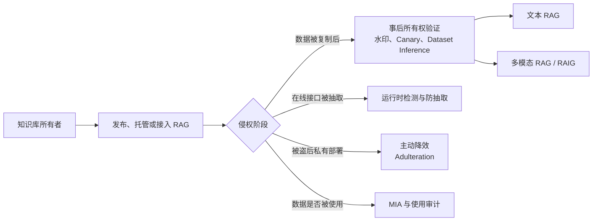

# Awesome RAG Knowledge Base Copyright Protection

> RAG 知识库版权保护、所有权验证、知识抽取防御与数据使用审计论文概览。  
> 最后核验：2026-07-27。共收录 20 篇：18 篇 PDF 已保存到 [`../paper/`](../paper/)，2 篇 OpenReview/ARR 稿件仅提供网页链接。  
> 会议等级以当前 CCF 推荐目录为准；`Findings of ACL`、ACL Rolling Review 投稿不继承 ACL 主会等级，ICLR 目前未列入 CCF 推荐目录。

## 1. 范围与分类

本文关注知识库本身的权利保护，而不是泛化的 LLM 输出水印：

- **直接版权保护**：在知识库中嵌入可验证信号，或通过黑盒查询证明数据被使用。
- **主动防御**：阻止攻击者通过 RAG API 重建知识库，或使被盗副本失去效用。
- **攻击与审计基线**：MIA、知识库抽取和统一评测，为版权方法提供威胁模型与对照。
- **不纳入主体**：模型参数水印、普通生成文本水印、训练数据版权，以及名称相近但目标不同的 CPR。

## 2. 顶会与 CCF-A 优先阅读

| 优先级 | 论文 | 出处 | 保护目标 | 核心价值 |
|---|---|---|---|---|
| ★★★ | RAG-WM | ACM CCS 2025，**CCF-A** | 文本 RAG 知识库所有权验证 | 面向 RAG 的实体—关系知识水印与黑盒统计验证 |
| ★★★ | Benchmarking Knowledge-Extraction Attack and Defense on RAG | ACM KDD 2026，**CCF-A** | 抽取攻击与防御评测 | 统一攻击、防御、索引、模型、数据集和指标 |
| ★★★ | RAGFort | AAAI 2026，**CCF-A** | 在线知识库抽取防御 | 同时处理跨主题与主题内两条抽取路径 |
| ★★★ | CanaryRAG | ACL 2026，**CCF-A** | 运行时抽取检测 | 双路径 Canary 完整性博弈，面向自适应攻击 |
| ★★★ | ImageSentinel | NeurIPS 2025，**CCF-A** | 检索增强图像生成的数据集保护 | 将 Sentinel 从文本 RAG 扩展到 RAIG |
| ★★★ | WARD | ICLR 2025，顶会、CCF 未收录 | RAG Dataset Inference | 首次系统形式化 RAG-DI，并提供统计保证与 FARAD |
| ★★★ | AQUA | ICLR 2026，顶会、CCF 未收录 | 多模态 RAG-as-a-Service | 保护图像知识在“图像检索—文本回答”链路中的传播 |

> **出处核正**：RAG© 不是 ICML 2025 正式论文。它是 [arXiv:2502.10440](https://arxiv.org/abs/2502.10440)，同时是[已撤回的 ICLR 2025 投稿](https://openreview.net/forum?id=3XTw909oXt)。

## 3. 方法横向对照

| 方法 | 载体 / 修改对象 | 黑盒信号 | 是否保持原文 | 主要短板 |
|---|---|---|---|---|
| WARD | 将全部受保护文档改写为红绿词表水印文本 | 多次回答中的 token 水印联合显著性 | 否 | 改写成本高；翻译、重写和再水印会削弱 token 信号 |
| RAG-WM | 注入由实体—关系元组生成的知识水印文本 | 特定错误关系命中率 + 二项检验 | 是 | 真实实体上的错误关系可能污染答案并引发碰撞 |
| RAG© | 水印短语 + 目标推理链 | LLM Judge 判断目标 CoT，配对 Wilcoxon | 是 | 依赖可传播的推理信号；易受检索器迁移、Judge 误差影响 |
| Watermarked Canaries | 注入风格匹配的虚构 Canary 文档 | 聚合回答的绿词 z-score | 是 | Canary 可被异常检测；token 水印怕重写/翻译 |
| KMW | 注入知识补全生成的多比特水印文本 | 多回答 bit 恢复 + 多数投票 | 是 | 生成与索引成本较高；仍依赖词表水印跨生成传播 |
| SentinelRAG | 注入秘密选择的全虚构实体与关系 | 语义一致性判定 + 二项检验 | 是 | 需校准自然幻觉率；虚构实体可能被事实核查过滤 |
| Who Stole Your Data? | 语义知识 + 红绿 token 双层改写 | 两类统计证据取并集 | 否 | 当前仅预印本；第二层仍有 token 水印脆弱性 |
| Rent-a-RAG | 供应商侧语义等价改写，控制 embedding 方向 | 方向桶 z-score + FDR | 否 | 仅 ARR 投稿；依赖 embedding 几何稳定性 |
| AQUA | 注入含罕见缩写/OCR 或空间关系的合成图像 | 文本回答中的语义触发信号 | 是 | 多模态专用；对 OCR、VLM 和检索链配置敏感 |
| ImageSentinel | 注入带随机检索键的风格一致 Sentinel 图像 | 生成图像与 Sentinel 的相似性 | 是 | 保护 RAIG 而非文本问答；键与异常样本可被清洗 |

## 4. 直接所有权验证与水印

### 4.1 WARD: Provable RAG Dataset Inference via LLM Watermarks

- **出处**：[ICLR 2025 Conference Paper](https://proceedings.iclr.cc/paper_files/paper/2025/hash/e9409aff8c8a430fd7db7c3ea7fdf581-Abstract-Conference.html)，顶会，CCF 目录未收录 ICLR。
- **PDF**：[2025_WARD_ICLR.pdf](../paper/2025_WARD_ICLR.pdf)
- **方法**：把 RAG 数据集推断形式化为黑盒 `RAG-DI`。所有受保护文档先由带红绿词表水印的 LLM 进行释义改写；所有者针对文档内容构造查询，再把多次 RAG 回答中的微弱 token 水印证据聚合为联合 p-value。论文同时提出含事实冗余的 FARAD-Easy/Hard，以避免“回答正确就等于用了我的数据”的错误归因。
- **特点**：统计假阳性可控，适合公开事实重复出现的真实场景；回答不需要逐字复现原文。代价是全库改写，且检测依赖词法水印在检索与二次生成后仍能存活。

### 4.2 RAG-WM: An Efficient Black-Box Watermarking Approach for RAG

- **出处**：[ACM CCS 2025](https://dl.acm.org/doi/10.1145/3719027.3744813)，**CCF-A**；[arXiv](https://arxiv.org/abs/2501.05249)。
- **PDF**：[2025_RAG-WM_CCS.pdf](../paper/2025_RAG-WM_CCS.pdf)
- **方法**：抽取语料中的高频实体与关系，并以所有者签名为 HMAC 密钥生成实体—关系水印元组。`WM-Gen` 生成文本，`Shadow LLM/RAG` 模拟真实传播，`WM-Disc` 反复筛选可检索、可回答且有区分度的水印；验证时用定向查询和二项假设检验累积证据。
- **特点**：不改写原始知识，水印关系比纯 token 信号更耐释义、删减和知识库扩充。其主要风险是给真实实体注入刻意不准确的关系，可能降低知识质量，并在公共事实或实体碰撞时抬高 FPR。

### 4.3 RAG©: Ownership Verification with Reasoning

- **出处**：[arXiv:2502.10440](https://arxiv.org/abs/2502.10440)；[ICLR 2025 投稿已撤回](https://openreview.net/forum?id=3XTw909oXt)，非正式会议论文。
- **PDF**：[2502.10440v1.pdf](../paper/2502.10440v1.pdf)
- **方法**：为验证问题生成两个答案相同但推理过程不同的正确 CoT；联合优化罕见水印短语与目标 CoT，使触发查询更容易检索目标推理，而普通查询不应命中。黑盒验证通过 LLM Judge 判断回答是否含目标推理，并对普通/水印查询的成对得分做 Wilcoxon 检验。
- **特点**：最终答案仍然正确，水印信号位于推理路径而非错误事实，因而强调“无害性”。局限是对 Retriever、Prompt、CoT 可见性和 Judge 非常敏感；隐藏推理、Query Rewrite、Reranker 与 Context Compression 都可能破坏传播链。

### 4.4 Dataset Protection via Watermarked Canaries in Retrieval-Augmented LLMs

- **出处**：[arXiv:2502.10673](https://arxiv.org/abs/2502.10673)，预印本。
- **PDF**：[2025_Watermarked-Canaries_arXiv.pdf](../paper/2025_Watermarked-Canaries_arXiv.pdf)
- **方法**：从原语料抽取主题、风格和长度等属性，生成风格一致但包含虚构实体、描述和关系的 Canary 文档；再用 Unigram 红绿词表水印模型写入 token 信号，并生成只针对 Canary 的查询。验证时连接多次回答并对绿词数量做 z-test。
- **特点**：不修改原始文档，Canary 可单独管理，兼具语义检索键和统计 token 信号。弱点是合成文档可能被异常检测或事实核查清除，释义、翻译和上下文压缩会削弱词法统计量。

### 4.5 Knowledge-Infused Multi-Bit Watermarking for RAG Knowledge Bases（KMW）

- **出处**：[Findings of ACL 2026](https://aclanthology.org/2026.findings-acl.1066/)，不按 ACL 主会标 CCF-A。
- **PDF**：[2026_KMW_Findings-ACL.pdf](../paper/2026_KMW_Findings-ACL.pdf)
- **方法**：从知识库采样 Chunk 并抽取局部知识图谱，通过关系预测完成“良性知识补全”，以新关系作为水印前缀；无偏生成水印算法用秘密密钥把多比特消息分段编码到同义词簇级词表分区。`Watermark Text Indexer` 由问题生成器和 RAG 模拟器共同优化稳定检索查询，检测端跨回答进行逐 bit 多数投票。
- **特点**：从“存在/不存在”一比特提升到可携带所有者信息的多比特水印，并专门评测选择、修改、扩充、RAG 设置限制与抢注攻击。比错误关系注入更重视知识合理性，但生成、筛选和查询优化成本更高，跨模型词表信号仍需独立复核。

### 4.6 SentinelRAG: Synthetic Sentinel Knowledge for RAG Database Copyright Protection

- **出处**：[arXiv:2606.05787](https://arxiv.org/abs/2606.05787)，预印本。
- **PDF**：[2606.05787v1.pdf](../paper/2606.05787v1.pdf)
- **方法**：从语料抽取领域结构，生成完全虚构但领域风格合理的实体与关系；秘密密钥哈希决定注入哪些 Sentinel，LLM 将其扩展为自然文档。所有者用定向查询探测嫌疑系统，以语义一致性验证器判断回答是否复现 Sentinel，并按基于自然幻觉率 \(p_0\) 的二项检验裁决。
- **特点**：避免在真实实体上写入错误关系，检测信号直观、与具体 token 序列解耦，低注入率即可工作。需要可靠估计无水印系统的幻觉基线；知识清洗器也可能通过虚构实体检测删除 Sentinel。

### 4.7 Who Stole Your Data? A Method for Detecting Unauthorized RAG Theft

- **出处**：[arXiv:2510.07728](https://arxiv.org/abs/2510.07728)，当前 PDF 仍含 ACM 占位信息，未确认正式录用。
- **PDF**：[2025_Who-Stole-Your-Data_arXiv.pdf](../paper/2025_Who-Stole-Your-Data_arXiv.pdf)
- **方法**：先选择与原文语义相容、同时具有区分度的新知识，嵌入语义层水印；再用红绿词表控制重写文本的 token 分布。`Interrogator` 生成只有访问水印知识才能答对的问题，`Detective` 分别统计知识命中比例与绿词 z-score，并组合两类证据。论文还构建了 RPD 检测数据集。
- **特点**：语义层抵抗 token 水印规避，词法层补偿知识水印规避，体现互补冗余。当前仍是未定会预印本，而且修改整篇文档、双重假设的整体 FPR 校准和攻击者针对性移除仍需更严格验证。

### 4.8 Rent-a-RAG: Embedding-Space Watermarks for Auditing Third-Party RAG

- **出处**：[ACL ARR 2026-05 投稿](https://openreview.net/forum?id=tnAsk6Jxdx)，未确认录用。
- **PDF 状态**：OpenReview 下载接口返回 403；请将 PDF 保存为 `research/paper/2026_Rent-a-RAG_ARR.pdf`。
- **方法**：`DirBucket` 对供应商文档做语义保持释义，并让其 embedding 在秘密方向与桶中呈可检测偏置；对多供应商混合知识库进行竞争式方向对齐。审计时汇总方向桶 z-score，并用 Benjamini–Hochberg/FDR 控制多供应商归因错误。
- **特点**：从“是否被盗”推进到混合来源中的供应商级、文档级归因，并考虑答案清洗。它依赖 embedding 几何在模型替换、重切分和 Query Rewrite 后仍稳定，且当前证据仅来自 ARR 投稿。

## 5. 多模态知识版权保护

### 5.1 AQUA: Safeguarding Multimodal Knowledge Copyright in RAG-as-a-Service

- **出处**：[ICLR 2026](https://iclr.cc/virtual/2026/poster/10008314)，顶会，CCF 目录未收录 ICLR；[arXiv](https://arxiv.org/abs/2506.10030)。
- **PDF**：[2026_AQUA_ICLR.pdf](../paper/2026_AQUA_ICLR.pdf)
- **方法**：面向“图像知识被检索、但回答为文本”的跨模态传播链，生成两类合成图像：`AQUA-acronym` 在图中放置罕见缩写及全称，`AQUA-spatial` 编码不常见空间关系。探测查询促使 Retriever 选中图像，再由 VLM 将语义信号传播到文本回答。
- **特点**：直接解决文本水印无法覆盖视觉知识的问题，提供黑盒和白盒验证模式。效果高度依赖 OCR、视觉检索器和 VLM 对空间关系的保真度。

### 5.2 ImageSentinel: Protecting Visual Datasets from Unauthorized RAIG

- **出处**：[NeurIPS 2025](https://proceedings.neurips.cc/paper_files/paper/2025/hash/1f3b0b15d6bb860dcfa6e5c8ba7d3d96-Abstract-Conference.html)，**CCF-A**。
- **PDF**：[2025_ImageSentinel_NeurIPS.pdf](../paper/2025_ImageSentinel_NeurIPS.pdf)
- **方法**：随机字符充当高区分度检索键；VLM 归纳私有图像集的风格，文生图模型生成风格一致、与键绑定的 Sentinel 图像并注入数据集。黑盒查询键后，比较嫌疑 RAIG 输出与 Sentinel 的视觉相似性。
- **特点**：保持原图不变，能同时绑定检索触发和数据集风格。它属于检索增强图像生成而非文本 RAG，异常键、合成图像检测与重建模型变化是主要风险。

## 6. 知识抽取防御与被盗后降效

### 6.1 RAGFort: Dual-Path Defense Against Proprietary Knowledge Base Extraction

- **出处**：[AAAI 2026](https://ojs.aaai.org/index.php/AAAI/article/view/40432)，**CCF-A**。
- **PDF**：[2026_RAGFort_AAAI.pdf](../paper/2026_RAGFort_AAAI.pdf)
- **方法**：把抽取分为跨主题扩展与主题内细节重建两条路径。前者用聚类和监督对比学习重新索引，使不同主题更隔离；后者用 Draft/Reference 两阶段约束级联生成和拒绝规则，减少细粒度敏感内容直接输出。
- **特点**：不是事后水印，而是在服务端主动降低重建率；同时保持常规问答质量。需要控制 Retriever/Indexer 与生成栈，不能证明离线被盗副本的所有权。

### 6.2 Detecting RAG Extraction Attack via Dual-Path Runtime Integrity Game（CanaryRAG）

- **出处**：[ACL 2026 Main](https://aclanthology.org/2026.acl-long.385/)，**CCF-A**。
- **PDF**：[2026_CanaryRAG_ACL.pdf](../paper/2026_CanaryRAG_ACL.pdf)
- **方法**：在运行时给检索 Chunk 注入无语义 Canary 字符串，并并行运行两条路径：目标路径在正常服务中不应泄露 Canary；Oracle 路径被明确要求恢复 Canary。任一路径违反预期，都表明攻击者在直接泄漏或自适应压制/篡改 Canary。
- **特点**：即插即用、模型无关，不要求改知识库或训练 Retriever，并专门覆盖知晓防御机制的自适应攻击。它保护在线服务完整性，不等同于数据被复制后的版权证明，且双路径增加推理成本。

### 6.3 AURA: Making Theft Useless for Proprietary Knowledge Graphs in GraphRAG

- **出处**：[arXiv:2601.00274](https://arxiv.org/abs/2601.00274)，预印本。
- **PDF**：[2026_AURA_arXiv.pdf](../paper/2026_AURA_arXiv.pdf)
- **方法**：识别图谱中的关键节点，生成语义和结构上都可信的虚假节点/边，并挑选对回答破坏最大的 Adulterant 注入 KG。授权系统凭秘密密钥识别加密元数据标签，在送入 LLM 前过滤；被盗副本无法区分真伪而产生错误回答。
- **特点**：面向所有者无法观察输出的私有、离线盗用场景，保护目标从“可追责”变成“偷了也没用”。代价是故意污染原始资产，密钥泄漏、过滤器错误和错误知识外溢风险较高，且当前专用于 GraphRAG。

### 6.4 DORA: Protecting Proprietary RAG Databases via Embedding-Aware Data Adulteration

- **出处**：[ACL ARR 2026-01 投稿](https://openreview.net/forum?id=uLzLU1IGwf)，未确认录用。
- **PDF 状态**：OpenReview 下载接口返回 403；请将 PDF 保存为 `research/paper/2026_DORA_ARR.pdf`。
- **方法**：把 AURA 式主动降效推广到文本 RAG，生成在 embedding 空间中容易被相关查询检索、同时足以误导回答的可信 Adulterant；授权服务用秘密键过滤，盗取数据库直接部署者则得到低效知识库。
- **特点**：覆盖水印无法观察的私有盗用，并报告较低授权开销。它要求将可致错内容真实写入数据库，主要针对直接数据库泄露，而不是经授权 API 慢速抽取。

### 6.5 Web Intellectual Property at Risk

- **出处**：[arXiv:2505.12655](https://arxiv.org/abs/2505.12655)，预印本。
- **PDF**：[2025_Web-IP-at-Risk_arXiv.pdf](../paper/2025_Web-IP-at-Risk_arXiv.pdf)
- **方法**：在网页内容中加入经黑盒优化的语义策略提示，使具备实时网页检索能力的 LLM 在回答时识别并遵守内容所有者设定的使用限制。
- **特点**：属于检索前访问控制，而非被盗知识库的事后所有权验证；部署门槛低，但依赖 LLM 的指令遵循与 Prompt 优先级，难抵抗有意移除策略文本的抓取者。

## 7. 攻击、审计与评测基线

### 7.1 Is My Data in Your Retrieval Database? MIA Against RAG

- **出处**：[arXiv:2405.20446](https://arxiv.org/abs/2405.20446)，预印本。
- **PDF**：[2024_RAG-MIA_arXiv.pdf](../paper/2024_RAG-MIA_arXiv.pdf)
- **方法**：围绕目标文本设计提示，通过 RAG 的回答判断该段落是否进入检索数据库，覆盖黑盒和灰盒设置；同时测试在 RAG 模板加入防泄漏指令的初步防御。
- **特点**：无需预先修改语料，可作为零水印 Dataset Inference 基线。单文档 membership 的统计证据通常不足以证明整库所有权，且容易受公共事实冗余和模型参数知识混淆。

### 7.2 Generating is Believing: S²MIA

- **出处**：[ICASSP 2025](https://arxiv.org/abs/2406.19234)，CCF-B。
- **PDF**：[2025_S2MIA_ICASSP.pdf](../paper/2025_S2MIA_ICASSP.pdf)
- **方法**：若目标样本在检索库中，RAG 输出通常与其具有更高语义相似度；S²MIA 据此以目标文本—生成内容的语义相似性分数判断 membership。
- **特点**：模型与检索器无关、黑盒成本低，并可绕过若干传统 MIA 防御。它仍是样本级隐私攻击，阈值会受回答风格、事实重复和生成模型变化影响。

### 7.3 The Good and The Bad: Exploring Privacy Issues in RAG

- **出处**：[Findings of ACL 2024](https://aclanthology.org/2024.findings-acl.267/)，不按 ACL 主会标 CCF-A。
- **PDF**：[2024_The-Good-and-The-Bad_Findings-ACL.pdf](../paper/2024_The-Good-and-The-Bad_Findings-ACL.pdf)
- **方法**：把检索提示分成用于命中目标记录的 `{information}` 与要求逐字输出上下文的 `{command}`，系统评估检索数据库泄漏；同时比较加入 RAG 前后 LLM 训练数据记忆泄漏的变化。
- **特点**：首次清晰揭示 RAG 一方面引入外部数据库泄漏，另一方面可能稀释参数记忆泄漏的双重效应，是版权防护威胁模型的重要早期基线。

### 7.4 CopyBreakRAG: Feedback-Guided Extraction of Knowledge Base

- **出处**：[arXiv:2411.14110](https://arxiv.org/abs/2411.14110)，预印本；早期文献中也常以 RAG-Thief 方向引用。
- **PDF**：[2025_RAG-Thief_arXiv.pdf](../paper/2025_RAG-Thief_arXiv.pdf)
- **方法**：黑盒 Agent 从初始对抗查询出发，把已泄漏知识与系统反馈写入记忆；通过好奇心驱动探索新主题，并对已有主题做反馈引导的查询细化，在 exploration/exploitation 之间循环。
- **特点**：比单次 Prompt Injection 更接近持续、规模化盗库，能覆盖主题内和跨主题抽取；非常适合检验 RAGFort、CanaryRAG 与水印在真实攻击流量下的稳健性。

### 7.5 Benchmarking Knowledge-Extraction Attack and Defense on RAG

- **出处**：[ACM KDD 2026](https://dl.acm.org/doi/10.1145/3770855.3817524)，**CCF-A**；[arXiv](https://arxiv.org/abs/2602.09319)。
- **PDF**：[2026_Benchmark-Knowledge-Extraction_arXiv.pdf](../paper/2026_Benchmark-Knowledge-Extraction_arXiv.pdf)
- **方法**：统一实现多类抽取攻击和防御，横跨不同 embedding、开源/闭源 Generator、普通与图索引、多语言数据集，并用一致的攻击效用、隐蔽性、泄漏和系统效用协议评测。
- **特点**：它不是新水印，但为版权保护实验提供了可复现的攻击面与基准坐标，可避免只在单个 Retriever、单一 Prompt 或私有指标上宣称稳健。

## 8. 研究脉络

1. **无修改推断**：RAG-MIA、S²MIA 尝试仅凭输出判断目标样本是否在库，但事实冗余造成归因困难。
2. **单层水印**：WARD 用 token 水印改写全库；RAG-WM、RAG© 和 Watermarked Canaries 转向可定向检索的语义载体。
3. **复合与高容量**：Who Stole Your Data? 组合语义与词法信号，KMW 支持多比特所有者信息，SentinelRAG降低真实实体污染。
4. **从事后举证到主动防御**：RAGFort、CanaryRAG 针对 API 抽取；AURA、DORA 处理无法观察的私有盗用。
5. **从文本扩展到多模态和多供应商**：AQUA、ImageSentinel 保护视觉知识；Rent-a-RAG探索混合数据提供商归因。

## 9. 对 RAG 知识库版权研究最值得继续追的问题

### 9.1 传播链鲁棒性不能只测 Vanilla Dense RAG

建议把检测率拆成：

\[
P(\text{detect})
=P(R)\,P(G\mid R)\,P(D\mid G,R),
\]

其中 \(R\) 表示水印被检索，\(G\) 表示信号经 Generator 成功传播，\(D\) 表示 Detector 正确判定。

实验上必须分别保存 Retriever Hit、Reranker 保留率、Prompt 实际上下文、Generator 信号与 Detector 判定。重点变量包括现代 Embedding、BM25/Dense/Hybrid、Reranker、重切分、Multi-query、Query Rewrite、Context Compression 和 Adaptive Routing。

### 9.2 正确区分版权证据与“模型碰巧知道”

- 使用事实冗余强弱分层，而不是只测虚构事实。
- 同时报告普通查询 FPR、目标信号 FPR、配对成功率和置信区间。
- 对多次查询、多个所有者、多个 Detector 做多重检验校正。
- 将水印检测与可主张的法律/来源证据区分开；统计显著不自动等于唯一所有权。

### 9.3 需要统一覆盖三类攻击

| 攻击 | 代表操作 | 首要指标 |
|---|---|---|
| Removal | 释义、翻译、摘要、重切分、扩库、Rerank、删除异常项 | 检测功效、效用保持 |
| Spoofing / Reclaiming | 再水印、伪造 Canary、覆盖 owner ID | FPR、错误归属率 |
| Ambiguity | 多来源混合、公共事实重复、局部盗用 | 供应商归因、局部检测功效 |

### 9.4 最有潜力的组合方向

- 用 **Sentinel/RAG© 的语义触发**承担可检索性，用 **KMW 的多比特编码**承担身份容量。
- 用 **WARD 的联合统计检验**替代单次 LLM Judge 裁决。
- 用 **Rent-a-RAG 的 embedding 方向信号**补充不可见 CoT 场景。
- 用 **RAGFort/CanaryRAG 的在线防抽取**保护服务接口，同时保留离线水印用于泄露后的归因。
- 将 **KDD 2026 抽取基准**与 Watermark Removal、Spoofing、Ambiguity 统一到同一评测矩阵。

## 10. 推荐阅读顺序

1. **WARD**：建立 RAG-DI、事实冗余和统计检验的基本问题意识。
2. **RAG-WM**：理解检索定向的知识水印，以及语义稳健性与知识污染的权衡。
3. **RAG©**：研究“正确答案不变、推理信号改变”的无害验证路线。
4. **KMW + SentinelRAG**：比较多比特容量、知识合理性与全虚构 Sentinel 两条新路线。
5. **RAGFort + CanaryRAG + CopyBreakRAG**：把所有权验证放回真实在线抽取攻防中。
6. **KDD 2026 Benchmark**：建立统一、可复现的攻击—防御评测。
7. **AQUA + ImageSentinel + Rent-a-RAG**：扩展到多模态与多供应商归因。

## 11. 易混淆论文

- **CPR: Retrieval Augmented Generation for Copyright Protection**（CVPR 2024，CCF-A）使用检索来约束生成模型对版权内容的复现，保护的是生成过程中的版权合规；它并不验证 RAG 知识库是否被盗，因此未列入主体清单。
- `BadChain`、`PoisonedRAG`、`AgentPoison` 等研究攻击完整性或代理行为，不以知识库所有权证明为目标；它们更适合作为水印的攻击面和对抗评测来源，见 [Awesome RAG Backdoor Attacks](./awesome-rag-backdoor-attacks.md)。
